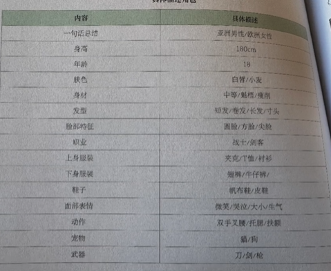

# 游戏美术设计入门

## 1 形状

圆形：友好

方块：坚硬

三角形：危险

不规则形状：怪异感、独特

不是审美问题是情绪控制

## 2 交互

《取景器》环境取景，围绕相机转

《巴别塔圣歌》情绪符号

## 3 图标

《宝可梦剑盾》 倾斜：活泼   放大：底纹装饰 扁平：干净克制

## 4 Logo

《小小梦魇》 场景适配图

《怪物猎人》 系列进化图

## 5 角色

拒绝纸片人

《smash Hit》 小球撞玻璃

《潜水员戴夫》 憨厚胖大叔

## 6 模板

救世主 杰洛特，布鲁斯韦恩

保护者 乔尔，奎托斯

隐士 克劳德，山姆

愚者 马里奥和路易吉，潜水员戴夫

智者 杨戟

伴侣 塞尔达

宠物 宝可梦

引导

商人

阻碍 八戒

## 7 视角

俯视角：一目了然

45°俯视角：体积感

平视角：平起平坐

第一人称：代入感

## 8 世界观

科幻世界

战争历史

宇宙崩坏生存

超自然悬疑

现代都市

东方武侠

## 9 建筑 

《黑猴》历史感  

## 10 植物

引导性