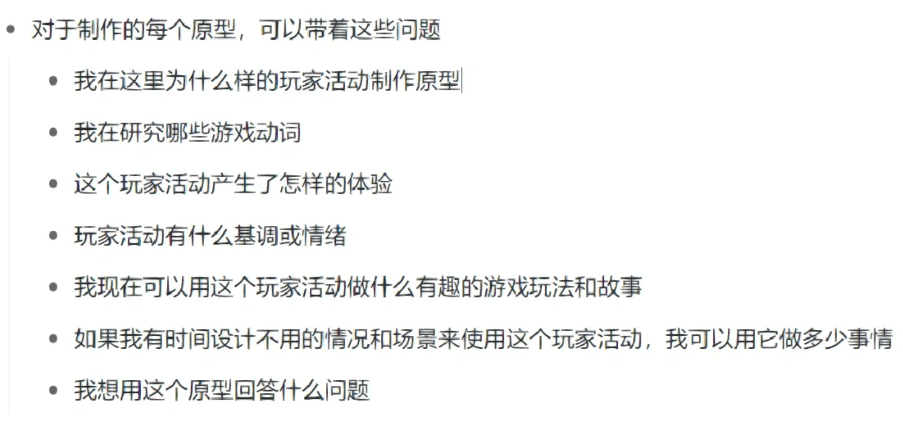
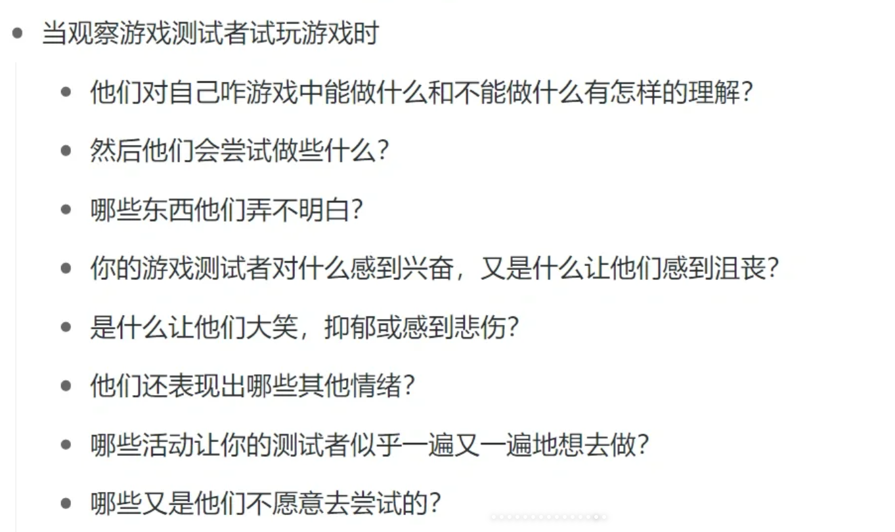

# 妙趣横生的游戏制作之旅

## 第一阶段 构思——制造想法

### 1. 如何开始

从奇思妙想（想出点子）、调研（从书籍和互联网中挖掘想法）、原型设计（制作简单的东西来试玩和评估）这三种构思活动中选一种开始。

### 2. 奇思妙想

#### 2.1 头脑风暴

- 设定一个时间限制
- 注重数量而不是质量
- 委任一名协调员——推进活动，贡献初始想法，并确保：
- 一次只有一个人说话
- 每个人都有发言的机会
- 把一切都写下
- 欢迎不寻常的想法——越奇怪越好
- 多说“是的，而且”——结合并改进想法
- 不要在头脑风暴期间讨论这些想法

##### 评估结果

优先级（可能一开始只是兴奋度）排序；找到将不同想法链接起来的方法，从而实现一个让整个团队都感到兴奋的综合方案

##### 思维导图

有了核心概念，想要深度探索；每个新想法都应该与核心想法，或者已经存在导图上的另一个想法相连接

#### 2.2 自动主义

定时，跟着意识流走

#### 2.3 列表有力量

实际上是信息有力量。学习电子表格！

### 3. 调研

每个人都有偏见——影子观察法。

IDEO Cards

### 4. 游戏原型：概述

构思的命脉不是思考，而是制作

设计是一项接触性的运动，在开始之前，无法发现可能损害或帮助我们的项目的隐藏的假设。从最少的奇思妙想开始（也许是一次头脑风暴，20min即可），之后立即开始制作原型。

原型不是游戏的演示。原型会为游戏探索一个或多个想法。

#### 4.1 游戏机制、动词和玩家活动

游戏机制：构成游戏功能和互动性的规则和流程，能控制玩家可以做什么以及游戏如何开始、展开和最终结束

游戏动词：玩家可以做什么的行动词汇

玩家活动：描述玩家如何使用特定动作的术语，是游戏机制，游戏动词，游戏叙事以及玩家的感知，想法，行动和意图相结合的成果。

### 5. 制作数字游戏原型

原型是玩具

### 6. 沟通是一种游戏设计技能

什么时候自己做决定，什么时候汇报

- 保持清晰
- 保持简洁
- 积极倾听

- 三明治法：赞美、建设性批评、另一部分赞美
    - 直接
    - 具体
    - 对事不对人

尊重、信任、认同

### 7. 项目目标

目前为止，有三种类型交付物：想法列表、调研笔记、原型。第四种是项目目标

游戏设计是将构成游戏的元素以一种能够为玩家带来良好体验的方式组成的抽象模式。

- 体验目标：希望玩家获得的体验，通常以情感体验来描述。MDA分析

- 设计目标
    - 硬件
    - 机制、动词、玩家活动
    - 交互方式
    - 你要使用的特殊硬件或软件
    - 游戏类型
    - 游戏主题
    - 叙事主题
    - 美术目标
    - 艺术目标
    - 影响力目标

项目目标 = 设计目标 + 体验目标

### 8. 构思阶段的结尾

## 第二阶段 预制作——通过制作进行设计

### 9. 控制流程

《神海》预制作：概念艺术设计、测试关卡、在纸上和原型上规划游戏设计做了很多准备。游戏将是什么，以及如何管理项目。

瀑布流在游戏早期是行不通的。

### 10. 垂直切片

高质量演示小样。包括怕整个游戏体验至关重要的所有（大部分）核心功能、资源和叙事的样本。

#### 10.1 核心循环

HALO 30s 乐趣：进入一个区域，首先注意敌人和战利品在哪里，然后躲起来。瞄准敌人，一个个击败。走来走去直到到达出口，进而进入一个新的区域。但没有核心循环30s是重复的。

特殊序列

#### 10.2 3C

#### 10.3 美丽角落

### 11. 构建一个垂直切片

从原型开始

选择游戏引擎和硬件平台

练习良好的内务管理

开始添加调试功能

尽早失败、快速失败、经常失败

在同一个物理空间或同时在线工作

保存和分类你的设计材料

以项目目标为导向

何时修改项目目标？某些元素组合不完全与目标一致，但每个人都喜欢

收集团队信息；预制作不能按常规方法规划。

### 12. 试玩测试

参考了The Design of Everyday Things

### 13. 同心开发

模块化分层构造

- 先构建游戏的核心元素再向外扩展

    e.g., FPS、TPS中，移动和相机控制；横板冒险，移动玩家和相机算法.

- 实现二级和三级机制

- 在制作中打磨

### 14. 预制作交付物——垂直切片

### 15. 反对加班

### 16. 游戏设计师的故事结构

叙事是对变化的研究。

并非每款游戏都有或需要故事，但大多数游戏都有某种叙事形式或结构。我们心里上将事件进行因果性排列，即使有些是随机的。从这个角度，国际象棋和篮球都有叙事性。

亚里士多德、夫莱塔格：三段论

Frank Daniel：电影的序列结构：第一幕两个、第二幕四个、第三幕两个。

### 17. 预制作交付物——游戏设计宏观方案

GDD: 有足够细节但又不过多

宏观设计+微观设计

地图

在制作过程中创建

- 第一部分：一个简短的游戏设计概述，总结了游戏的核心元素：游戏的基本元素，游戏最重要的特殊机制，以及游戏情节的简要概述。

- 第二部分：宏观图表，一个电子表格，提供了游戏关卡的逐步细分，以及每个关卡内发生的动作、活动和故事节拍。
    - 哪里有哪种游戏玩法
    - 所有机制
    - 玩家目标、设计目标、情绪节拍、位置/序列名称，时间/天气/心情，遇到的敌人/物体，需要的资产，音频/视觉效果笔记

### 18. 编写游戏设计宏观图表

事件、地点顺序。对比和连续性

### 19. 排期

T = N 人数 * P 平均每人每周工作小时数 * W 预制作结束与全面制作结束的周数

优先级

燃尽图与信息图

### 20. 里程碑评审

- 预制作结束
- Alpha
- Beta
- 项目后评审

1. 开发者简要介绍游戏并总结项目进展
2. 在评审团面前进行Demo展示或游戏试玩
3. 如果可以，评审小组的高级成员开始给予反馈
4. 其他评审组成员参与并做记录，对游戏发表评论。可能激烈争吵
5. 评审时间到了，游戏开发者感谢小组的反馈。
6. 在评审多个项目的背景中，例如季度商务会议或游戏开发课程，我们将继续进行下个项目

“好的点评说明了什么是错的、什么是缺失的、什么是不清楚的、什么是没有意义的。好的点评是及时的，不会拖到来不及解决问题。好的点评不会提出要求，他甚至不必提供对应的解决方案。
好的点评是明确切题的。”

### 21. 预制作的挑战

交付：垂直切片、游戏宏观设计方案、进度表

- 致力于设计：“是的，并且”交流风格

- 如果预制作不顺利就取消项目

## 第三阶段 全面制作——制作和发现

### 22. 全面制作的特点

alpha里程碑 在2/3进度左右

- 检查项目目标
- 站立会议
- 全面制作里程碑
    - Alpha: 特性完备的。发挥作用的东西都应粗略呈现。
    - e.g., 玩家角色和其他角色能力、游戏机制和核心循环、世界中对象的基本行为
    - 逐渐放弃同心开发，并将开始放入placeholder content
    - Beta: 内容完整的。所有资源至少以第一次质检合格的质量水准呈现。
    - 可能有平衡性问题。
- 按照什么顺序构建
    - art structure: 第一幕 开端、第二幕上半场 中段、第二幕下半场 中段、第三幕 结尾
    - 按照： 第二幕上半场、第一幕、第三幕、第二幕下半场 顺序

- 注重易用性
- 不要大更改项目目标
- 何时冒险？有些design在接近开发结束才完全确定

### 23. 测试类型

- 非正式试玩测试
- 设计过程测试
    - 正式试玩
    - 用户
    - 焦点
- 质量保证测试
- 自动化测试
- 面向公众的测试

### 24. 准备正式的试玩测试

- 健康版本
- 正式的试玩测试脚本
- 调查问卷
- 提供耳机
- 操控备忘单
- 准备书面提示或文件，帮助玩家了解已知游戏体验或功能问题
- “放声思考”
- 适当时使用内容警告
- 开始试玩
- 观察游戏体验
- 观察言行
- 完全不要帮助
- 如果需要，录制视频
- 捕获有关测试环节的指标数据
- 注意事件：需要进行问卷调查和体验后访谈
- 在测试之后和任何对话之前，给游戏测试者一份正式试玩测试调查问卷
- 调查问卷结束后，使用准备好的体验后访谈问题进行访谈
- 写下或录下体验后访谈的答案
- 不要成为游戏解释者
- 不要气馁

### 25. 运作正式的游戏测试

### 26. 游戏指标

telemetron远距离测量 “遥测”

按下按钮的时间，死亡次数，资源价值等等

### 27. Alpha阶段和缺陷跟踪

### 28. Alpha里程碑

游戏特性完备

游戏序列完备（关卡就位，至少占位资源）

选择游戏名称

### 29. 把内容以存根形式放入游戏

例如白盒、灰盒、阻挡墙

远离同心开发

### 30. 让游戏吸引受众

维持消费者的兴趣不久。

开始营销。

### 31. Beta里程碑

内容完整的
- 游戏所有特性和内容至少以第一次质检合格的可发布形态呈现
- 所有前端、菜单和界面元素至少应以第一次质检合格的课发布形态呈现。
- app分辨率图标图像和配套标题文本
- 启动画面
- 在线商店展示所需的文字和图片
- 成就系统和相关内容
- 彩蛋
- 认证要求

此外，制定可行计划解决以下问题：
- 突出的设计问题
- 性能问题
- 突出缺陷

## 第四阶段 后制作——修补和打磨

### 32. 后制作阶段

平衡和缺陷修复，音量，微调等

### 33. 发布候选里程碑

### 34. 认证流程

### 35. 预期之外的游戏设计

预告片、网站、攻略、展览等

### 36. 游戏完成后