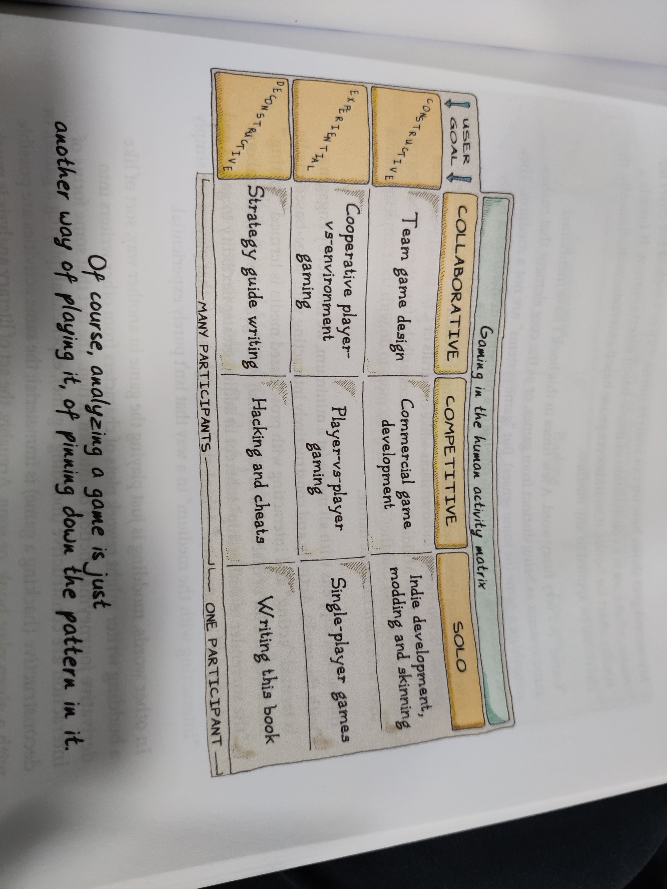
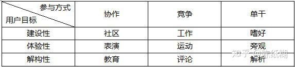
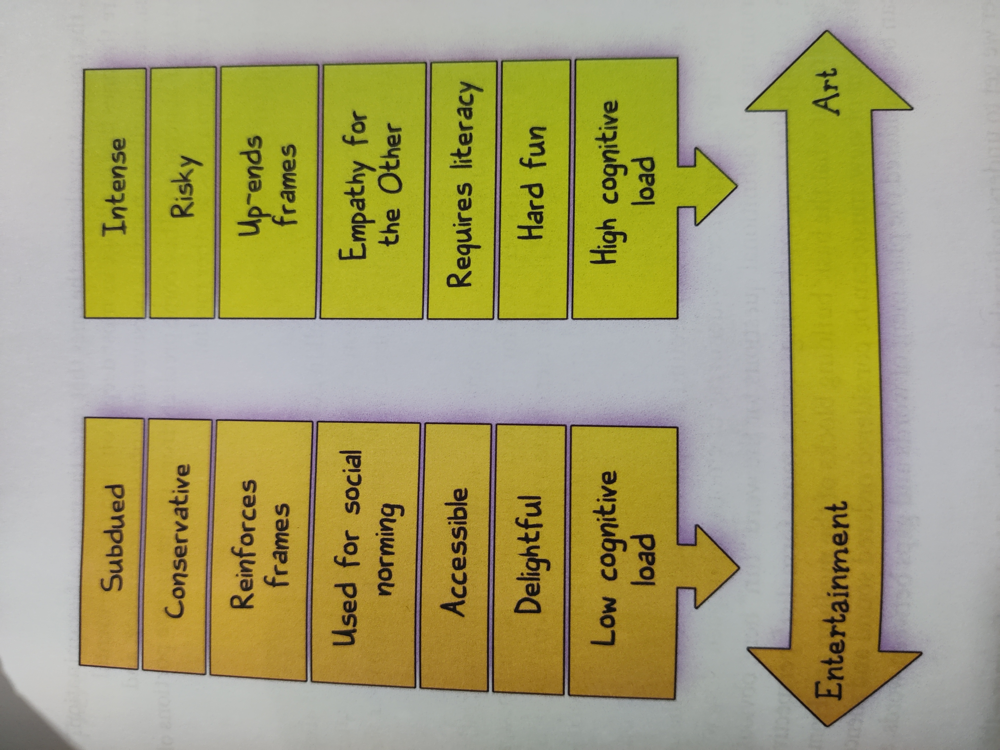

# A Theory of Fun

## Chapter 1 Why Write This Book?

1，如果大脑面对的环境，有恰好足够的复杂度，大脑就可以正确的从其中识别出模式来，当大脑成功做到这一点后，大脑会分泌多巴胺来奖励自己。（玩到好的游戏）
2，如果大脑面对的环境，不足够复杂，那么大脑中储存的模式，已经可以将其对应了，所以大脑不会再进行识别的动作，也不会分泌多巴胺。（玩到无聊的游戏）
3，如果大脑面对的环境，太过于复杂，那么大脑无法从中识别出任何模式来，那么大脑就会精疲力尽但是一无所获，没有获得新的模式，自然也不会分泌多巴胺。（玩到太复杂的游戏）

***游戏的快感是从掌握和理解中获得的，是解谜行动本身使游戏变的有意思。
换句话说，在玩游戏时，学习就是兴奋剂。***

厌烦刚刚好相反，当一个游戏不能教给我们的时候，我们就会开始觉得它十分无聊。厌烦是大脑在寻找新的信息。这就是当我们无法体验到新模式的感觉。当一本书无法吸引你读下面的章节时，就说明它没有展现出它的魅力。到那个一本书无法吸引你读下面的章节时，就说明它没有展现出它的魅力。同样，当你感觉一首乐曲只是在不断重复或者毫无创业时，你就会觉得无聊，因为它没有激起我们对认知的挑战。

不要低估大脑想要学习的欲望。如果把一个人放在一个没有任何东西可以感知的屋子中，他很快就会觉得不开心。大脑需要刺激，它时时刻刻都在尝试学习新内容，从周围世界积累各种信息。在这方面，大脑是永不知足的。

大脑不喜欢多余的工作，当游戏无法在它所提供的谜团里展现新鲜的事物时，就会令人感到无聊。这让它在感官的剥夺与超负荷，多多的规则与混乱，寂静与喧闹之间显得进退两难。

***一款好游戏的定义就是，能够在玩家停止游戏之前，把应该提供的每一样东西交给玩家。***
## Chapter 2 How the Brain Works?

### Definition of Game

- Roger Caillois "Activity which is voluntary, uncertain, unproductive, governed by rules, make-believe"
- Johan Huizinga "Free activity outside 'ordinary' life"
- Jesper Juul "A rule-based formal system with a variable and quantifiable outcome, where different outcomes are assigned different values, the player exerts effort in order to influence the outcome, the player feels attached to the outcome, and the consequences of the activity are optional and negotiable"

没有什么和"fun"有关。而游戏设计者们往往给出不同定义。（更多详情见腾讯游戏学堂folder的notes）

- Sid Meier "A series of meaningful choices"

### People Are Pattern-matching Machines

"When not looking at someone face-to-face, we oftern misinterpret the information."

"Assumption are what brain is best at"

### Brain

- Good at cutting out the irrelevant
- Notices a lot more than we think it does
- Actively hiding the real world from us

### Chunk

人始终在进行组块化(chunking)的过程。一旦人识别出一种模式，就能在追踪和识别它的过程中享受快乐。e.g., morning routine.

人有时会过度相信chunk及其联想，从而导致犯错。这就是为什么不自己犯错就不会清楚。

Thinking is, mostly memory, pattern-matching against past experience

### People Dislike Chaos

"Noise is any pattern we don't understand"

艺术必须遵从一定秩序而非完全的混沌，需要被人所理解，接受其模式，从而组块化。游戏也是如此。

### 3 Levels of Brain Functioning
（自注：the design of everyday thing 中的章节“行动的七个阶段和大脑的三个层次”）
1. Conscious Thought. 理性逻辑思考（智力理解）。
Logical, works on a basically mathematical level. Sort of mind we measure when taking IQ test.

2. Integrative, Association, and Intuitive. 综合联想直觉判断（直觉理解）。
Really slow. It links this that don't make much sense. The part of chunking,

3. Not thinking. 不思考的本能反应（完全理解）。
Grok: understand something so thoroughly that you have become one with it and even love it. Has a lot in common with "muscle memory". （潜意识的？）它包含了本能做出的一系列决定，而建造这样的知识库的过程就是“练习”。在练习的过程中，大脑会得到锻炼，这也会带来快乐。

## Chapter 3 What Games Are

### 重提游戏定义
Huizinga在《游戏的人》中对游戏的定义：“魔环（magic circle）”（自注：中国美术学院出版社，1996.10，多人译版中将其译作“巫术场”，原文为：“所有的游戏展开并据有游戏场所。这个场所有意无意，或从理想上或从实际中都被预先标画出来…竞技场、牌桌、巫术场、庙宇、舞台、屏幕、网球场、法庭等等，在形式和功能上都是游戏场合。它包含特殊的规矩，如禁止污损、互相隔离、划分禁地、神圣化等，这一切是平常世界中的暂时天地，用以一项活动的举行。”）。这个魔环是与现实世界不相连的。

The more rigidly constructed your game, the more limited it will be.

游戏描述的形态在现实中可能不存在，但游戏的规则（模式）与人处理真实事物的方式相同。

### What is fun? 

游戏是需要解开的谜题，它具有目标，可供人练习某个特定的模式。游戏包含的模式决定了游戏的局限性。来自游戏的快感是从掌握、理解游戏中获得的,“……但你只会在掌握模式之前去玩”。若游戏中有更多变量，玩家完整体验游戏所需的时间也会更长。***游戏好玩意味着“让玩家保持学习状态”。***

厌倦感会以以下的形式出现，会使本应具有的令人愉悦的学习经历消失：

- 玩家通过最初5分钟就弄清楚了游戏的玩法，从而觉得这样的游戏没什么意思，就像成年人玩井字游戏一样。“太简单”，这很可能是玩家对这种游戏的评价。
- 玩家发现游戏要达到的可能的变化需要很多东西，但是这些东西却无法令他们兴趣。
- 玩家没发现pattern。“太难了”
- 游戏中的模式变化速度太慢，这会使游戏被过早的认为没什么可玩的而被放弃“太简单-都是在重复”
- 玩家中的模式变化得太快了，这会使玩家因控制不了而放弃，“太难了，太快了”
- 玩家也许精通游戏中的所有模式，这样愉悦感就会消失殆尽“我完全打败了”

"Fun is another word for learning. Games teach you how aspects of reality work, how to understand yourself, and how to understand the actions of others, and how to imagine."

（自注：宏观层面上什么是有趣？）
- 新鲜感与变化：变化是乐趣的本源之一，探索是有趣的
- 掌控感：感受到自己的进步，技能升级 
- 音视刺激：爽快感是刺激
- 替代行为：压抑与释放，用别处的生活来代替自己当前的生活，获得释放
- *社交，竞技（博弈）

## Chapter 4 What Games Teach Us

"The very phrase "it's just a game" implies that playing a game is a form of  PRACTICE for a real-life challenge."

赌博（掷骰子等）也算游戏，因为teaching people how odds work.

### Some games teach
- spatial relationships (tetris)
- explore (super mario)
- how to aim precisely (fps)
- teamwork (cs)
- skills (guitar hero)
- life skills
    - resource allocation
    - force projection
    - territory control

### Comparison
人们常常构造现实生活的抽象模型用于练习以应付现实生活的挑战，只不过由于其内容的重要性而抛开了从中获得快乐的念头，不将其视为游戏，例如消防演习。

形式规则集合是大部分游戏的基础，因此游戏往往反映了现实。

大多数游戏含有空间推理元素(物理空间、概念空间等)，分类、比较及锻炼人驾驭空间事物的能力是所有游戏的基本教育目的之一(不仅需要理解空间及其运行规则，还要理解空间如何对变化作出反应，以便对空间施加自己的影响，这一反复施加影响并学习的过程也是游戏进程进展的过程)。

大多数游戏与权力有关，这些游戏可以教给人们和团体背景相关的经验技巧。

游戏是会随着生活所要求技能的演变而改变的。

与音乐相比，游戏长于：控制、传达、环绕、匹配、回忆、计算、量化等；音乐长于：信息量少而其中情感占比高。

与文学相比，游戏能为更丰富复杂的情况构建模型(例，《权谋》(Diplomacy))，但其核心理念仍是教会人们生存的技能，文学能解决更为宽泛的课题。但游戏系统更复杂，它包括文学，音乐。

自注：即，只要有合适的文学作品，一个人从中获取快乐的门槛要比参与游戏更低，因为阅读有书打开就行，游戏需要设备，载入，玩一玩看看喜欢不喜欢...所以阅读能使人更快进入心流？这种论调是反直觉的，但有一定道理。

自注：游戏是否为生活必需品？最早有记录的电子游戏诞生于1952年，为井字棋游戏（Tic-Tac-Toe），运行于真空管计算机上。 电子游戏在1970年代开始以一种商业娱乐媒体被引入，成为1970年代末日本、美国和欧洲一个重要娱乐工业的基础。

自注：前文提到快乐的来源就是学习。那游戏的目的是教育人？还是单纯的使人享乐？这似乎是一个先有鸡后有蛋的问题。
我们因为听说游戏快乐所以玩，然后从中学到了（获得更多快乐）所以继续玩。那么第一个人（发明tic-tac-toe）的呢？一种猜测：觉得无聊所以想出来的，然后发现有意思就介绍给朋友......）

### Change from "response" to "instinct"

相较前人遗留的传统，目前的游戏可以更加顺应当前人类的生存特性，从以下几点作出改进(以前的游戏往往鼓励它们)：对领袖的盲从和狂热崇拜，严格的等级制度，二元的思维方式，运用武力解决问题，乐于找寻与自己相似的东西或排外(自注：即在游戏中体现人文关怀，展现相互依存和合作，陈星汉的作品在这方面具有很大参考价值)。

操控感好的以跳跃为特色的游戏都自动遵循这一规则：角色在空中的跳跃时间几乎与按下跳跃键的时长相同。动作游戏会在训练玩家熟练掌握技巧之后利用任务推动玩家提高行动速度。这些例子都体现了潜意识和本能反应的应用。自主反应本身并不会带来快乐，你已经记住了这样的反应机制，因此只有在这种心理挑战的环境下完成了自主反应的时候，大脑才会将给你快乐的感觉。比如人们并不会从打字行为本身感到多爽，而是在这个过程中想出了如何去表达，或者在打字游戏中迅速打字的时候才会感到快乐。而策略游戏不应该设计限时模式，因为其目标并非训练条件反射的速度。

### Characteristics of Game

- 给人提供往往高度抽象的真实事物的模型；

- 本身一般是量化的模型；

- 主要教授可以通过潜意识吸收的东西，而非提供需要逻辑思维解决的问题；

- 主要教会我们一些相当简单的行为能力，但并非必须如此。

e.g., Morden platformer
- "Get to the other side" still the basic paradigm （线性？）
- "Visit all the map" is handled by a "secrets" system （开放式？）
- Time limits add another dimension of challenge

有的游戏对玩家提出彻底探索一块区域的要求，这需要玩家有耐心并能享受发现的快乐，不仅仅针对最终目标而行动，还能锻炼更加广泛的技能。

THe evolution of moder video game can largely be explained in terms of topology. In fact, when we design games, we often start with a previous game and change just one element in it.

## Chapter 5 What Games Aren't
### Game and Storytelling

大部分游戏都采用虚构背景进行包装，但游戏的目的是训练玩家跨越这些虚构想象，传授潜藏的模式。游戏的外衣与其核心本质很大程度上并不相关，理解游戏时必须学会这一点。

游戏的核心内容通常并不是其故事。
- 游戏更接近体验式的教学，故事则让人产生共鸣；
- 游戏擅长objectification使人以客体化形式出现（自注：即作为游戏中的object(对象)），故事擅长将人吸引到其中，产生同理心；
- 游戏倾向于量子化、简化和分类，故事倾向于模糊、深化和表现微妙的差别；
- 游戏是外部的，关于人的行为，故事则是内部的，关于情感和想法；
- 游戏是player narratives的generator（自注：指人们通过游戏的体验作为素材创造故事？），故事provide narrative。

Story, setting, and backplot只是an attempt to give a "side dish" while it completes its challenges. 有时只是希望它能弥补原本平淡无奇的游戏。

（自注：在有些学者眼里把游戏当成interactive narration（or Interactive storytelling， defined by Chris Crawford），其实我是更赞同的。因为哪怕是三消，也会通过颜色，形状以及不同元素调动情感，向你讲述。这点可能要看作者是否主观在叙事，不然从读者的角度，一切皆叙事。ref：故事的要素https://www.actualidadliteratura.com/zh-CN/%E4%BB%80%E4%B9%88%E6%98%AF%E6%95%85%E4%BA%8B/#Elementos_que_definen_un_relato）

（自注：补充：***游戏是一种交互的规则————玩家给出操作，规则给出反馈***）

### Enjoyment和fun分类

- Marc LeBlanc "8 types of fun"
    - sense-pleasure
    - make-believe
    - drama
    - obstacle
    - social framework
    - discovery
    - self-discovery
    - expression
    - surrender

- Paul Ekman "dozens"

- Nicole Lazzaro 
    - hard fun
    - easy fun
    - altered states
    - the people factor

- Raph Koster (the author) "breakdown like Lazzaro's"
    - Fun is the act of mastering problems (自注：learning by / to mastering problems)
    · 快乐，掌握了一个问题时发自内心的表现(本书中提到的“快乐”全部属于此类)；
    - Aesthetic appreciation ***not always fun*** but ***enjoyable***
    · 审美欣赏，使人感到享受，与快乐的区别在于其为识别模式而非学习模式；
    - Visceral reactions 
    · 内心的自主反应，在本质上是生理性的，与对问题的肢体掌握有关，可以带来满足感，但自我并没有处于心理挑战的环境；
    - Social status signals
    · 不同类型的社会地位更替，本质上源于自我形象和社会声望，其中产生的积极情感都是在社会阶梯中战胜他人的信号，但并不一定是快乐。

对上文解释：
"Learning patterns is not the only thing that is entertaining. Humans enjoy Primate dominance ganmes, e.g.. You could argue that jockeying for status (自注：争夺地位) is also a challenge, ofc." （自注：除了learning，其他都是enjoyment，learning是fun的本质，且是长时的，其他则是短时的

"Aesthetic appreciation is enjoyment, not fun.It is recognizing patterns, not learning new ones. Why is beatiful landscape a Delight? Beaty is found in the tension between our expectation and the reality, and only found in settings of extreme order."

"Physical challenges alone aren't fun. The feeling of trumph when you break a personal record is. "

所有的社交行为也是令人愉悦的。人人参与的社会地位连续更替是一种认知训练，因此从本质上说也是一种游戏。环绕交往行为周围的是一种积极的感情，是一种在社会阶梯中奖某人踢下去或者自己爬上来的信号，其中最著名的是：

- 幸灾乐祸：当竞争对手失败时，你的一种沾沾自喜的感情，这种本质就是前面所说的将某人踢下去。
- 骄傲：当完成一个重要任务时对胜利感的宣泄（例如挥动拳头），这是向他人表明自己有价值的信号。
- 满意：指导的某人取得成功时你的感觉。这是为了种族持续发展而存在的一种明确的回馈机制。
- 打扮行为：一种隐私信号，通常表明一种相对的社会地位。
- 回报他人：这是人类社会中相当中一个相当重要的社会信号

"Feedback mechanisms the brain gives us for successfully exercising survival tactics. Our breains rewarding us for haveing learned well."

### fun定义
***The feedback the brain gives us when we are absorbing patterns for learning purposes***

Fun is contextual. " "I was just doing it for fun." The implication is that we are shrugging off the loss of social status inherent in a loss. Since it was merely a form of practice, perhaps we didn't put forth our best effort." 学校不fun是因为那不是练习而是真实发生的

### 快乐是什么感觉

可以参考Csikszentmihalyi提出的“畅感”(心流)的概念。这是一直对某个任务高度集中时的状态。***真正的快乐来源于当你具备绝对的控制力时，恰好有一个符合你能力水平的挑战摆到了你的面前。*** 拉扎罗将其称为“强烈的快乐”，而且，这是一种有可能将挫败感和成就感混杂在一起的状态。喜悦是无法持久的，就像在楼梯间偶遇美人的微笑一样，是转瞬即逝的。它不可能有别的方式——应为认知不是一个可延伸的过程。离那些曾经引发你喜悦的事物，在回来之后就可以重新获得喜悦，再度获得那种认知。

但快乐并不等同于心流。心流的实例大部分与练习掌控有关，而非学习。快乐主要与训练和学习相关，而非与练习掌控相关(自注：即单纯为了学习模式而训练，而并非为了社会地位和自我形象等)。因此，快乐与环境及从事活动的理由有很大关系。掌握了快乐的定义，也就明确了游戏并不与上述另外几种良好的情感相关。

***奖励是游戏是否成功的关键组成部分，如果没有优势的去做一件事，大脑会立即将它丢弃。***

### Fun isn't the only reason to play a game with a system

- Practice
- Meditation
- Storytelling
- Comfort

(自注：fun是本质原因，其他是附属品)

## Chapter 6 Different Fun for Different Folks

不同的人群根据其学习风格和思维能力不同天生易受不同类型游戏的吸引。且由于游戏是形式化抽象系统，自然地更容易吸引青年男性。另一方面，努力尝试自己不喜欢的游戏，能帮助人培养更多技能，发掘自己的潜力，打破先天的能力不均衡。

## Chapter 7 The Problem with Learning

### Cheating
Learning is kind of hard work.

Player seeks to advance in a game will always try to optimize what they are doing.

In other words, many people are willing to cheat, it's not a sign of people being bad, in fact it is a sign that the player is grokking.

利用漏洞与作弊不同，利用漏洞是找到规则的不严谨之处，并没有违反规则。

“底部进食”行为 – 理智逻辑的玩家会有意接受更弱的对手。

游戏的性质决定了其必须呈现一种模式，在模式之外的创新被定义在魔环之外，游戏必须规定或限制玩家解决问题的方法，但通过好的设计，能一定程度上纠正玩家作弊的问题。

### Fundamental Components of a game element

不可预知性意味着新的需要学习的模式，因此对人类来说是有趣的，但又伴随着风险。游戏的主要任务就是将不可预知性与学习经验打包，排除其现实风险后提供给玩家，以教会玩家让风险最小化并知道如何选择。而玩家的本能便是使游戏更容易预知。因此游戏注定会变得令人厌烦，而不是越来越有趣。

人类的思维是目标驱动的，因此**奖励**是一个成功游戏活动("ludemes", the basic units of gameplay)的关键组成部分之一。除此之外，成功的游戏往往由以下元素组成：

- **准备**。在接受挑战之前玩家进行一些影响他成功几率的选择，若无此元素，则游戏过于依赖随机；

- **空间感**。可以是地形、棋盘乃至玩家间的关系网络；

- **坚固的核心机制**。通常是一条相当小的规则，规则必须本质上是有趣的，可以往其中添加其他内容。

- **一系列挑战**。即游戏内容，在规则范围内进行操作。

- **一系列解决问题的选择**。大部分游戏随着时间推移不断为玩家提供新的能力以供学习，玩家能在不同的计划中进行选择，以免游戏很快变得枯燥。

- **运用能力所必需的技能**。技能包括资源管理、时间控制、身体敏捷等，若无必需的技能要求，则游戏会单调乏味。

此外，游戏还有如下一些特征：

- **一个可变的反馈系统**。遭遇战的结果不应该完全预知，理想的状况是，熟练地完成挑战会得到更好的回报。在国际象棋中，可变的反馈是你的对手在你走棋后的反应。

- **控制权问题必须得到处理**。高等级的玩家不能在简单的遭遇战中获得较大的利益，不然他们会进行“底部进食”，新手玩家将无法到达游戏的其他大部分地方。

- **失败必须要有代价**。至少是一个机会成本的代价，或者更多。下一次挑战时，你就被设定从失误的地方进入游戏–无法重来一次。再一次的尝试。可以让你有不一样的准备。

### Questions to Ask
- 你在接受挑战前做准备了吗？

- 你能用不同的方法准备并且仍然取得成功吗？

- 挑战发生的环境会不会对挑战产生影响？

- 有没有固定的规则定义你接受的挑战？

- 玩家能不能使用多种能力应对挑战？

- 在高难度任务中，玩家是否不得不使用多种能力来应对挑战？

- 有没有与使用能力相关的技能？（如果没有，这是不是游戏中的基本“步骤”，就像在跳棋中走一步那样？）

- 取得挑战的胜利后有没有多种成功状态？（换句话说，成功不应该只有一个固定的结果。）

- 高级玩家是不是不会从赢得简单的挑战中获益？

- 在挑战中失败是否至少会使你重头再来？

### The Lesson for Designers

A game is destined to become boring, automated, heated, and exploited.

对设计师来说，唯一的责任就是知道游戏将教给玩家什么经验，并保证游戏传授这一经验，***对于这一经验没有贡献的系统不应该存在于游戏中***。要素、系统、挑战过多过杂的设计只是“下水道设计”。

## Chapter 8 The Problem with People

The holy grail of game system design is to make a game where the challenges are never ending, the skills required are varied and the difficulty curve is perfect and adjusts itself to exactly our skill level.  ("life"? haha)

自注：英雄联盟火的经久不衰的很大的一部原因就是他的永无止境，技能变化多端，既有完美的难度曲线，又根据玩家的技能水平进行调整的游戏，能使玩家高度集中，且能调动玩家的各种感情

### Tactics to make game self-refreshing

- **"涌现行为"**。允许玩家做设计师并未预见到的事，从而在规则外涌现新模式，通常是靠产生和利用漏洞。

- **非线性的故事叙述**。编一个有多种解释的故事，并与游戏相结合。

- **让玩家互相争斗**。其它玩家就是无穷无尽新内容的来源。但如果玩家无法匹配到技能水平相当的玩家，他们就会离开游戏。

- **依靠玩家来生成新内容**。如玩家自定义地图和人物等。

这些策略的本质都是扩展概率空间，但玩家的本能是以最快速度来减小概率空间。人们往往会把事物归结为一个特定的难题，并尝试用已知的方法解决。例如MMORPG的玩家往往会在不同游戏中选择扮演相同类型的角色。

因为人的惰性和对掌控感的需求，玩家可能会为了满足自己的权力幻想，反复地玩已经完全掌握的游戏并乐在其中，但这是与游戏的本来目的背道而驰的。一个玩家选择反复的玩一个他已经彻底精通的游戏，仅仅是因为他们喜欢那种强大的感觉，而这正与游戏设计原本的出发点相违背。游戏需要鼓励人改变。游戏不是为了人们满足对权力的幻想。

游戏与其它形式化系统相同，其复杂度只会越来越高，从而越来越背离大众的需求，同时使得玩家中分化出精英阶层，但这同样是对游戏初衷的背叛。

上述的人类本性与游戏目的的矛盾恰恰在游戏设计师身上体现的最为明显。设计师对游戏的模式过于敏感，他们往往只花少量时间去玩一个游戏并分析其模式，再依靠对其它游戏的回忆去制作新游戏。而人收藏的解决方法越多，去追求新事物的可能性就越小，大量派生性作品也由此诞生。***最有创造力的设计师往往是不过分依赖其它游戏来汲取灵感的人。***

## Chapter 9 Games in Context

人类活动分类也可以如下

游戏是否能被艺术化？作为一种媒体，游戏同样具有互动性，其基本目的是沟通(COmmunicating)，这一点与艺术是相同的。媒体提供信息，娱乐提供令人舒适、简单化的信息，而艺术则提供具有挑战性的信息，能吸引人并使人不得不为之思考。即，艺术使用一种特殊的媒体，在其范围内进行对媒体本身思考的交流沟通。艺术形式分为个人和协作两种，而有些媒体就是来自不同媒体的专家协作的结果，游戏就是一种这样的媒体。

只要作品中的交流要素出色、新颖，单纯的娱乐也可以成为艺术。而游戏正是长于互动的，能改变人们感知世界的方式。但仅仅出色和新颖只意味着技艺的精湛，艺术必须是可以重复回味、不断从中学习新东西的。作为封闭形式系统的游戏要实现这一点，其设计者必须明确游戏的主题，确保玩家能重复接触与主题相关的挑战，并发掘出新的内容。越了解构建游戏的基本模块，就越有可能让游戏达到艺术的高度。

游戏与其它艺术形式的区别在于，当游戏与其它媒体交织在一起时，对于游戏设计师来说可供个人发挥影响力的空间和自由度却会变得更小。游戏并不善于传递个性，它只传递共性，尽管这种共性可能会通过一种有价值的、深刻的个性化表述传递出来。

"We often discuss the desire for games to be art - for them to be puzzles with more than one right answer, puzzles that lend themselves to interpretation."

## Chapter 10 The Ethics of Entertainment

在游戏过程中，尽管快乐的情绪是游戏的精髓，但之前提到的审美愉悦、内心自主反应、社会地位更替等享受的情感对于游戏的体验仍然重要。人不可能在绝对抽象的水平上与游戏进行互动，因此游戏设计并不仅仅关乎其结构。游戏的核心（即“首要元素”）与外在修饰及虚构主题的搭配不当会对玩家体验造成严重影响，甚至会由于游戏的外观缺失社会价值而使游戏整体遭到排斥。这意味着，游戏设计者应主动担负起社会责任，才能为游戏争取到被认真对待的权利。

## Chapter 11 Where Games Should Go

People are plants and games are trellis 

对游戏而言，描绘出的人类状态与只存在于游戏中的人类状态是不同的。目前，游戏还远远未能发挥拓展人们对自身认识的作用，而主要是一个竞技场，展示了人类最粗鲁、原始的行为方式。

人类在从外界环境和天性中学习的同时，也在逃离这些束缚试图自由生长，而伟大的艺术作品往往具有特殊的意图，能使人向多种可能的方向成长。但目前，游戏能培养玩家的只有“有趣”和“厌倦”两个方向。游戏若要真正成为被广泛认可的艺术形式，其规则需要源于我们对人类自身的理解，其形式结构必须要对人类的状态有所启示，使人可以通过考察与游戏的关系来更好地了解自身。

游戏可以用来模拟比权力更高尚的概念，如义务、爱、荣誉、责任。游戏塑造人的方式并非是机械呆板的，它是一种态度、一种世界观，从根本上说，它是有意向的。

## Chapter 12 Taking Their Rightful Place

游戏有能力达到与其它交流媒体平等的地位，游戏可以成为艺术，游戏可以描绘人的状况，游戏可以作为教育的手段，游戏可以弥补社会交往方面的不足，游戏可以宣泄情感。游戏还有很多潜力可以发挥，有很多主题可以开拓。

游戏设计师要把自己当成艺术家、当成教师、当成拥有强大工具的人，要认识到***艺术和娱乐是没有界限的***，是激进（intensity）的而非规范（type）的。

人是有惰性的，人乐于进行轻松的娱乐，倾向于已经认同和可以预见的事物。但这是不可靠的，游戏的开发正是为了教会人们如何生存，提供给人们适应变化的手段。游戏在人类文化中本应一直占有一席之地，但人们过去仅仅因为游戏传授的道理过于单纯就摒弃游戏，这是不应该的。

游戏设计者的工作是有价值的，是值得做的，是对社会有贡献的。

"I do connect, I do teach people to be a better person"

## Epilogue Fun Matters, Grandpa

"Games are powerful tools for good - they rewire people's brains, just like books and moves and music"

"If you think 'it's a game', consider Pascal's Wager"

游戏能成为一种强有力的使人向善的工具，能与图书、电影、音乐一样，激活人的头脑。相对人类的艺术史而言，对于游戏的学术研究才刚刚展开不久，因此自然会面临人们对于陌生事物的恐惧心理，但正因如此，游戏的力量还未得到完全利用，游戏设计者应该负责任地使用它，明白它是如何融入文化的，尊重它的力量，并尊重游戏的受众。同样，世界上的其他人也应该尊重游戏，并明确它们可以且必须起作用的范围。

只要人类仍然寻求快乐，感到好奇，游戏就仍将存在。但只有了解游戏为什么是有意义的以及快乐如何才有意义，游戏才能进步。