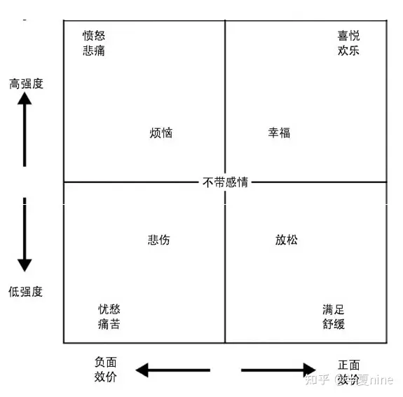

# 第一部分 体验引擎

游戏设计既不是存在与游戏的代码，艺术风格和声效里，也不是存在于棋子或棋盘中。游戏设计意味着精心打磨一些规则，而一些规则能够赋予游戏中的事物以灵魂

- 设计技巧：把故事和规则串成一个系统

- 设计流程：设计师知道如何通过测试、计划以及分析找到答案。

设计技巧并未定义游戏的目的 而是告诉我们如何去达成目的。

## 1 体验引擎

### 1.1 游戏机制和事件

游戏有许多机制组成，这些机制定义了游戏如何运行

在游戏中，游戏机制和玩家之间的交互就会产生事件

#### 1.1.1 情感是首要因素

事件必须激发某种情感才有意义（让人共情）

游戏中有价值的情感可能十分微妙，以至于在通常情况下，玩家甚至不会注意到

感知并理解细微的情感是一种设计能力

游戏中的情感绝不只是“有趣”而已

一些游戏会利用强烈的竞技性来激发获胜者的满足感，有些游戏会利用故事叙述的手法创造出各种奇迹 或者让人们产生共鸣

#### 1.1.2 情感触发器

你的潜意识会不断分析你的处境和状况。当达到特定条件的时候，潜意识就会触发相应的情感

情感触发器是指能过激发情感的事物或者意见（e.g., 身体感知的危险、人际关系、社交状态的改变、学习、锻炼、性暗示...）

#### 1.1.3 情感和改变

事件必须改变一些对人类而言有价值的东西才能激发情感（生命/死亡）

人类价值是指对人们而言很重要、并且可以在多种状态之间转换的事情

和情感有关的并不是事件本身，而是时间带来的人类价值的改变。被改变的人类价值越重要，改变得越频繁，产生的情感越强烈

除了改变，参与改变也会出现情感因素

显示信息和改变信息所导致的情感其实是一样的（知道了一个事实和改变了一个事实）

#### 1.1.4 情感黑盒

我们无法得知情感触发器背后的逻辑

尽管不知道原因，但我们还是先给情感分配一个原因，然而这种原因往往是错的

由于情感错位，想要了解游戏如何影响我们是十分困难的（伟大的设计师很会找到“原因”，如Kojima）

### 1.2 基本的情感触发器

#### 1.2.1 学习引发的情感

一种知识所包含的人类价值越重要，我们学习他的动力越大

一种知识越是复杂和难以掌握，学会它的成就感就越大

当玩家得到某些新的信息，如果他突然明白了原有信息的含义，那么就是有所领悟。比如，当看到移动的光点时，就可以知道狙击手的位置；或者当我们看到敌方的农民时，就可以对敌人 的基地发起反击。如此一来，我们也许可以置之死地而后生，或者反败为胜。

#### 1.2.2 角色弧线引发的情感

我们可以随着游戏的进程来创造角色弧线。安排故事冲突，因为只有在冲突过程中，人的内在价值和能力才会展现出来。他们面对的冲突越强烈，我们对他们真实 本性的了解就越深入。

#### 1.2.3 挑战---

#### 1.2.4 社交---

#### 1.2.5 财富---

#### 1.2.6 音乐---

#### 1.2.7 美---

#### 1.2.8 环境---

#### 1.2.9 新技术---

#### 1.2.10 原始威胁---

瘀血、蜘蛛

#### 1.2.11 性暗示---

### 1.3 虚构层（The Fiction Layer）

当游戏机制通过虚构的情节包装之后就会具有另一个层面的情感意义

#### 1.3.1 虚构和游戏机制的对比

都可以产生不同类型的情感。没有虚构层难以产生沉浸，幽默，恐惧，共鸣等情感

虚构和游戏机制很容易相互影响。如“箱子”很难舍弃

由于虚构和游戏机制之间总是会相互干扰，于是许多游戏会选择重点突出一个，而完全忽略掉另一个。

两者经常有冲突，但只是表面现象，游戏设计最高境界是将完美的游戏机制和引人入胜的虚构情节无缝结合成一个具有深远含义的系统

### 1.4 构建体验

体验是存在与玩家脑海中的情感想法以及决策

#### 1.4.1 纯粹情感

#### 1.4.2 并列

juxtaposition指的是吧完全不同的貌似不兼容的一些感觉组合在一起

#### 1.4.3 对立的情感

比如由共享所带来的社交乐趣经常会被残酷的技巧性竞争所破坏。

又比如巫师3中Gwent的悲伤时刻和“太棒了！”

#### 1.4.4 氛围

#### 1.4.5 情感变化

为了更新鲜的体验，游戏甚至可以让玩家的情感经过上图每一个角落

#### 1.4.6 心流

心流是一种注意力高度集中的状态，等同于全神贯注。

#### 1.4.7 沉浸

沉浸指的是，玩家自己的思维和他在游戏中的角色融为了一体，于是发生在游戏角色身上的事件对玩家 来说也意义重大，就好像这个事件是真实地发生在玩家自己身上一样。

情绪二因论指出，情绪是由生理唤醒（physiological arousal）和认知因素（cognitive label）这两部分所组成的。

**为了能够真实反映出游戏角色的体验，我们可以通过3个步骤来实现。首先，通过制造心流，把真实世界 从玩家脑海中剥离出去。其次，通过游戏机制所创造的威胁和挑战来激发唤醒状态。最后，利用虚构层来重新标识这个唤醒状态，使玩家的感受能够感受到的情感和游戏角色的感受完全匹配。**

游戏是这种制造体验的人工系统。

# 第二部分 游戏制作

## 2 优雅

### 2.1 浮现的优雅

良好的游戏设计意味着最大化情感力量（刺激）和多样的游戏体验，同时最小化玩家的理解成本和游戏开发成本（简单易懂）。这种高效的形式我们称之为“优雅”。

浮现指的是通过简单机制的交互而创造出各种复杂情况的时刻。

促进浮现指的是精心打造一些游戏机制，这些机制并不是简单叠加在一起，而是能够通过相互作用引发大量可能体验。

当各种机制通过复杂不明显的方式交互的时候，游戏的设计就会变得优雅。但这种复杂和不明显也使得实现优雅的设计非常困难

一个优雅的有序允许所有交互，可以创造许多玩法，同时不会增加玩家学习成本。

### 2.2 我喜欢在早晨闻到优雅的味道

通过训练获得这种直觉和精神启发。

和多数其他游戏机制交互的那些游戏机制有可能是优雅的。如果这个机制和许多其他机制都有交互，那么它很有可能是优雅的设计。如果它只和一两个机制有交互，那么有可能就不是。

简单的机制可能是优雅的。

能够以多种方式使用的机制可能是优雅的。

与其他机制作用不重复的那些机制可能是优雅的。

对已建立的用户习惯和界面重复利用的机制可能是优雅的，因为它们利用了玩家已经掌握的知识。原创游戏设计也可以使用普遍接受的符号和界面来传达其独特的内容，而游戏也会受益匪浅。

和已存在的机制规模相类似的那些机制可能是优雅的。

频繁地重复使用的机制有可能是优雅的。

不对游戏内容施加限制的机制有可能是优雅的。

能够充分利用已有界面表现能力的那些机制可能是优雅的。即使控制界面只是一个按键，游戏也可以在按钮被松开或者被一直按下时做点文章，而不是只有按键被按下时才有反应。

## 3 技巧

能够产生心流的优秀体验存在于难度大（让人沮丧）和难度简单（让人无聊）的Goldilocks zone。技巧性的处理意味着需要理解技巧性的上限与下限。如果游戏超过技巧性上限，就会导致挫败感太强，但是如果低于技巧性下限的话就会变得无聊。

### 3.1 深度

深度游戏能够通过高水平的技巧创造有意义的玩法。

一个游戏的技巧上限指的是技巧的级别已经达到无法再进一步改进的程度。如果这个技巧的级别超越了 人类的极限，这个游戏就是一个无止境的、不能被任何人完全掌握的深度游戏。e.g.，象棋

### 3.2 无障碍

无障碍游戏对技巧要求低。Skill Barrier是指玩这个游戏必须掌握的基础技巧。e.g., FPS障碍高。
### 3.3 技巧范围

Skill range 指的是一个游戏展现其挑战性所需要的技巧级别的范围

宽泛的技巧范围意味着一个游戏可以让初学者和专家都觉得好玩，这种游戏很容易上手却很难精通。（如任天堂大乱斗）
### 3.4 技巧范围的延伸

- Reinvention: 随着玩家技巧的提升，游戏会不断的进行自我再造扩展其技巧范围。

- 根据技巧范围的不同，游戏往往会经历三种典型的再造阶段: 手动阶段（manual）、情景阶段 （situational），以及心理阶段（mental)。

- 弹性挑战: 允许不同程度的成功或者失败，因此为不同技巧范围的玩家提供了相匹配的挑战。（动态难度）

- 我们也可以体现不同程度失败。e.g., AI角色不会死亡，而是失去行动力需要救援。

- 训练: 好的训练方式是潜移默化的。有些游戏甚至提供适应性的训练方式：不同于按部就班的教学顺序，只有在察觉到玩家缺少某种知识的时候，教学内容才会出现。 （《毁灭战士永恒》中只有遇见相应的怪或道具才会出现相关教程。）如果不想让玩家在越过技巧障碍之前就放弃游戏，可以利用一些需要技巧的情感触发器让他们体验某种能够维持的情感。e.g., 多人棋盘游戏每次失误会受到朋友嘲弄，而单人则少了很多乐趣

- 改变难度: 隐式难度选择允许玩家通过战略性决策来调整难度的级别。e.g., 选英雄

- 处理失败: 不要因失败而惩罚玩家，找一些其他的方法来产生紧张感。（魂除外）避免失败陷阱出现（指玩家长时间停留在某种肯定会失败的状况）

## 4 故事

虽然游戏很像电影，但工作机制截然不同

根据玩家的选择来创造，修改或者重新塑造一个故事，让他能深化玩家做的每一件事的意义
### 4.1 故事叙述工具

故事的叙述工具粗略分成三种：脚本故事（scripted story）、世界性故事（world narrative），以及浮现的故事（emergent story)。

### 4.2 脚本故事

脚本故事最基本的工具是过场动画。不幸的是，过场动画会不可避免地破坏游戏流程，因为它会屏蔽所有的交互行为。如果过场动画太多，在游戏和过场动画间来回切换时，会给人一种停停走走的感觉。这并不是致命的问题，因为在两段紧张刺激的游戏过程之间插入过场动画能够让玩家适当地放松和休息。

#### 4.2.1 软脚本

脚本序列是一种加入了少许控制的脚本故事。这种软脚本的好处是它不会破坏当前的游戏流程，因为玩家仍然可以进行一些操作，而其缺点是它剥夺了游戏设计师的控制权。

### 4.3 世界性故事

世界性故事指的是一个地方所发生过的故事，包括它的过去以及相关联的人们。这些故事是通过建筑物，以及身在其中的事物来进行叙述的。它能避免许多因运行脚本事件的同时还要与玩家交互所产生的问题。如果游戏世界观一致，并且表现出更多内在联系的时候，世界性故事的效果就会得以加强。

避免了运行脚本事件的同时还要与玩家交互所产生的问题。

当游戏的世界观更加一致，并且表现出更多内在联系的时候，世界性故事的效果就会得以加强。

### 4.4 浮现的故事

浮现的故事指的是在游戏过程中，通过游戏机制和玩家的交互而产生的故事。

妄想（apophenia）是人类与生俱来的一种能力，通过这种能力可以从复杂的数据中看到自己想象的图案

抽象（abstraction）展示和告诉给玩家的内容越少，留给妄想去填充的空间就越多
### 4.5 故事的顺序

### 4.6 代理权问题

代理权指的是，制订的决策和采取的行为能够影响世界的能力。

玩家和角色动机要一致。“跳桌行为”：由于动机不同，玩家可能做出一些游戏角色做不出的行为。

允许玩家无意识的跳桌，可以极大减少玩家跳桌欲望

我们可以修改虚构层的设定，使得在游戏中不能直接和其他人类（或类似人类）的角色交互是顺理成章的事情。

对话树能预设一系列玩家可以执行的行为，并且让其他角色的反馈相互匹配来处理人类交互。也可以重用一些标准动作

## 5 决策

### 5.1 感受未来

并不是已经发生的事情才能产生情感，重要的是让玩家感受到事情发生的可能性。

如果我们希望一个决策有意义，那么它的结果既不能无法预料，也不能无法避免。也就是说结果必须能够被部分预测。

如果想要预测未来可能发生的事情，首先需要有一个易于理解和具有一致性的系统。

### 5.2 信息平衡

一种设计过程，指通过向玩家提供或屏蔽一些信息，使得某个决策对于玩家来说易于理解同时不至于太过浅显。

如果没有平衡，就会有信息过剩或信息匮乏。

信息匮乏是一种具有隐蔽性的问题，原因有二： 首先，由于设计师自身对游戏的理解十分充分，因而无 法发现这种问题。 再者，即使发现这样的问题在情感上也很难接受。 但有的游戏信息匮乏也是一种设计（比如赌博游戏）

### 5.3 有问题的信息源

来自虚构层面的信息经常会产生歧义，因为玩家无法分辨哪些是正常游戏机制。优秀的游戏决策，包括优秀谜题设计总是会涉及游戏机制的某些特殊用途，并且这些游戏机制的用途是显而易见的。

游戏超信息是指，玩家从游戏以外的真实世界收集到的和游戏有关的信息。

### 5.4 决策和心流

#### 5.4.1 决策范围
决策范围——指制订一个决策所需要思考的内容。

从大到小分为无须决策、快捷决策、战略决策、深奥的决策，以及不可能完成的决策。如果一个游戏具有大量细微的快捷决策，那么它就是一个令人血脉贲张的动作游戏。如果一个游戏具有 一系列沉闷而又深奥的决策，那么它就是一个节奏缓慢的策略游戏。如果一个游戏中具有几乎不可能完 成的脑力挑战，那么它就是一个解谜游戏。

#### 5.4.2 避免心流断层

心流断层是指，玩家的大脑在一段时间之内没有什么东西可以消化。这段时间可能是一秒钟也有可能是一个小时。某些虚构或者审美环节的设计因素也会导致心流断层。比如菜单特效、角色动作动画，以及对话框等等 都会短暂地阻碍玩家的行动，从而在众多决策之间形成断层。

比如游戏中的眩晕效果——眩晕效果在丰富游戏节奏的同时，也会带来一个问题，即被击晕的玩家会被强制进入心流断层。

#### 5.4.3 避免决策溢出

决策溢出是指，由于同时出现过多的决策而使得玩家不堪重负的时刻

#### 5.4.4 决策变化

我们必须遵守的唯一一个心流节奏的准则是：心流节奏需要产生变化。也就是说，不要让玩家经历长时间的缓慢节奏，因为他们会觉得无趣；也不要长时间让玩家处于精神高度紧张的状态，因为这样会让他们感到筋疲力尽。

## 6 平衡性

平衡性调整是指通过调整游戏机制来改变道具、单位、策略、团队或者游戏角色的威力。

### 6.1 平衡性的目的

如果在游戏开始的时候没有任何玩家具备明显的优势，我们就说这个游戏是公平的。

所谓策略是指玩家为了某种目标所采取的具体行为的组合。如果寻找最佳策略的思维过程更加细致入微，游戏的决策也会更加丰富

### 6.2 策略退化

指一个策略很明显策划稿你为了当前最好的选择

有时增加策略不会增加游戏深度（参见之后纳什均衡）

### 6.3 平衡的技巧

对于技巧性的游戏来说，让所有技巧水平的玩家都感到平衡几乎是不可能的。设计师必须决定，他希望在哪种技巧水平下的平衡才是游戏的目标，并允许游戏在其他技巧水平下的策略退化。

而对于竞技强度不是很高的游戏，设计师应该平衡中低技巧水平。

### 6.4 平衡性的挑战和解决方案

调整一个机制不仅会改变我们希望改变的策略，同时也会改变所有与其相关联的策略。

#### 6.4.1 平衡的方法

找出一个道具基础的作用和特性。尽可能的最大化这些特征，并把他们固定在最大化的位置。然后，通过调整其他特征来解决平衡性问题

为了解决问题，删除再多东西也要忍痛割爱。

不要冲动。

不要通过反馈来收集建议，要收集*用户体验*！

从作用和虚构含义而言，以上提到的都是这些道具的基本属性。所以，尽可能地最大化这些特征。比 如，让火箭背包能够非常迅速地把人发射出非常远的距离，或者让盔甲变得坚不可摧。一旦我们把这些 特性调到它们的极限，道具的作用就变得非常清晰和明显了。同时，游戏体验的广度也得到了扩展，并 且当玩家在更为广阔的可能性空间进行探索的时候，更多的策略就会随之出现。

不要只思考听到的故事。通过大量的测试在脑海中构建一种思维模型，从而清楚的了解到游戏作为一个系统运行的效果。只有到了那时，你对游戏才会有一个大致的了解，才能基于此做出具有平衡性的决策。

## 7 多人游戏

### 7.1 博弈论

博弈论能够帮助设计师分析玩家必须对彼此的行为做出预测和回应的状况。

博弈论的核心是“纳什均衡”——如果在一种策略配置中，每个参与者都无法凭借独自改变自己的策略来获得更高的收益，那么这种策略 配置就称作纳什均衡。

只含有一种纯粹纳什均衡的策略交互是游戏设计的一个败笔，因为最终总是会导致出现相同的纳什均衡 的情况。也就是说，对于每一个玩家而言，真正可行的选项只有一个，所以也就不存在真正的决策了。

星际争霸2：猜硬币的博弈

混合的纳什均衡：预设一系列具有固定概率的策略，然后让玩家从中随机选择一种

混合策略纳什均衡的关键是：在均衡状态下，每一种可选的出招都具有相同的收益。

### 7.2 心理战

心理战（Yomi）是一种思维博弈的游戏，这种游戏通过预测对手的动向、欺骗对手，以及使用计谋等方法获取博弈论数学因素以外的优势。

当玩家能够流畅地组合使用各种策略时，就会产生心理战。

复杂和难以量化的收益能够产生心理战。

随机心理能够产生心理战。

操纵信息能够产生心理战。

心理战要求玩家的数量不能太多。

### 7.3 破坏性的玩家行为

目标分歧（Divergent Goals）如果玩家追求的某些目标破坏了其他玩家的游戏体验

蓄意破坏（Griefing）为了让自己获得乐趣而故意对其他玩家的游戏体验造成破坏的行为

## 8 动机和实现

### 8.1 多巴胺的快乐（Dopamine Pleasure）

多巴胺不是带来快乐，而是带来动机

### 8.2 多巴胺动机

我们可以想要某些不喜欢的东西，或者喜欢某些不想要的东西

### 8.3 奖励预期

我们制造多巴胺动机最主要的方法是制造令人期待的奖励

### 8.4 强化程序

强化程序是一个由许多规则组成的系统，这些规则定义了玩家什么时候会得到奖励。目前已经有无数种强化程序，其中最重要的两种是“固定比例”（fixed ratio）和“可变比例“（variable tatio)。

固定比例的强化程序是一种比较差的动机。它会让玩家长时间都处于沉寂的状态，只有当玩家想要得到 下一个奖励的时候，他才会再次活跃起来。这种长时间的碌碌无为很容易造成玩家流失。

玩家在面对可变比例的强化程序时，总是有机会在下一次行为中获得大量的奖励，所以玩家的行为总是 频繁和连续的。

一个固定时间间隔（fixed interval）的强化程序会在玩家得到某个奖励之后，经过一段固定的时间再次产出奖励。

一个可变时间间隔（variable interval）的强化程序使得玩家在拾取某个奖励之后，经过随机的一段时间 就可以重新获得该奖励。

叠加的强化程序。

浮现的强化程序。

### 8.5 外在和内在动机

外在奖励可以取代甚至摧毁游戏自身所能够提供的满足感。

外在奖励指的是活动本身以外的奖励。比如，击败兽人所得到的金币就是一种外在奖励，因为金币本身和击败兽人这个行为无关。相比较而言，内在奖励和它所属的活动本身是不可分割的。如果击败兽人这 种行为本身就会让人觉得愉快，玩家就会因为这个内在动机去击败兽人，即使并不会因此而获得任何奖励。 （比如让兽人掉落金币会减少玩家自身想要击败兽人的渴望）

#### 8.5.1 奖励的一致性

奖励的一致性是指奖励系统鼓励玩家做出的行为十分接近玩家在没有奖励的情况下所做出的行为。设计奖励的目的在于构建一种可以检测和正确地给予玩家奖励的系统，而这些奖励应该是玩家本身就想 要的东西。既然每一个游戏的情况都有所不同，那么每一个游戏都要有一种独特的，并且精心制作的奖励系统。（《鬼泣》的评分系统、跑酷游戏中做出不同动作获得不同分数）

### 8.6 玩家的悔恨感（Player's Remorse）

如果给予了玩家动机但是没有让他获得满足，就会产生悔恨感

## 9 界面

没有被传达到的消息和没有发生过一样

### 9.1 象征

象征是指把一个我们所熟悉的外表给予一个新事物，使它更容易被理解。

游戏机制其实是只实现了真实事物的一小部分功能。

每一个游戏都必须创建自己的象征词汇表。比如，带有长条纹标记的墙面说明这里可以贴着墙跑。一块很特别的突起砖块暗示它可以用于攀爬。这些元素通过早期一些非常简单的谜题就已经让玩家了解了。

### 9.2 信号和噪声

噪声是指未能传递有意义信息的一种信号。

噪声主要有两种成因：复杂的美术效果和过多的信号。

复杂的美术效果会产生噪声。 在一个充满灰色图形的世界里，每一个敌人、目标、道具，以及路线都很 容易被发现。因为屏幕中的每一个形状都有其特定的含义，玩家不需要过多的思考就知道什么东西很重 要。但是当我们增加了美术效果之后，整个世界立刻被各种与游戏机制无关的绚丽线条和颜色所填满。 于是，我们的大脑必须挑选出有实际意义的图形，而有时候这并不是一件简单的事情，于是信号就变成了噪声。

玩家在同一时刻只能接受一定数量的信号。如果信号的数量超过玩家能够接受数量的上限，这些信号就 会被玩家所遗漏，并最终变成噪声。

在视觉层次中，所有的东西都会立即出现，但是更重要的信息将会更加显眼，以便人们在第一时间就能够注意到它们。
### 9.3 冗余

冗余指的是，即使玩家错过了一半的游戏内容（这是一个相当合理的比例），仍然可以理解那些重要的部分。

同类冗余是指用同样的方式多次传递同样的信息。

可变冗余是指用不同的方式多次传递同样的信息。

被动冗余是指，如果玩家没有接收到游戏中的首要信息，游戏将会显示次要信息再次提示玩家。

### 9.4 间接控制

间接控制方法可以在玩家不知情的情况下对玩家的行为进行引导。

间接控制有三种基本方法，分别是：微影响（nudging）、灌输（priming），以及社会模仿（social imitation)。

#### 9.4.1 微影响

微影响指的是，在不改变既有选项的前提下，通过改变选项呈现的方式来影响玩家的行为。

我们还可以通过视觉设计来影响玩家。与一个昏暗的门口相比，灯火通明的门口更能吸引玩家。

#### 9.4.2 灌输

灌输是指通过激活玩家脑海中的某些概念而影响到他们后来的行为。比如当玩家去看医生的时候，他们就会自然而然地想到治疗。

社会模仿（social imitation）是指玩家很自然地会效仿他人的行为。

比如在赛车游戏中，如果让计算机控制的赛车在转弯前减速的话，玩家也将学会这么做。

### 9.5 游戏输入

输入设计的目的是，让玩家的预期和游戏中的行为同步。

有两条关键原则能够指导我们将各种操作与游戏中的行为对应起来，它们分别是：映射（mapping）和操作互斥（control exclusivity）。 映射是指各种物理界面元素和它们所控制的行为之间的关系。操作互斥是指不同操作，以及这些操作如何组合使用之间的一种物理关联。

操作感（Control Feel）通过某个界面传递自己的意图而带来的即时体验。可以通过一些微小的无效区域或者额外的几个过渡帧来消除玩家操作的无效输入。

输入协助（input assistance）是针对玩家的原始输入所做的预处理。

操作延迟是指，从游戏接受一个输入到该输入所对应的反馈显示出来的时间延迟。一个游戏的操作延迟的时间长度决定了玩家必须提前多久做出预测。

## 10 市场

### 10.1 设计目的

### 10.2 市场竞争

#### 10.2.1 马太效应

#### 10.2.2 创新者困境

### 10.3 细分市场

最好的市场策略是找到一块未开发的细分市场。但是这种策略的难度和风险都很大，因为没有很好的方法可以衡量未开发的细分市场。

价值曲线是一种游戏对比图，根据市场价值打分

《盖瑞模组》是第一人称视角游戏，但是它并没有和《生化奇兵》或者《杀出重围》的关键价值形成竞争，反而通过提供那些游戏没有的特性而避免了正面冲突，即千奇百怪的创意性。

游戏中的重要价值是指那些可以超过市场中其他游戏所提供的价值的价值。除了重要价值以外的其他价值则无需超越其他游戏
### 10.4 没有人什么都知道！

### 10.5 证实偏见

证实偏见（confirmation bias）是指人们在认知事物时，总是倾向于证实他们已知的证实偏见（confirmation bias）是指人们在认知事物时，总是倾向于证实他们已知的观点。

# 第三部分 流程

失败的游戏设计流程通常来自于我们不知不觉之中所做出的根深蒂固的假设

- 借鉴的假设
- 天生的假设
  - 认知偏见
  - 光环效应
  - 损失厌恶
  - 可得性启发

## 11 规划和迭代

### 11.1 规划过多

### 11.2 规划过少

### 11.3 过多和过少

游戏设计在现代创意性工作中显得与众不同，因为在其规划中充斥着大量的不确定性。

### 11.4 迭代

迭代是一种实践：制作短期的规划，开发并测试这些内容，然后重复这个过程。

### 11.5 规划周期

规划周期是指设计师对未来所做规划的时间跨度。

非原创的、衍生的游戏可以规划的相对长远。反之则反。

正确规划周期应该随着项目的进展逐渐延长。

测试的代价小的时候，应该使用较短规划周期。

### 11.6 为什么规划的太多

人类天生就怀有一颗自负之心。 心理学家将这种现象称之为“乐观偏差”（optimism bias）。人类的某 种心理会让我们把实际上只有30%的自信膨胀为90%.

处于集体中的人们会很自然地奖励过度自信的行为，而不是理性的不确定行为。自信的领导者就会比务实的领导者获得更多的追随者。不确定性被领导者的威信所掩盖，而过度规划引发的问题就会随之而来。

后见偏差是一种认知偏差，它会悄声无息地将记忆中的内容重新编排，使得曾经发生的事情看起来比实 际上更容易被预测。

### 11.7 测试协议

### 11.8 灰盒

不要有早产型创作

### 11.9 品质的矛盾性

允许较低品质最终可能会使成品质量更高

### 11.10 幻想的误区

### 11.11 机缘巧合

能够发现机缘巧合的设计（如模拟房间->模拟人生）需要敏锐的观察力以及强大的适应能力。

游戏设计是一个不断观察和发现的过程。

### 11.12 相信迭代

## 12 创造知识

为了避免这种文化层面的回音室效应（指的是在封闭的环境中，一些固有的信息、观点，甚至信仰都会被不断放大和加强），游戏设计师必须培养独特的兴趣。

研究、思考、讨论、测试模型、计算、创造、测试

## 13 依赖性

依赖性是指设计中两个部分之间存在的某种关系。使得其中一个部分发生变化时。也会迫使另一个部分发生变化。

依赖堆栈是一种简单的、能够识别设计因素中关键依赖关系的分析方法。它能够帮助我们确定哪些是当 前应该做的工作，哪些是之后应该做的工作。

e.g., 如果没有哥布林的袭击，陷阱和防御工事的作用就不大。没有搏斗系统，哥布林的袭击就无法实现。如果没有围墙和游戏角色，搏斗也就毫无意义。围墙需要被建造，而建造工作又需要游戏角色来执行。每一个设计因素都依赖于位于其下方的其他因素。

底层系统在实现和测试的时候几乎肯定要发生变化，而这些改变又会波及其他方面的设计，并且迫使这 些设计做出改变。从依赖堆栈底部的内容开始迭代，随着迭代的进行逐渐向上开发

设计backlog是一种无序的流动的储藏库，里面保存了各种想法、概念，以及尚未实现或者短期内不会实 现的内容。应该把大多数灵感记录在设计backlog里。

只有在底层系统已经足够坚实和确定的时候，我们才能向依赖堆栈添加其他内容。

核心玩法是指，处于游戏的依赖堆栈底部的那些不可删除的机制。删除所有能够被删除，并且不会让游 戏变得毫无意义的东西，剩下的就是核心玩法。(see also Game Planner Shuchu Koza 大师吉泽秀雄谈游戏设计：创意与节奏)

## 14 权利

给予团队成员一定的权利。

霸占（arrogation）是指夺走那些原本属于他人自然权利的决策权

下属必须向上沟通

## 15 动力

大多数员工在大多数情况下都提到外部奖励完全没有起到激励他们的作用，同时最看重金钱的那些员工 在创造力方面并不是很出众。

在绝大多数情况下，被采访的员工都觉得最大的驱动力来自于挑战、社团，和同事之间的友谊，以及主人翁意识。而所有这些因素都会受到金钱奖励的影响。

“自我奉献”

## 16 复杂的决策

设计效应是指决策对游戏所产生的影响

开发成本是指执行一个决策所需的资源

不成熟的负担是指由于手头工作不得不依赖于游戏中某些未完成的部分导致的成本

重大故障风险是指因系统不成熟引起的重大故障所带来的成本

流程负担是指对工作进行跟进和规划所需的成本

政治效应会影响开发者之间的关系

文化效应会改变开发人员的习惯以及开发团队的风气

决策成本是指制定正确的决定所需的成本

## 17 价值

价值是在情感的驱动下我们对想要成为什么样的人的一种选择。这是人类所追求的一种品质。从来没有人能够把他们的价值具体化但我们通过不断尝试来完善工作和我们自身

游戏是生活的缩影

最棒的游戏还没被创造出来