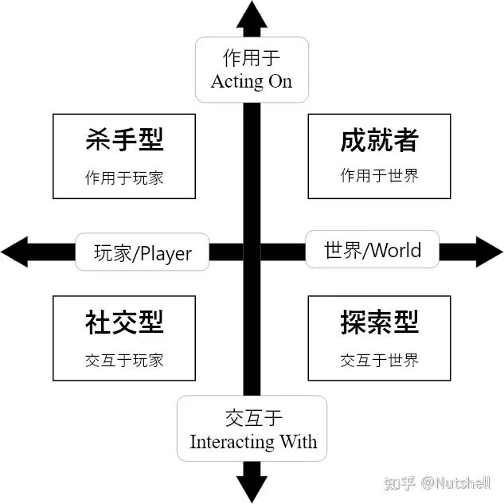
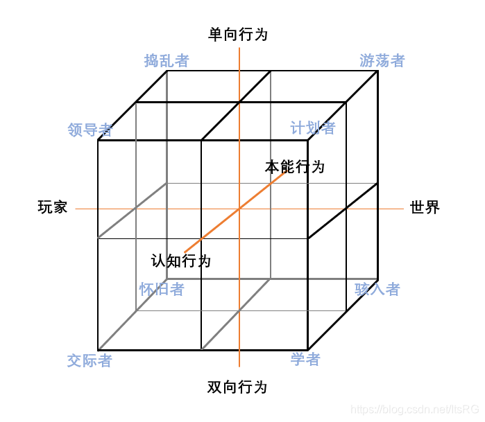

# 玩家分类法

https://zh.wikipedia.org/zh-cn/%E5%B7%B4%E7%89%B9%E5%B0%94%E7%8E%A9%E5%AE%B6%E5%88%86%E7%B1%BB

## 巴特尔玩家分类法

理查德·巴特尔 (Richard Bartle) 是多用户游戏领域的先锋，第一个多人参与的MUD(Multi-user Dungeon，多用户地牢)游戏的联合开发者。MUD 游戏让多个用户可在同一个虚拟的世界中一起探险，并且让用户能与其他玩家进行互动。巴特尔和他的合作者们在创造 MUD 的过程中细分了玩家的行为并以此启发设计师。他在 1996 年发表了篇题为《牌上的花色--MUD 中的玩家》(Hearls，Clubs，Diamonds，Spades : PlayerWho Suit MUDs) 的论文，将 MUD 游戏中玩家的行为分成了4个基本类别。尽管在这后有很多研究对完善玩家分类的拓扑图谱做出了贡献，巴特尔的分类始终以其简单和广泛性受到欢迎和认可。

成就型玩家(Achievers)(方片) 主要关注的是如何在游戏中取胜或达成某些特定的目标。这些目标可能包括游戏固有的成就或者玩家自己制定的目标，比如:“我要达到 80级”,“我要在排行榜上名列前茅”,“我要挣到 100 万个金币”，或者“我要在3 个小时之内只用这把刀把这个游戏打通关”··.···

探险型玩家(Explorers)(黑桃)尝试在虚拟世界的系统中寻找一切他们所能找到的东西。游戏设计师通常属于这一类型。收集爱好者也是探险型玩家中的一类。口袋妖怪(Pokemon) 就是一个对探险型玩家很有诱惑力的游戏--玩家不仅可以在地图上探险来探索虚拟世界的广度，而且细致及透明的战争机制对用户而言也很有趣且易学，让用户对探索游戏机制产生极大的兴趣。那些在游戏中试图搜集所有可能得到的物品的玩家都是典型的探险型玩家。

社交型玩家(Socializers)(红桃)享受在游戏过程中与其他玩家的互动。除了人类起游戏的社交本能，他们喜欢利用公会和团队的机制来进一步强化自己的社会存在感。

杀手型玩家(Killers)(梅花) 喜欢把他们自己的意愿强加给他人。杀手型玩家又可以分为两类: 有一类杀手型玩家在游戏中杀人是为了显示他们的强大，而另一类玩家的目的是骚扰或激怒其他人，我们把这部分玩家称为“破坏者”(griefers)。

巴特尔用两条轴线分出的 4 个象限来分析这 4 种不同的玩家。X 轴从左至右分别是玩家(Players)和世界(World)，Y轴从下至上分别是“交互于”(Interacting With) 和“作用于”(Acting On)。成就型玩家倾向于作用于世界，探险型玩家倾向于交互于世界，社交型玩家倾向于交互于其他玩家，杀手型玩家倾向于作用于其他玩家。

ref: https://www.zhihu.com/tardis/zm/art/667471959?source_id=1003

## 马克·罗斯沃特万智牌分类

万智牌首席设计师马克·罗斯沃特（Mark Rosewater，常被称为 MaRo）将《万智牌》玩家群划分为两大维度：心理特征分类（Psychographic Profiles）和审美特征分类（Aesthetic Profiles）。这两套分类体系是威世智（Wizards of the Coast）设计和营销卡牌时的核心理论工具。

注：感觉简单分为强度 / combo爽感 / combo冷门 三类

### 心理特征分类（玩家为什么玩？）

该分类探究玩家在游戏中的核心驱动力和心理动机（Why They Play）。最初使用男性化名字，后在 Magic 官网的 Making Magic 专栏 中补充了女性化对应名称：

- 提米 / 塔米（Timmy / Tammy）：追求游戏体验者核心动机： 寻求感官和情感上的直接刺激。特征： 喜欢身材巨大的生物、效果震撼的咒语以及能够带来戏剧性转折的场面。他们不在乎胜率是否最高，而在乎“赢的那一次是否足够爽快”。

- 强尼 / 珍妮（Johnny / Jenny）：追求自我表达者核心动机： 把卡组视作展现聪明才智和创造力的媒介。特征： 痴迷于发掘冷门卡牌之间的奇特联动（Combo），喜欢构筑独特、具有个人标签的娱乐或说书卡组。对他们而言，用自己发明的奇葩套路赢一次，远比用抄来的毒瘤卡组赢十次更快乐。

- 斯派克（Spike）：追求证明自我者（竞技型玩家）核心动机： 享受竞争的肾上腺素飙升，通过胜利来证明自己的技术。特征： 极为关注胜率、最优解和对局细节。他们会无情地寻找环境中最强的套牌（T1卡组），并乐于在复杂且高强度的竞技对抗中击败对手。

### 二、 审美特征分类（玩家认为游戏的什么最美？）

该分类不探究输赢动机，而是观察玩家如何鉴赏和评价一张卡牌的设计（What They Appreciate）

- 沃索斯 (Vorthos)：深度痴迷于万智牌的故事线、背景设定、卡牌插画和风味叙事（Flavor Text）。他们会因为“剧情不合理”而讨厌某张牌，或因为喜欢某个角色而把其组进卡组。

- 梅尔 (Mel / Melvin) ：欣赏卡牌机制的数学美感、规则的严谨性以及设计上的精妙与优雅。他们更看重一张牌在游戏系统内的结构是否完美，而不在乎它的插画或背景故事。

## 三、玩家八分类法则——四分类法则的进阶

其实巴图博士很早以前就分析了MUD1的玩家数据，发现了大多数玩家几乎都跟随了一个特定的类型转变规律，即：

杀手型→探索型→成就型→社交型

杀手：玩家在首次进入虚拟世界时，不再受现实社会的法律与道德的约束，便通过击杀其他玩家的方式来获得新鲜感；

探索：不久后这一“新鲜行为“也不再新鲜有趣，他们便开始探索游戏世界，寻找其他乐趣；

成就：在探索中他们又了解到了游戏的点数系统，便开始收集点数升级；

社交：最终在他们达到高等级时，虚拟世界中几乎没有能给他们带来挑战的事物了，他们也完全掌握了游戏的机制，他们就在大厅里与朋友互动交流着，享受老友之间的社交时光。

这样的解释听上去比较合理，但却只是一个猜测，难以验证真实性。

我们之前有提到过，四分类法则针对两个维度来分类玩家，而在巴图博士后来的研究学习后，他添加了另一个至关重要的维度——玩家行为是出于本能还是出于对游戏知识已有的认知（Player actions are implicit or explicit）。

简短的描述难以清晰的称述该维度的具体界定范围，因此需要特别给予定义。

本能行为：
玩家不需要思考就能直接做出的行为就是本能行为，我们常说的肌肉记忆就是其中之一。

认知行为：
玩家需要在实行前或是实行过程中进行计划并思考才能顺利完成的行为就是认知行为。

Implicit v.s. Explicit

### 成就型

本能行为——游荡者（Opportunist）：
他们在游戏提供的玩法中游离，寻找有趣的内容；他们游玩时通常不会有特定的目标，只是尝试一切可能感兴趣的玩法；他们会持续尝试某种感兴趣的玩法但是如果遇到困难，他们就会去寻找其他事情做。

认知行为——计划者（Planner）：
他们为自己设定挑战并制定计划去实现：他们的行为总是目的性的，为了实现某种目标而实行；当他们在计划中遇到困难时，他们会想方设法的解决出现的问题，而不是中途放弃。

### 探索型

认知行为——学者（Scientist）：
他们根据自身的游玩经验，以及从游戏中摄取的信息来构建对于游戏的理论（可以是背景故事也可以是一些影响游戏机制），他们在探索与尝试中不断学习游戏知识。

本能行为——骇入者（Hacker）：
他们结合与分析游戏中被发现的各种细节信息，尝试找出与其相关的背景，以及各个场景、NPC出现的意义等。通常为毕业玩家，对游戏的大多数系统已经了如指掌，以至于他们中的一部分有了世界设计方面的理解，甚至能够在一定程度上预测游戏未来的走向，故被称为黑客（Hacker）。

### 社交型

认知行为——交际者（Networker）：
他们寻找愿意与他们交流互动的其他玩家，并通过已经建立的社交关系以及游戏中的系统扩大他们的社交网络。在社交的过程中也顺便获得了关于游戏的知识，并且在认识的人中选择他们认为值得的朋友深交。

本能行为——怀旧者(Friend)：
他们只与关系非常好的玩家交流互动，互相有非常深入的了解，他们享受与固定的玩家游戏的感受，并且能够接受彼此的缺点。

### 杀手型

本能行为——捣乱者(Griefer)：
他们眼里只有杀，杀，杀。言行通常十分恶劣，并且难以解释这样言行背后的理由。似乎只想为自己赢得恶人的称号，并臭名远扬。

认知行为——领导者(Politician)：
他们的行为是充满远见并经过充分的考虑的，他们使用游戏中的机制与社交手段控制/引导其他玩家的行为，并帮助他们达到某种目的。这个目的通常是为了获得正面的名声、地位等，例如游戏中的公会会长。

### 巴图博士根据后来的玩家数据分析出的结果，总共有四种主要的玩家类型变化顺序：

主流顺序：
捣乱者→学者→计划者→怀旧者

社交型主流顺序：
捣乱者→交际者→领导者→怀旧者

探索型主流顺序:
游荡者→学者→计划者→骇入者

小众顺序:
游荡者→交际者→计划者→怀旧者

我们很容易就能从这些顺序中找到一个共同点——它们都是从本能行为变化为认知行为，最后回到本能行为。

此外，少数玩家也有可能会从某一顺序转变到另一顺序，但是一定是类型有相交的顺序，并且转变一定发生在相交的类型阶段。

玩家无目的地进行某种行为，来探索限制玩家行为的种种边界

↓

他们把探索中掌握的规律组合起来，形成对游戏机制的猜测

↓

他们验证自己的猜测，并在这个过程中逐渐掌握游戏知识

↓

他们成功的学习了游戏的知识，成为大佬，并且游戏中的行为成为了“肌肉记忆”

这个转换过程和与皮亚杰的认知发展（Piaget’s stages of cognitive development）所提到的四个阶段相符合：

感知运动阶段（依靠动作和感知探索世界）

↓

前运算阶段（学习思维方式和语言以了解世界）

↓

具体运算阶段（理解世界的运行方式但仍需要具体事物例子辅助理解）

↓

形式运算阶段（能够脱离具体事物进行推理与思考）

至此我们完整地回答了玩家为什么会在游玩过程中转变类型，并归纳了转变的规律。

ref: https://blog.csdn.net/ItsRG/article/details/118386322

