# The Art of Game Design

## 1. In the Beginning, There Is the Designer

### Magic Words

##### What is Game Design?

Game design is the act of deciding what a game should be.
That’s it. On the surface, it sounds too simple.

The designer is usually involved in the development of a game from the
very beginning to the very end, making decisions about how the game should be all
along the way.

### What Skills Does a Game Designer Need?

动画（Animation） - 让游戏中的角色更加鲜活，给予它们生命， 开启更广阔的创意设计视野。

人类学（Anthropology） - 准确地找出用户群体，并且分析需求，满足其欲望。

建筑学（Architecture） - 理解人与空间的关系，在游戏世界的构建过程中有一个好的立足点和新的方向。

头脑风暴（Brainstorming） - 不断的想出新的创意。

商业（Business） - 商业游戏的使命，越会用游戏赚钱，越有机会做出成就梦想的游戏。（also 数据分析）

电影学（Cinematography） - 学会穿搭一种在情感上极具吸引力的体验，将游戏过程想象成一部沉浸式电影。

交流（Communication） - 需要和各个领域的人交流沟通，解决问题，满足客户需求和让受众了解游戏的核心想法。

创造性写作（Creative Writing） - 游戏世界像小说中的世界一样，需要这样的能力来构建游戏世界。

经济学（Economics） - 游戏资源构建就是复杂的经济系统，理解经济学中的各种概念原则，对于游戏中经济体系的构建有着很大的帮助。

工程学（Engineering） - 看明白代码。

历史（History） - 如果是负责策划建构在历史背景上的游戏，需要丰富的历史知识，即便是在幻想背景上，许多灵感也是来自于真实历史。

管理（Management） - 让团队可以朝着同一个目标努力。

团队协作

数学（Mathematics） - 数值的计算和分析。

音乐（Music） - 音乐和美术是两个给用户第一印象的点，也是让用户沉浸其中的一个灵魂语言。

心理学（Psychology） - 了解用户，满足用户。

公众演讲（Public Speaking） - 需要把想法表达给别人，必须充满自信和说服力，让他人理解我们现在所做的工作。

声音设计（Sound Design） - 无须多言，耳听为实

技术性写作（Technical Writing） - 编写各种文档来清晰表述复杂的设计。

视觉艺术（Visual Arts） - 任何产品的视觉要素，是影响用户去留的非常重要的因素之一，理解并且有自己的想法，对整个设计有很大的提升。

### The Most Important Skill 

倾听，分为五个领域：团队，受众，游戏，客户以及自己。

这个倾听，是要倾听事物的本质，了解事物的真相

用一颗平静的心和一个静待开放的灵魂去倾听。去除情感，去除欲望，去除判断，去除指责。

### The Five Kinds of Listening
我们需要倾听我们的团队，因为我们需要一起制作游戏和做出各种关键的设计决策，并且一个人很难完全掌握上面所述的所有技能，但是一个团队的智慧加起来就有可能。所以我们需要深层的倾听我们的团队，并且和他们交流，让每个人都变成整体的一部分，分享自己所掌握的技能。

我们需要倾听我们的受众，因为他们是真正来玩我们的游戏的人，如果它们不满意我们的游戏，那么我们所做的一切都是失败的，去了解如何让他们满意，就是深层的倾听他们，想办法比他们更了解他们自身的需求。

我们需要倾听我们的游戏，这表示我们需要了解我们游戏的里里外外方方面面，任何一个问题都知道出在哪里，该如何解决。

我们需要倾听我们的客户，客户是金主爸爸，如果我们给不到他们想要的，他们就会去找下一家，只有学会倾听他们，满足他们，才能保持长期良好的合作关系。

最后还要倾听自己，这将成为无穷创造力背后的秘密。

要真正热爱这份工作，才能成为有天赋的游戏设计师，想要知道是否具备这种天赋，就要开始在这条路上走下去，看看它是否能让我们内心欢快。

所以回到开头，首先要告诉自己

**我是一名游戏设计师**

### The Secret of the Gifted 
There are two kinds.
First, there is the innate gift of a given skill. This is the minor gift. If you have this
gift, a skill such as game design, mathematics, or playing the piano comes natu-
rally to you.

The major gift is love of the work.

## 2. The Designer Creates an Experience

Create artifacts (rule sets, game boards, computer programs) that are likely to create certain kinds of experiences when a player interacts with them.

### 2.1 Experience? Unique to the games?

一本书或者一个电影剧本的作者只是在设计一种线性体验而已。在他们创作的内容以及读者和观众体验到的感觉上有着直接的映射关系。而游戏设计师就没这么轻松了。在体验过程中，我们给予了玩家对各种事件的节奏和顺序极大量的控制。

我们甚至在游戏里加入了随机事件！这使得交互的实体和体验之间的区分比线性娱乐要明显得多。与此同时，这也使得更难确定在玩家内心里到底产生了哪种体验。

### 2.2 追寻彩虹的三种途径

心理学

- 结果就是，现代心理学越向前发展，就离我们所关注的——人类体验的本质越来越远。

- 作为设计师：我们并不关注客观现实世界中的绝对正确，而只关注在主观体验世界中的相对正确。

人类学

- 他们努力客观地观察文化并进行实践，同时不断反思，将自己放在实验对象的位置。

- 我们可以从人类学家的研究中学到很多关于人类本质的重要知识——但更重要的是把文化人类学家的方法引入到我们的玩家中，与他们交谈，学习它们的一切，把我们自己放到它们的位置，我们就能获得客观观点中没有的洞察力。

设计学

- 我们必须开放思维并且勇于实践——优秀的创意能够来源于任何地方，但只有帮助提升游戏体验的创意才是好创意。

### 2.3 Introspection: Powers, Perils, and Practice

Peril #1: Introspection Can Lead to False Conclusions
About Reality

Peril #2: What Is True of My Experiences May Not be True
for Others

### 2.4 Dissect Your Feelings

### 2.5 战胜海森堡原理

“粒子的运动是无法在不干扰粒子的运动的情况下观察到的。类似地，一种体验也无法在不干扰到体验的本质的前提下观察到。”

- Analyze Memories: Not analyzing it while you play, but with the intention of analyzing the memory of it immediately after

- Two Passes: 分析记忆的一种方法是进行两轮体验。第一次别去停下来分析任何东西，只是去感受体验。然后回来再做一次，在这一次去分析每一样东西，可能甚至停下来记笔记。

- Sneak Glances
- Observe Silently

### 2.6 Essential Experience

在尝试设计一种体验时，你的目标是寻找能够定义你所想要的体验的基本元素，并想办法让它们成为游戏中的一部分。

游戏设计师的终极目标是穿搭体验。当你对理想中的体验和它所需的元素有一个清晰的认识时，你的设计就有了方向。

"如果我想做一个打雪球的游戏，那分析一下自己过去真实的打雪球的记忆不是对我要做的这个游戏很有帮助吗？但假如不是在一个真实的世界里和一群真实的朋友玩一场真正的打雪球，那是没办法完美地复制出这种体验的——那创造体验的关键点又在哪里呢？

关键点在于你并不需要完美地复制各种真实的体验才能做出一个好的游戏。你需要的只是为你的游戏去捕获这些体验中的本质就可以了。那“一次体验的本质”又是什么意思呢？——每一次可回想起的记忆都是有着一些关键的特征来界定它的，正是这些关键的特征使记忆显得特别。例如当你回忆一次打雪球的体验时，你可能会想起很多东西。你可能甚至会想到这次体验中一些很本质的内容：“学校的课取消了，那天又下了很大雪，”“我们当时是在街上玩的，”“那些雪很容易裹成一团，”“那天很冷，但是阳光普照——天空是很蓝的，”“当时四处都有很多小孩，”“我们建了个巨大的城堡，”“Fred把一个雪球扔得很高，当我抬头去看时，他又把另一个丢到我头上了！”“我们一直在大笑。”在体验里还有一些部分你会觉得不是本质的：“当时我穿着灯芯绒的裤子，”“在我口袋里有一些薄荷糖，”“一个正在遛狗的男人看着我们。”

作为游戏设计师，当你想要设计出某种体验时，你的目标是找出真正界定了你想创造的这种体验的本质元素，然后寻找各种方法来把这些元素变成游戏设计中的一部分。这样能让你游戏中的玩家能体验到这些本质元素。这本书中大部分的内容都会谈及各种这类的方法，利用这些方法，你打造出来的游戏能让玩家体验到你希望他们体验的。这里关键的一点在于你通常能用与真实体验极为不同的方法来传达出本质体验。回到我们前面说到的打雪球的例子，你能用什么方法在一个打雪球的游戏里传达出“天很冷”的体验呢？假如这是一个视频游戏，那理所当然能用美术图形的方式表达：角色会呼出一团团的白色热气，身体会做不断发抖的动画。你还能用音效去表达，通过刺耳的风声来传达寒冷的感觉。可能你想象到的不一定是寒冷大风的日子，但声效能捕捉到其中的本质，把寒冷的体验传达给玩家。假如寒冷这个概念对你很重要的话，你还能利用游戏的各种规则来表达。比方说玩家在不戴手套的情况下能做出更棒的雪球，但当他们的手变得太冷时，他们就必须带上手套了。这种情况可能并没有真的发生，但游戏规则能传达出这种寒冷的体验是游戏中主要组成部分。

有些人觉得这种方法很奇怪，他们会说：“我们可以光去设计一个游戏，然后看看从中能冒出什么样的体验的！”我想这一定程度上也是对的——假如你不清楚自己想要什么，那你是不用在意自己会得到什么的。但假如你清楚自己想要什么——假如你能想象到游戏在玩家面前呈现出什么样的感受——那你就需要考虑如何去传达这种本质体验了。"

The design of the very successive baseball game in Wii Sports is an excellent
example of the Lens of Essential Experience in use. Originally, the designers had intended to make it as much like real baseball as possible with the added bonus that you could swing your controller like a bat. As they proceeded, though, they realized they wouldn’t have time to simulate every aspect of baseball as well as they wanted. So, they made a big decision — since swinging the controller was the most unique part of this game, they would focus all their attention on getting that part of the baseball experience right — what they felt was the essential part. They decided that other details (nine innings, stealing bases, etc.) were not part of the essential experience they were trying to create.

## 3. The Experience Rises Out of a Game

### 3.1 漫谈定义

A game is something you play. A toy is an object you play with. A good toy is an object that is fun to play with. Fun is pleasure with surprises. 

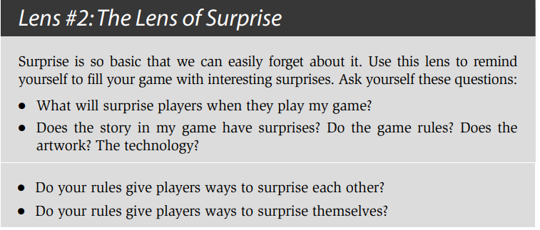

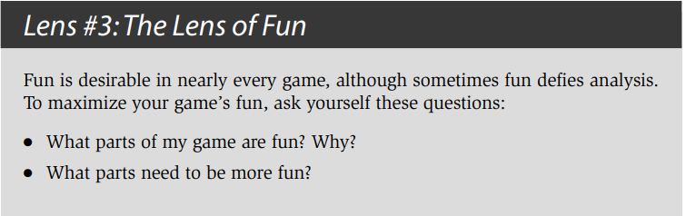

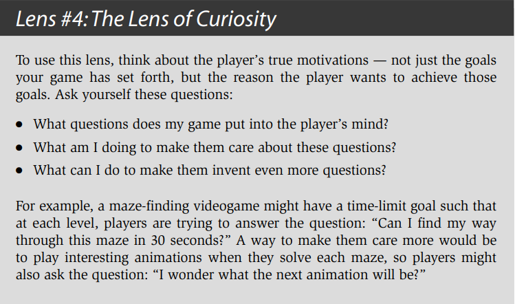

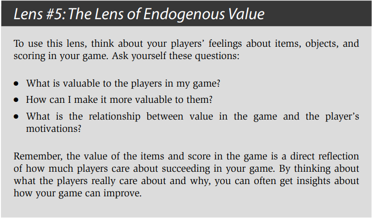

- Games are entered willfully. 
- Games have goals. 
- Games have conflict. 
- Games have rules. 
- Games can be won and lost. 
- Games are interactive. 
- Games have challenge. 
- Games can create their own internal value. 
- Games engage players. 
- Games are closed, formal systems.

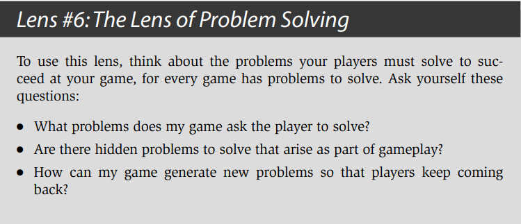

Jesse 认为 除了上面10点，游戏其实包含了解决问题。A game is a problem-solving activity, approached with a playful attitude.

但是诸如Gary's mod, MineCraft的问题是什么呢？如何让自己的创造物更好？Playful attitude，对于严肃游戏有成立吗？

所以给出我的定义：游戏是以自愿和自由为前提，以获得快乐自足为目的，且具有一定交互规则（玩家给出操作，规则给出反馈）的行为活动。

## 4. The Game Consists of Elements

### 4.1 The Four Basic Elements

1. 机制（Mechanics）：机制相当于你游戏的过程和规则。它描述了你游戏中的目标，定义了玩家在尝试达成目标的过程中能做和不能做的事，以及当玩家尝试去做这些事时会发生什么事。假如你把游戏和更具线性的娱乐体验（例如书籍、电影等等）相比较，你会留意到虽然在线性体验中也包含了技术、故事和美感（四元组中的其他三种元素），但它们完全不涉及到机制，因为正是各种机制让游戏成为一个游戏。当你挑选出一组关键的游戏玩法机制时，你需要挑选支持这些机制的技术，挑选用于强化它们使得玩家能清楚了解的美感，以及确定出一个能让各种游戏对玩家显得有意义的故事。

2. 故事（Story）：这是在你游戏中逐步展开的一系列事件。它可能是线性的、脚本预定义的、分支的，或者是突发的。

3. 美感（Aesthetics）：美感是你的游戏在视觉上、听觉上、嗅觉上、味觉上和感觉上的表现。

4. 技术（Technology）：Any materials and interactions that make your game possible such as paper and pencil, plastic chits, or high-powered lasers.The technology is essentially the medium in which the aesthetics take place, in which the mechanics will occur, and through which the story will be told.

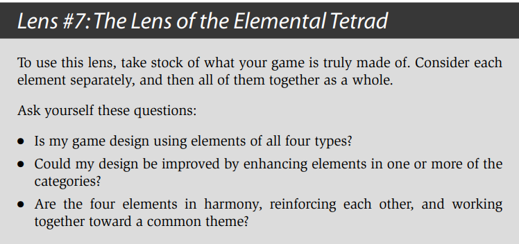

### 4.2 Skin and Skeleton

皮肤（玩家的体验）& 看到游戏的骨骼（组成整个游戏的各种元素）

这是设计师面对的一个很大的挑战：在理解各种元素及其相互关系对体验的影响以及为什么产生这种影响的同时，还需要不断去感觉整个游戏的体验。你必须同时看到游戏的皮肤和骨骼。

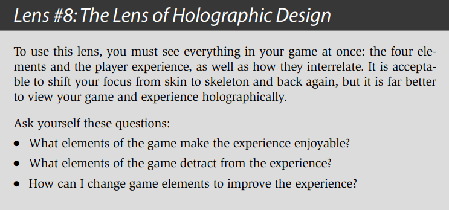

## 5. The Elements Support a Theme

### 5.1 Unifying Themes 

Strengthen the power of your game’s experience. 

*Step 1: Figure out what your them49e is.*

*Step 2: Use every means possible to reinforce that theme.*

主题化的一个简单的例子：他有一本关于大象的书。这本书的创意是很简单的：向小孩子传达一种体验，让他们理解大象到底是什么。在某种意义上，你可以把这本书的主题叫做“什么是大象？”如此，步骤1就完成了。接下来我们去到步骤2：利用每一种可能的方法去强化这个主题。作者把这点是做得很明显的——这本书包含了各种关于大象的文字和图片。并且作者还把这步深化了，他把整本书以及书的封面和内页都裁剪成大象的形状。在每一次翻页里，你都需要找机会去以聪明和难以预料的方式去强化你的主题。

### 5.2 Resonance 共鸣

“experience-based theme” “truth-based theme”

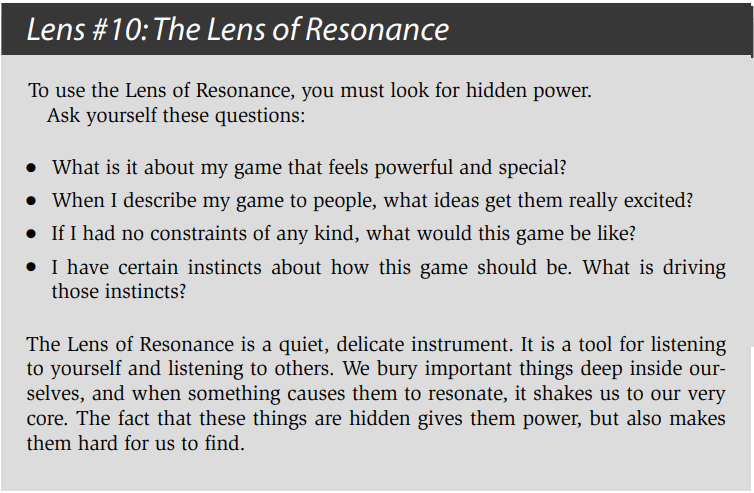

共鸣性的主题能对你的作品增添极大的力量，不过即使你的游戏看起来没有这么一个主题，只要用一个统一的主题去聚焦游戏的体验，那整个游戏也会因此得以强化。

主题并不只是一种象征意义，不会像谜题一般故意留下隐藏的信息。主题会把你的作品聚焦在对玩家有意义的事物上。

### *5.3 注记

- 什么是主题？

主题在音乐创作中叫主旋律，在文章写作中叫中心思想，是观念形态由感性上升到理性后的总结，通过明确主题，让我们更清晰的认识到自己在做的是什么。

- 两种主题

大多数情况下，每项内容都可以抽象出外部主题和内部主题，外部主题需要直接的展示出来，让受众快速理解这是什么，而内部主题普遍会隐藏在外部主题之下，但却是作者真正想要传达的。e.g., 一道菜：
外部主题：一道价值299元的菜品，在食客品尝这道菜之前，厨师需要通过菜品的颜色组合、散发的香气、精致的摆盘，让用餐者食指大动，传达出这道菜值299的感觉；内部主题：不仅要好看，最重要还是要好吃，让食客回味无穷，流连忘返的那种好吃。一部电影：外部主题：电影《热辣滚烫》的外部主题是“破而后立的自我救赎”，在观众去电影院之前，就已经知道这是个励志故事了；内部主题：电影《热辣滚烫》的内部主题是“爱自己”，贾玲在电影中减肥，学习拳击，学会拒绝他人，都只是“爱自己”这主题的外化表象

- 总结：尽早确认主题，可以让我们的设计更聚焦，然后用尽所有方法强化主题，提升主题的传达度

## 6. The Game Begins with an Idea

1. Think of an idea. 
2. Try it out. 
3. Keep changing it and testing it until it seems good enough. 

Don’t look to others for inspiration — look everywhere else.

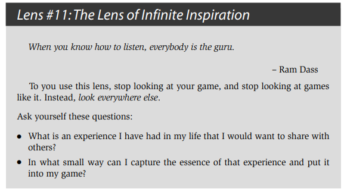

设计的目的是解决问题，好的问题陈述能指出你的目标和约束。例如你最初的问题陈述可能是这样的：
“如何能做出一个青少年真正喜欢的基于网页的游戏呢？”一个完整的游戏设计会包含基本四元组中的所有四类元素，也就是技术、机制、故事和美感。通常你的问题陈述会把你约束到四元素中的一种（或者多种）的一些已确立的决定上。

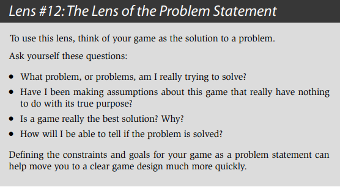

### 6.1 How to Sleep

睡眠不足会导致反应迟钝，记忆力下降，大脑运转效率退步，相当于进入了降智的debuff状态，很难获得灵感。

优秀的设计师会把睡眠的无穷力量的优势利用到极致。如Dali的小睡眠。大部分优秀的、聪明的和创新的创意都不是通过有逻辑和有理可循的过程获得的。真正的优秀创意是随时随地地冒出来的，换句话说它们是从我们意识表层下的某处地方出现的——我们把这个地方称为潜意识，如梦境。

### 6.2 Subconscious Tips

#1: Pay Attention 

#2: Record Your Ideas

#3: Manage Its Appetites (Judiciously)：假如你没有得到温饱上、安全上和健康的个人关系上的满足，那是很难做出体现自我实现的创作性作品的。因此优先让这些事情得到解决，用一些折衷委婉的方案来让潜意识得到满足，如此它才能投入时间去提出各种天才般的想法。

#4: Sleep

#5: Don’t Push Too Hard：你曾经在谈话中想到某个名字（可能是你认识的某个人的名字，又或者是某个你认识的电影明星）却塞在嘴边想不起来吗？于是这时候就开始紧眯着眼睛，努力尝试去把答案从你脑海里逼出来——但它就是不肯出来。这时候你应该放弃并继续下去，先谈一下别的东西。几分钟以后这个答案就会突然从你脑海里跳出来了。你觉得它是从哪里跳出来的呢？这就好像当你转移到其他事情上时，你的潜意识同时也在不断努力去寻找这个名字那样。当他找到答案后，他把答案交回给你。

### 6.3  Brainstorm Tips

#1：写下答案

#2：写字还是打字？

#3：草图

#4: Toys 

#5: Change Your Perspective

#6: Immerse Yourself

#7: Crack Jokes

#8: Spare No Expense

#9: The Writing on the Wall 

#10: The Space Remembers

#11: Write Everything

#12: Number Your Lists

#13: Mix and Match Categories

#14: Talk To Yourself

#15: Find a Partner：不超过4个人的群体是最好的。

## 7. The Game Improves Through Iteration

### 7.1 Choosing an idea

A plan is a real thing. Do get emotionally detached

### 7.2 The Eight Filters

你最终成型的设计最终必须要通过八道考验，或者说是八个滤镜。只有当它通过了所有滤镜后，这个设计才是“足够好的”。

滤镜#1：美感上的刺激：这是所有滤镜中最针对个人的一个。作为设计师，你要问一下自己这个游戏是否让你“感觉对头”，假如的确对头，那它就通过这道考验了。假如感觉不对头，那就需要修改某些东西。你内在的感受是很重要的。这些感受不一定总是对的，但其他的滤镜会帮你把一切平衡过来。

关键问题：“这个游戏感觉对头吗？”

滤镜#2：受众的统计数据：你的游戏是有着一群目标受众的。他们可能是一个年龄区间，或者某种性别，又或者是某类与众不同的受众（例如“高尔夫球的狂热者”）。你必须考虑这份设计是否符合你瞄准的受众的各种统计数据。受众的统计数据会在第8章进行更详细地讨论。

关键问题：“目标受众会足够喜欢这个游戏吗？”

滤镜#3：体验设计：在应用这个滤镜时，把你所知道的能用来创造一种出色的体验的所有东西都考虑进去，包括美感、兴趣曲线、共鸣的主题、游戏平衡，以及其他更多的东西。这本书里很多透镜都是关于体验设计的——当通过这重滤镜后，你的游戏一定是经得起众多透镜的考验了。

关键问题：“这是一个良好设计的游戏吗？”

滤镜#4：创新：假如你在设计一个新游戏，那明显需要在游戏里有一些新的东西，一些玩家从来没见过的东西。你的游戏是否新颖是一个主观的问题，但也是一个非常重要的问题。

关键问题：“这个游戏足够新颖吗？”

滤镜#5：商业和市场营销：游戏行业始终是一门商业，那些想把游戏卖出去的设计师必须考虑到这点事实，然后把商业整合到游戏设计里面。这引申出很多问题。例如，主题和故事会吸引消费者吗？游戏容易解释，以致于能通过看包装盒就能理解这是一个什么游戏吗？消费者基于这个类型会希望这个游戏里有什么样的特点？这个游戏中各种特性和市场上同类游戏相比如何呢？这个游戏的制作成本会不会大到使得它赚不到钱？零售商会愿意销售这个游戏吗？对这些问题以及其他类似问题的答案会影响到你的设计。讽刺的是，当你把设计用这重滤镜审核时，当初驱动最初的设计的那个创新想法可能变得完全站不住脚。这点我们会在第29章详细讨论。

关键问题：“这个游戏能卖得火吗？”

滤镜#6：技术角度：在你把游戏做出来之前，游戏创意仅仅是一个创意，而且光是创意是不需要受到可行性和实用性的约束的。要通过这重滤镜，你必须回答一个问题：“我们打算如何做出这个游戏呢？”问题的答案在于技术上的限制，技术上是否允许这个创意如它原本设想地那样制作出来呢？新手的设计师通常都会对技术强加给设计的限制感到失落。不过技术角度的滤镜往往也能让游戏向着新的方向发展，因为在运用这个滤镜的过程中，你可能意识到一些本来没设想到且技术支持的特性。这个滤镜的运用过程中出现的各种创意是特别珍贵的，因为你能很确定它们是可行的。关于技术和工程方面的问题我们会在第26章更详细地讨论。

关键问题：“这个游戏在技术上有可能做出来吗？”

滤镜#7：社会/社区角度：有时候，一个游戏光是有趣是不够的。一些设计目标可能需要一种强力的社会成分，或者是形成一个围绕着游戏的兴盛的社区。你的游戏中的设计会对这些方面带来很强的影响。这方面我们会在第21章和22章详细讨论。

关键问题：“这个游戏满足我们社会上和社区上的目标吗？”

滤镜#8：游戏测试：一旦游戏开发到可玩的程度时，你必须运用这个游戏测试的滤镜，它可以说是所有滤镜中最重要的。你所想的游戏过程会是一种情况，实际上玩起来可能是另一种情况，而当你看到目标受众在玩的时候或许又是另一种情况。你应该让游戏尽快到达一种可玩的阶段，因为当你真正看到游戏在运行时，那些必须做出的重大修改会马上变得明显起来。这个滤镜的运用除了能对游戏进行修改以外，它往往还会修改和调整其他滤镜，因为在这个运用过程中你开始对游戏各个机制以及目标受众的心理有了更多的了解了。游戏测试过程会在第25章详细讨论到。

关键问题：“参与游戏测试的人足够喜欢这个游戏吗？”

### 7.3 The Rule of the Loop 

The more times you test and improve your design, the better your game will be.

#### 7.3.1 瀑布模型

#### 7.3.2 Barry Boehm的螺旋模型

风险评估、原型制作和循环迭代。简单来说，螺旋模型建议你按照以下的方法来做：

1. 提出一个基础设计
2. 找出设计中最大的风险
3. 建立出各种原型来减轻这些风险
4. 测试和检验这些原型
5. 基于你已经了解的提出一个更详细的设计
6. 回到步骤2

### 7.4 Risk Assessment and Prototyping

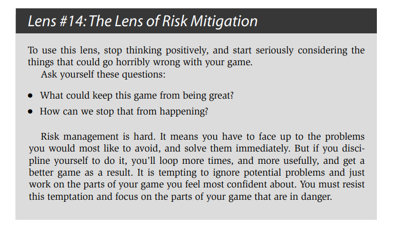

### 7.5 Eight Tips for Productive Prototyping

**Prototyping Tip # 1: Answer a Question**

Some sample questions a prototype might answer: 

● How many animated characters can our technology support in a scene? 

● Is our core gameplay fun? Does it stay fun for a long time? 

● Do our characters and settings fit together well aesthetically? 

● How large does a level of this game need to be?

**Prototyping Tip # 2: Forget Quality**

**Prototyping Tip # 3: Don’t Get Attached**

无论你喜不喜欢它，你系统的第一个版本都不会成为一个成品，它实际上只是在你用“正确的”方式做出你的系统前必须要抛弃的一个原型。

**Prototyping Tip # 4: Prioritize Your Prototypes**

**Prototyping Tip # 5: Parallelize Prototypes Productively**

系统，脚本，美术并行

**Prototyping Tip # 6: It Doesn’t Have to be Digital**

**Prototyping Tip # 7: Pick a “Fast Loop” Game Engine**

**Prototyping Tip # 8: Build the Toy First**

GTA并不是设计成我们看到的GTA那样的。它只是设计成一个媒介，一个鲜活逼真的玩起来有趣的城市。”当这个“媒介”开发完成时，整个团队都觉得它是一个很有趣的玩具，结果就必须为它做出一个游戏了。他们意识到整座城市就像一个迷宫那样，于是他们从一些他们认为不错的游戏里借用了迷宫的游戏机制。Jones解释道：“GTA的设计来源于吃豆人（Pac-Man）。那些小点也就是小人。我自己是在小小的黄色汽车里的，而吃豆人里的幽灵也就是GTA里的警察。”

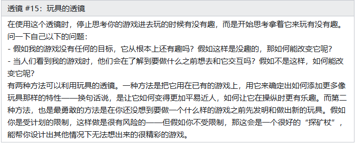

### 7.6 让循环变成回路

1. 陈述出问题。
2. 对一些可能的解决方案进行头脑风暴。
3. 选择一种解决方案。
4. 列出使用这种解决方案的各种风险。
5. 建立各种原型来减轻这些风险。
6. 测试这些原型。假如你觉得足够好了，那就停止。
7. 陈述出你想要解决的新的问题，然后回到第2步。

问题的陈述是逐步发展和在每轮里变得更加具体的。团队参与到重要的设计决策里。单靠设计师是无法做到这点的，大部分的设计都要经过技术和美感上的验证。

### 7.7 How Much is Enough?

Mark Cerny 预知作：30%的预算

50%法则的前半部分：当计划你的游戏时，你确定用这种方式构建它，如果你50%的预算被削减了，你依然能够有一个可玩的游戏。这条规则要求你保持系统简单，也保证了当出现糟糕的事情时（很可能会变糟）迫使你放弃一些特性时，你依然能够得到一个可玩的游戏。

50%法则的后半部分：所有核心玩法元素都应该在你规划中的前半部分完成。这意味着你用一半时间让游戏变得可玩，然后用一半时间让游戏变得更好。开发者们往往计划用80%的时间开发，然后用20%的时间改进。当然如果出了问题，这20%的时间也没有了。到最后，你只有一个超期和劣质的游戏。如果你计划将所有的在50%的时间里完成，即使出了问题，你依然有时间完成重要的迭代。

*注记：不应该用20%的时间完成原型开发迭代然后80%polish和内容填充?

## 8.  The Game is Made for a Player

#### 8.1 Demographics

-  0-3：婴儿/初学走路的小孩。在这个年龄区间的孩子都对玩具非常感兴趣，但如果游戏中加入了复杂性和问题解决过程，那对他们来说是要求太高的。

-  4-6：学龄前儿童。这个年龄的孩子通常会展现出他们对游戏的兴趣了。这时候的游戏应该是非常简单的，而且孩子们通常会更多地和父母一个玩，因为父母知道如何调整规则来让游戏好玩和有趣。

-  7-9：小孩。7岁的年龄通常也称为“理性时期”。在这个年龄下，小孩子都进入学校了，一般都能阅读、把一件事思考完全和解决部分困难的问题了，自然而然地，他们也开始对玩游戏表现出浓厚的兴趣。同时也在这个年龄段里，小孩开始能自己决定他们喜欢和不喜欢哪类玩具和游戏了，而不像以前那样只一味地接受父母选择给他们的东西。

-  10-13：青春期前时期或者“童年到青少年的过渡时期”。市场商也是最近才意识到这群人是和“小孩”以及“青少年”有所区别的。他们开始对世界有更为深入的思考，开始着迷于他们感兴趣的东西，例如：喜欢的异性、某项竞技类运动、音乐等。

-  13-18：青少年，青少年的任务是开始为成年期准备。在这个年龄下，我们通常能看到在男性和女性的兴趣上出现了明显的分歧。男孩不断表现出在竞技和专精上的兴趣（而且通常会越来越感兴趣），他们喜欢尝试新鲜的体验，因为安全性以及道德的约束，很多行为只能在游戏中进行，例如：战斗、飙车、破坏等等。而女孩变得更加关注现实世界的问题和沟通交流。

-  18-24：年轻的成人。这是第一个的“成人”年龄分组，也标记着一个重要的过渡时期。通常来说成人是比小孩玩得要少的。大部分的成人的确还会继续玩，但在这个时期由于他们十几岁的时候已经尝试过很多东西了，他们已经确立了自己喜欢的游戏类型和娱乐类型的品味。年轻的成人通常手里都有着时间和金钱，这也让他们成为游戏的重大消费者。

-  25-35：二十几到三十几岁。在这个年龄段里，时间开始变得更加珍贵了。这个年龄是“构建家庭的巅峰时期”。他们的大半精力投入到家庭与工作中，大多数人只玩休闲游戏，但也有少部分的“核心玩家”，游戏是他们的主要爱好，有大量闲钱可以花在游戏上，十分愿意表达自己对游戏的喜好与厌恶

-  35-50：三十几到四十几岁。有时候会把这个阶段叫做“家庭成熟”阶段，在这个年龄段上的成人都非常专注于事业和家庭责任，并且只会是轻度游戏玩家。由于他们孩子年龄的增长，他们会寻求整个家庭一起玩游戏的机会。

-  50：50岁及以上。在这个年龄段上的成人通常称为“空巢者”，他们突然手里有了大堆的时间，同时他们的孩子也搬出去了，自己也很快面临退休了。于是其中的一些人会回到自己年轻时喜欢的游戏上，而其他人会寻求改变，转向新的游戏体验。在这个年龄段上的成人会对那些有着强力的社交成分的游戏体验感兴趣，例如高尔夫球、网球、桥牌，以及多人在线游戏。

#### 8.2 Five Things Males Like to See in Games

1. Mastery. Males enjoy mastering things. It doesn’t have to be something important or useful — it only has to be challenging. 

2. Competition. Males really enjoy competing against others to prove that they are 
the best. 

3. Destruction. Males like destroying things.

4. Spatial Puzzles. Studies have shown that males generally have stronger skills of 
spatial reasoning than females, and most people would agree that this matches 
anecdotal evidence.

5. Trial and Error. 男性倾向于通过反复试错来学习。

#### 8.3 Five Things Females Like to See in Games

1. 情感。女性玩家喜欢探索人类丰富的情感体验。对于男性玩家来说，情感只是有趣的内容之一。

2. 现实世界。女性玩家倾向于玩一些与现实世界有关联的娱乐活动。如果你观察孩子们玩游戏，女孩们会玩那些与现实世界有强烈联系的游戏(过家家、扮演兽医、换装游戏等)，而男孩们更喜欢扮演幻想中的角色。

3. 抚育。在固有印象中，女性玩家喜欢抚育。喜欢照顾玩具娃娃、玩具宠物和比他们更小的孩子，种植游戏和宠物游戏在女性玩家中的成功大部分源于它们的抚育机制。

4. 对话和文字谜题。常有人说女性因为缺乏空间能力而造就了他们在语言上的能力。

5. 通过例子来学习。就像男性喜欢远离说明书，自己去进行反复试验的方法那样，女性更喜欢通过例子来学习。

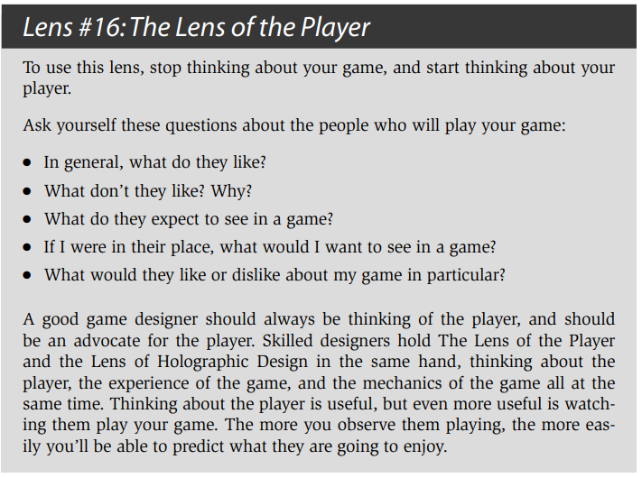

#### 8.4 Psychographics 

##### 8.4.1 勒布朗的游戏乐趣分类：

感官、幻想、叙事、挑战、团队关系、探索、表达、服从。

##### 8.4.2 Bartle’s Taxonomy of Player Types

1. ♦ Achievers want to achieve the goals of the game. Their primary pleasure is 
Challenge. 
2. ♠ Explorers want to get to know the breadth of the game. Their primary pleasure is Discovery. 
3. ♥ Socializers are interested in relationships with other people. They primarily 
seek the pleasures of Fellowship. 
4. ♣ Killers are interested in competing with and defeating others. This category 
does not map well to LeBlanc’s taxonomy. For the most part, it seems killers 
enjoy a mix of the pleasures of competition and destruction. Interestingly, Bartle 
characterizes them as primarily interested in “imposing themselves on others, ”
and includes in this category people who are primarily interested in helping 
others

##### 8.4.3 More Pleasures

- 预感。当你知道某种快乐将要来临时，光是等待的过程也是一种快乐。

- 幸灾乐祸。当一些不公平的人突然得到他们应得的报应时，我们就会感到这种快乐了。这在竞技性游戏中是很重要的因素。德国人把它称为“幸灾乐祸”。

- 给予礼物。这是当你通过一份礼物的惊喜来让他人开心的一种独特的快乐。我们把礼物层层包装来提升和加强这种惊喜感。快乐并不是因为那个人很开心，而是来源于你让他开心了。

- 幽默。两种不相关联的东西通过形式变化突然联系起来了。这种感觉是很难描述的，但当它发生时我们都能了解到。奇怪的是它能让我们会心大笑。

- 可能性。这种快乐是在游戏有着众多选择并且让你知道你可以挑选其中的任何一种所产生的。它通常能在购物过程中或者坐在自助餐桌前能体验到。

- 成就的自豪。光靠这种快乐可以在成就达成之后持续很长一段时间。依地语把这个词叫做“得意”，它是指一种快乐的满足感，通常用在小孩子的身上。

- 净化。让某件东西变得干净是让人感觉良好的。很多游戏都利用了净化的快乐——比方说让你“吃光所有的豆”、“消灭所有的坏蛋”，或者“清光这个关卡”都是利用了这种快乐。

- 惊喜。正如第2个透镜：惊喜感向我们展现的，我们的大脑都喜欢各种惊喜。

- 刺激。在过山车设计师里流传着这么一种说法：“害怕减去死亡等于乐趣”。刺激正是这种乐趣——你能体验到恐惧，但却能感觉自己是安全的。

- 战胜逆境。当你达成了某样你所知道是极少人成功的事后，你就能感觉到这种快乐了。这种快乐往往是伴随着个人的胜利的。意大利人用“自豪”这个词来形容这种快乐。

- 好奇。一种敬畏和惊愕并存的无法抗拒的感觉。

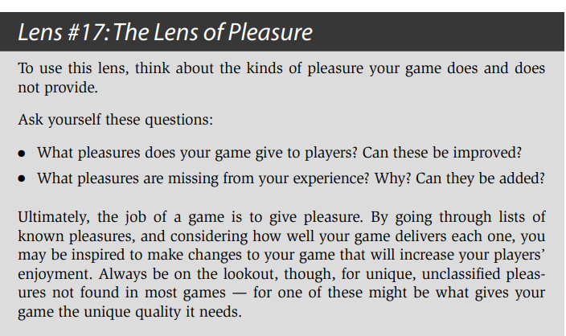

## 9. The Experience is in the Player’s Mind