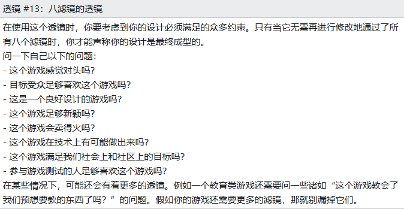
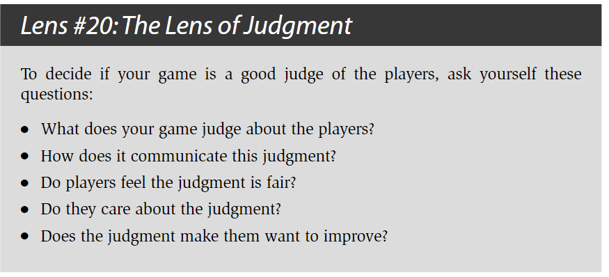
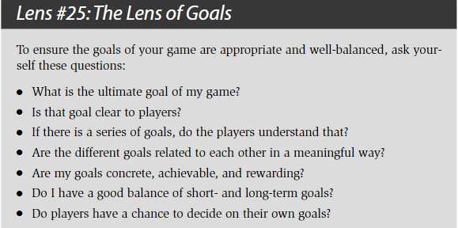
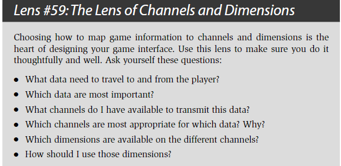
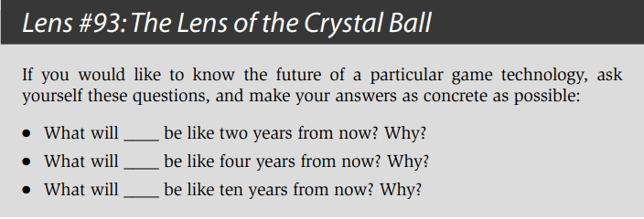

# The Art of Game Design

## 1. In the Beginning, There Is the Designer

### Magic Words

##### What is Game Design?

Game design is the act of deciding what a game should be.
That’s it. On the surface, it sounds too simple.

The designer is usually involved in the development of a game from the
very beginning to the very end, making decisions about how the game should be all
along the way.

### What Skills Does a Game Designer Need?

动画（Animation） - 让游戏中的角色更加鲜活，给予它们生命， 开启更广阔的创意设计视野。

人类学（Anthropology） - 准确地找出用户群体，并且分析需求，满足其欲望。

建筑学（Architecture） - 理解人与空间的关系，在游戏世界的构建过程中有一个好的立足点和新的方向。

头脑风暴（Brainstorming） - 不断的想出新的创意。

商业（Business） - 商业游戏的使命，越会用游戏赚钱，越有机会做出成就梦想的游戏。（also 数据分析）

电影学（Cinematography） - 学会穿搭一种在情感上极具吸引力的体验，将游戏过程想象成一部沉浸式电影。

交流（Communication） - 需要和各个领域的人交流沟通，解决问题，满足客户需求和让受众了解游戏的核心想法。

创造性写作（Creative Writing） - 游戏世界像小说中的世界一样，需要这样的能力来构建游戏世界。

经济学（Economics） - 游戏资源构建就是复杂的经济系统，理解经济学中的各种概念原则，对于游戏中经济体系的构建有着很大的帮助。

工程学（Engineering） - 看明白代码。

历史（History） - 如果是负责策划建构在历史背景上的游戏，需要丰富的历史知识，即便是在幻想背景上，许多灵感也是来自于真实历史。

管理（Management） - 让团队可以朝着同一个目标努力。

团队协作

数学（Mathematics） - 数值的计算和分析。

音乐（Music） - 音乐和美术是两个给用户第一印象的点，也是让用户沉浸其中的一个灵魂语言。

心理学（Psychology） - 了解用户，满足用户。

公众演讲（Public Speaking） - 需要把想法表达给别人，必须充满自信和说服力，让他人理解我们现在所做的工作。

声音设计（Sound Design） - 无须多言，耳听为实

技术性写作（Technical Writing） - 编写各种文档来清晰表述复杂的设计。

视觉艺术（Visual Arts） - 任何产品的视觉要素，是影响用户去留的非常重要的因素之一，理解并且有自己的想法，对整个设计有很大的提升。

### The Most Important Skill

倾听，分为五个领域：团队，受众，游戏，客户以及自己。

这个倾听，是要倾听事物的本质，了解事物的真相

用一颗平静的心和一个静待开放的灵魂去倾听。去除情感，去除欲望，去除判断，去除指责。

### The Five Kinds of Listening

我们需要倾听我们的团队，因为我们需要一起制作游戏和做出各种关键的设计决策，并且一个人很难完全掌握上面所述的所有技能，但是一个团队的智慧加起来就有可能。所以我们需要深层的倾听我们的团队，并且和他们交流，让每个人都变成整体的一部分，分享自己所掌握的技能。

我们需要倾听我们的受众，因为他们是真正来玩我们的游戏的人，如果它们不满意我们的游戏，那么我们所做的一切都是失败的，去了解如何让他们满意，就是深层的倾听他们，想办法比他们更了解他们自身的需求。

我们需要倾听我们的游戏，这表示我们需要了解我们游戏的里里外外方方面面，任何一个问题都知道出在哪里，该如何解决。

我们需要倾听我们的客户，客户是金主爸爸，如果我们给不到他们想要的，他们就会去找下一家，只有学会倾听他们，满足他们，才能保持长期良好的合作关系。

最后还要倾听自己，这将成为无穷创造力背后的秘密。

要真正热爱这份工作，才能成为有天赋的游戏设计师，想要知道是否具备这种天赋，就要开始在这条路上走下去，看看它是否能让我们内心欢快。

所以回到开头，首先要告诉自己

**我是一名游戏设计师**

### The Secret of the Gifted

There are two kinds.
First, there is the innate gift of a given skill. This is the minor gift. If you have this
gift, a skill such as game design, mathematics, or playing the piano comes natu-
rally to you.

The major gift is love of the work.

## 2. The Designer Creates an Experience

Create artifacts (rule sets, game boards, computer programs) that are likely to create certain kinds of experiences when a player interacts with them.

### 2.1 Experience? Unique to the games?

一本书或者一个电影剧本的作者只是在设计一种线性体验而已。在他们创作的内容以及读者和观众体验到的感觉上有着直接的映射关系。而游戏设计师就没这么轻松了。在体验过程中，我们给予了玩家对各种事件的节奏和顺序极大量的控制。

我们甚至在游戏里加入了随机事件！这使得交互的实体和体验之间的区分比线性娱乐要明显得多。与此同时，这也使得更难确定在玩家内心里到底产生了哪种体验。

### 2.2 追寻彩虹的三种途径

心理学

- 结果就是，现代心理学越向前发展，就离我们所关注的——人类体验的本质越来越远。

- 作为设计师：我们并不关注客观现实世界中的绝对正确，而只关注在主观体验世界中的相对正确。

人类学

- 他们努力客观地观察文化并进行实践，同时不断反思，将自己放在实验对象的位置。

- 我们可以从人类学家的研究中学到很多关于人类本质的重要知识——但更重要的是把文化人类学家的方法引入到我们的玩家中，与他们交谈，学习它们的一切，把我们自己放到它们的位置，我们就能获得客观观点中没有的洞察力。

设计学

- 我们必须开放思维并且勇于实践——优秀的创意能够来源于任何地方，但只有帮助提升游戏体验的创意才是好创意。

### 2.3 Introspection: Powers, Perils, and Practice

Peril #1: Introspection Can Lead to False Conclusions
About Reality

Peril #2: What Is True of My Experiences May Not be True
for Others

### 2.4 Dissect Your Feelings

### 2.5 战胜海森堡原理

“粒子的运动是无法在不干扰粒子的运动的情况下观察到的。类似地，一种体验也无法在不干扰到体验的本质的前提下观察到。”

- Analyze Memories: Not analyzing it while you play, but with the intention of analyzing the memory of it immediately after

- Two Passes: 分析记忆的一种方法是进行两轮体验。第一次别去停下来分析任何东西，只是去感受体验。然后回来再做一次，在这一次去分析每一样东西，可能甚至停下来记笔记。

- Sneak Glances
- Observe Silently

### 2.6 Essential Experience

在尝试设计一种体验时，你的目标是寻找能够定义你所想要的体验的基本元素，并想办法让它们成为游戏中的一部分。

游戏设计师的终极目标是穿搭体验。当你对理想中的体验和它所需的元素有一个清晰的认识时，你的设计就有了方向。

"如果我想做一个打雪球的游戏，那分析一下自己过去真实的打雪球的记忆不是对我要做的这个游戏很有帮助吗？但假如不是在一个真实的世界里和一群真实的朋友玩一场真正的打雪球，那是没办法完美地复制出这种体验的——那创造体验的关键点又在哪里呢？

关键点在于你并不需要完美地复制各种真实的体验才能做出一个好的游戏。你需要的只是为你的游戏去捕获这些体验中的本质就可以了。那“一次体验的本质”又是什么意思呢？——每一次可回想起的记忆都是有着一些关键的特征来界定它的，正是这些关键的特征使记忆显得特别。例如当你回忆一次打雪球的体验时，你可能会想起很多东西。你可能甚至会想到这次体验中一些很本质的内容：“学校的课取消了，那天又下了很大雪，”“我们当时是在街上玩的，”“那些雪很容易裹成一团，”“那天很冷，但是阳光普照——天空是很蓝的，”“当时四处都有很多小孩，”“我们建了个巨大的城堡，”“Fred把一个雪球扔得很高，当我抬头去看时，他又把另一个丢到我头上了！”“我们一直在大笑。”在体验里还有一些部分你会觉得不是本质的：“当时我穿着灯芯绒的裤子，”“在我口袋里有一些薄荷糖，”“一个正在遛狗的男人看着我们。”

作为游戏设计师，当你想要设计出某种体验时，你的目标是找出真正界定了你想创造的这种体验的本质元素，然后寻找各种方法来把这些元素变成游戏设计中的一部分。这样能让你游戏中的玩家能体验到这些本质元素。这本书中大部分的内容都会谈及各种这类的方法，利用这些方法，你打造出来的游戏能让玩家体验到你希望他们体验的。这里关键的一点在于你通常能用与真实体验极为不同的方法来传达出本质体验。回到我们前面说到的打雪球的例子，你能用什么方法在一个打雪球的游戏里传达出“天很冷”的体验呢？假如这是一个视频游戏，那理所当然能用美术图形的方式表达：角色会呼出一团团的白色热气，身体会做不断发抖的动画。你还能用音效去表达，通过刺耳的风声来传达寒冷的感觉。可能你想象到的不一定是寒冷大风的日子，但声效能捕捉到其中的本质，把寒冷的体验传达给玩家。假如寒冷这个概念对你很重要的话，你还能利用游戏的各种规则来表达。比方说玩家在不戴手套的情况下能做出更棒的雪球，但当他们的手变得太冷时，他们就必须带上手套了。这种情况可能并没有真的发生，但游戏规则能传达出这种寒冷的体验是游戏中主要组成部分。

有些人觉得这种方法很奇怪，他们会说：“我们可以光去设计一个游戏，然后看看从中能冒出什么样的体验的！”我想这一定程度上也是对的——假如你不清楚自己想要什么，那你是不用在意自己会得到什么的。但假如你清楚自己想要什么——假如你能想象到游戏在玩家面前呈现出什么样的感受——那你就需要考虑如何去传达这种本质体验了。"

The design of the very successive baseball game in Wii Sports is an excellent
example of the Lens of Essential Experience in use. Originally, the designers had intended to make it as much like real baseball as possible with the added bonus that you could swing your controller like a bat. As they proceeded, though, they realized they wouldn’t have time to simulate every aspect of baseball as well as they wanted. So, they made a big decision — since swinging the controller was the most unique part of this game, they would focus all their attention on getting that part of the baseball experience right — what they felt was the essential part. They decided that other details (nine innings, stealing bases, etc.) were not part of the essential experience they were trying to create.

## 3. The Experience Rises Out of a Game

### 3.1 漫谈定义

A game is something you play. A toy is an object you play with. A good toy is an object that is fun to play with. Fun is pleasure with surprises.

- Games are entered willfully.
- Games have goals.
- Games have conflict.
- Games have rules.
- Games can be won and lost.
- Games are interactive.
- Games have challenge.
- Games can create their own internal value.
- Games engage players.
- Games are closed, formal systems.

Jesse 认为 除了上面10点，游戏其实包含了解决问题。A game is a problem-solving activity, approached with a playful attitude.

但是诸如Gary's mod, MineCraft的问题是什么呢？如何让自己的创造物更好？Playful attitude，对于严肃游戏有成立吗？

所以给出我的定义：游戏是以自愿和自由为前提，以获得快乐自足为目的，且具有一定交互规则（玩家给出操作，规则给出反馈）的行为活动。

## 4. The Game Consists of Elements

### 4.1 The Four Basic Elements

1. 机制（Mechanics）：机制相当于你游戏的过程和规则。它描述了你游戏中的目标，定义了玩家在尝试达成目标的过程中能做和不能做的事，以及当玩家尝试去做这些事时会发生什么事。假如你把游戏和更具线性的娱乐体验（例如书籍、电影等等）相比较，你会留意到虽然在线性体验中也包含了技术、故事和美感（四元组中的其他三种元素），但它们完全不涉及到机制，因为正是各种机制让游戏成为一个游戏。当你挑选出一组关键的游戏玩法机制时，你需要挑选支持这些机制的技术，挑选用于强化它们使得玩家能清楚了解的美感，以及确定出一个能让各种游戏对玩家显得有意义的故事。

2. 故事（Story）：这是在你游戏中逐步展开的一系列事件。它可能是线性的、脚本预定义的、分支的，或者是突发的。

3. 美感（Aesthetics）：美感是你的游戏在视觉上、听觉上、嗅觉上、味觉上和感觉上的表现。

4. 技术（Technology）：Any materials and interactions that make your game possible such as paper and pencil, plastic chits, or high-powered lasers.The technology is essentially the medium in which the aesthetics take place, in which the mechanics will occur, and through which the story will be told.

### 4.2 Skin and Skeleton

皮肤（玩家的体验）& 看到游戏的骨骼（组成整个游戏的各种元素）

这是设计师面对的一个很大的挑战：在理解各种元素及其相互关系对体验的影响以及为什么产生这种影响的同时，还需要不断去感觉整个游戏的体验。你必须同时看到游戏的皮肤和骨骼。

## 5. The Elements Support a Theme

### 5.1 Unifying Themes

Strengthen the power of your game’s experience.

*Step 1: Figure out what your them49e is.*

*Step 2: Use every means possible to reinforce that theme.*

主题化的一个简单的例子：他有一本关于大象的书。这本书的创意是很简单的：向小孩子传达一种体验，让他们理解大象到底是什么。在某种意义上，你可以把这本书的主题叫做“什么是大象？”如此，步骤1就完成了。接下来我们去到步骤2：利用每一种可能的方法去强化这个主题。作者把这点是做得很明显的——这本书包含了各种关于大象的文字和图片。并且作者还把这步深化了，他把整本书以及书的封面和内页都裁剪成大象的形状。在每一次翻页里，你都需要找机会去以聪明和难以预料的方式去强化你的主题。

### 5.2 Resonance 共鸣

“experience-based theme” “truth-based theme”

共鸣性的主题能对你的作品增添极大的力量，不过即使你的游戏看起来没有这么一个主题，只要用一个统一的主题去聚焦游戏的体验，那整个游戏也会因此得以强化。

主题并不只是一种象征意义，不会像谜题一般故意留下隐藏的信息。主题会把你的作品聚焦在对玩家有意义的事物上。

### *5.3 注记

- 什么是主题？

主题在音乐创作中叫主旋律，在文章写作中叫中心思想，是观念形态由感性上升到理性后的总结，通过明确主题，让我们更清晰的认识到自己在做的是什么。

- 两种主题

大多数情况下，每项内容都可以抽象出外部主题和内部主题，外部主题需要直接的展示出来，让受众快速理解这是什么，而内部主题普遍会隐藏在外部主题之下，但却是作者真正想要传达的。e.g., 一道菜：
外部主题：一道价值299元的菜品，在食客品尝这道菜之前，厨师需要通过菜品的颜色组合、散发的香气、精致的摆盘，让用餐者食指大动，传达出这道菜值299的感觉；内部主题：不仅要好看，最重要还是要好吃，让食客回味无穷，流连忘返的那种好吃。一部电影：外部主题：电影《热辣滚烫》的外部主题是“破而后立的自我救赎”，在观众去电影院之前，就已经知道这是个励志故事了；内部主题：电影《热辣滚烫》的内部主题是“爱自己”，贾玲在电影中减肥，学习拳击，学会拒绝他人，都只是“爱自己”这主题的外化表象

- 总结：尽早确认主题，可以让我们的设计更聚焦，然后用尽所有方法强化主题，提升主题的传达度

## 6. The Game Begins with an Idea

1. Think of an idea.
2. Try it out.
3. Keep changing it and testing it until it seems good enough.

Don’t look to others for inspiration — look everywhere else.

设计的目的是解决问题，好的问题陈述能指出你的目标和约束。例如你最初的问题陈述可能是这样的：
“如何能做出一个青少年真正喜欢的基于网页的游戏呢？”一个完整的游戏设计会包含基本四元组中的所有四类元素，也就是技术、机制、故事和美感。通常你的问题陈述会把你约束到四元素中的一种（或者多种）的一些已确立的决定上。

### 6.1 How to Sleep

睡眠不足会导致反应迟钝，记忆力下降，大脑运转效率退步，相当于进入了降智的debuff状态，很难获得灵感。

优秀的设计师会把睡眠的无穷力量的优势利用到极致。如Dali的小睡眠。大部分优秀的、聪明的和创新的创意都不是通过有逻辑和有理可循的过程获得的。真正的优秀创意是随时随地地冒出来的，换句话说它们是从我们意识表层下的某处地方出现的——我们把这个地方称为潜意识，如梦境。

### 6.2 Subconscious Tips

1: Pay Attention

2: Record Your Ideas

3: Manage Its Appetites (Judiciously)：假如你没有得到温饱上、安全上和健康的个人关系上的满足，那是很难做出体现自我实现的创作性作品的。因此优先让这些事情得到解决，用一些折衷委婉的方案来让潜意识得到满足，如此它才能投入时间去提出各种天才般的想法。

4: Sleep

5: Don’t Push Too Hard：你曾经在谈话中想到某个名字（可能是你认识的某个人的名字，又或者是某个你认识的电影明星）却塞在嘴边想不起来吗？于是这时候就开始紧眯着眼睛，努力尝试去把答案从你脑海里逼出来——但它就是不肯出来。这时候你应该放弃并继续下去，先谈一下别的东西。几分钟以后这个答案就会突然从你脑海里跳出来了。你觉得它是从哪里跳出来的呢？这就好像当你转移到其他事情上时，你的潜意识同时也在不断努力去寻找这个名字那样。当他找到答案后，他把答案交回给你。

### 6.3 Brainstorm Tips

1：写下答案

2：写字还是打字？

3：草图

4: Toys

5: Change Your Perspective

6: Immerse Yourself

7: Crack Jokes

8: Spare No Expense

9: The Writing on the Wall

10: The Space Remembers

11: Write Everything

12: Number Your Lists

13: Mix and Match Categories

14: Talk To Yourself

15: Find a Partner：不超过4个人的群体是最好的。

## 7. The Game Improves Through Iteration

### 7.1 Choosing an idea

A plan is a real thing. Do get emotionally detached

### 7.2 The Eight Filters

你最终成型的设计最终必须要通过八道考验，或者说是八个滤镜。只有当它通过了所有滤镜后，这个设计才是“足够好的”。

滤镜#1：美感上的刺激：这是所有滤镜中最针对个人的一个。作为设计师，你要问一下自己这个游戏是否让你“感觉对头”，假如的确对头，那它就通过这道考验了。假如感觉不对头，那就需要修改某些东西。你内在的感受是很重要的。这些感受不一定总是对的，但其他的滤镜会帮你把一切平衡过来。

关键问题：“这个游戏感觉对头吗？”

滤镜#2：受众的统计数据：你的游戏是有着一群目标受众的。他们可能是一个年龄区间，或者某种性别，又或者是某类与众不同的受众（例如“高尔夫球的狂热者”）。你必须考虑这份设计是否符合你瞄准的受众的各种统计数据。受众的统计数据会在第8章进行更详细地讨论。

关键问题：“目标受众会足够喜欢这个游戏吗？”

滤镜#3：体验设计：在应用这个滤镜时，把你所知道的能用来创造一种出色的体验的所有东西都考虑进去，包括美感、兴趣曲线、共鸣的主题、游戏平衡，以及其他更多的东西。这本书里很多透镜都是关于体验设计的——当通过这重滤镜后，你的游戏一定是经得起众多透镜的考验了。

关键问题：“这是一个良好设计的游戏吗？”

滤镜#4：创新：假如你在设计一个新游戏，那明显需要在游戏里有一些新的东西，一些玩家从来没见过的东西。你的游戏是否新颖是一个主观的问题，但也是一个非常重要的问题。

关键问题：“这个游戏足够新颖吗？”

滤镜#5：商业和市场营销：游戏行业始终是一门商业，那些想把游戏卖出去的设计师必须考虑到这点事实，然后把商业整合到游戏设计里面。这引申出很多问题。例如，主题和故事会吸引消费者吗？游戏容易解释，以致于能通过看包装盒就能理解这是一个什么游戏吗？消费者基于这个类型会希望这个游戏里有什么样的特点？这个游戏中各种特性和市场上同类游戏相比如何呢？这个游戏的制作成本会不会大到使得它赚不到钱？零售商会愿意销售这个游戏吗？对这些问题以及其他类似问题的答案会影响到你的设计。讽刺的是，当你把设计用这重滤镜审核时，当初驱动最初的设计的那个创新想法可能变得完全站不住脚。这点我们会在第29章详细讨论。

关键问题：“这个游戏能卖得火吗？”

滤镜#6：技术角度：在你把游戏做出来之前，游戏创意仅仅是一个创意，而且光是创意是不需要受到可行性和实用性的约束的。要通过这重滤镜，你必须回答一个问题：“我们打算如何做出这个游戏呢？”问题的答案在于技术上的限制，技术上是否允许这个创意如它原本设想地那样制作出来呢？新手的设计师通常都会对技术强加给设计的限制感到失落。不过技术角度的滤镜往往也能让游戏向着新的方向发展，因为在运用这个滤镜的过程中，你可能意识到一些本来没设想到且技术支持的特性。这个滤镜的运用过程中出现的各种创意是特别珍贵的，因为你能很确定它们是可行的。关于技术和工程方面的问题我们会在第26章更详细地讨论。

关键问题：“这个游戏在技术上有可能做出来吗？”

滤镜#7：社会/社区角度：有时候，一个游戏光是有趣是不够的。一些设计目标可能需要一种强力的社会成分，或者是形成一个围绕着游戏的兴盛的社区。你的游戏中的设计会对这些方面带来很强的影响。这方面我们会在第21章和22章详细讨论。

关键问题：“这个游戏满足我们社会上和社区上的目标吗？”

滤镜#8：游戏测试：一旦游戏开发到可玩的程度时，你必须运用这个游戏测试的滤镜，它可以说是所有滤镜中最重要的。你所想的游戏过程会是一种情况，实际上玩起来可能是另一种情况，而当你看到目标受众在玩的时候或许又是另一种情况。你应该让游戏尽快到达一种可玩的阶段，因为当你真正看到游戏在运行时，那些必须做出的重大修改会马上变得明显起来。这个滤镜的运用除了能对游戏进行修改以外，它往往还会修改和调整其他滤镜，因为在这个运用过程中你开始对游戏各个机制以及目标受众的心理有了更多的了解了。游戏测试过程会在第25章详细讨论到。

关键问题：“参与游戏测试的人足够喜欢这个游戏吗？”

### 7.3 The Rule of the Loop

The more times you test and improve your design, the better your game will be.

#### 7.3.1 瀑布模型

#### 7.3.2 Barry Boehm的螺旋模型

风险评估、原型制作和循环迭代。简单来说，螺旋模型建议你按照以下的方法来做：

1. 提出一个基础设计
2. 找出设计中最大的风险
3. 建立出各种原型来减轻这些风险
4. 测试和检验这些原型
5. 基于你已经了解的提出一个更详细的设计
6. 回到步骤2

### 7.4 Risk Assessment and Prototyping

### 7.5 Eight Tips for Productive Prototyping

**Prototyping Tip # 1: Answer a Question**

Some sample questions a prototype might answer:

● How many animated characters can our technology support in a scene?

● Is our core gameplay fun? Does it stay fun for a long time?

● Do our characters and settings fit together well aesthetically?

● How large does a level of this game need to be?

**Prototyping Tip # 2: Forget Quality**

**Prototyping Tip # 3: Don’t Get Attached**

无论你喜不喜欢它，你系统的第一个版本都不会成为一个成品，它实际上只是在你用“正确的”方式做出你的系统前必须要抛弃的一个原型。

**Prototyping Tip # 4: Prioritize Your Prototypes**

**Prototyping Tip # 5: Parallelize Prototypes Productively**

系统，脚本，美术并行

**Prototyping Tip # 6: It Doesn’t Have to be Digital**

**Prototyping Tip # 7: Pick a “Fast Loop” Game Engine**

**Prototyping Tip # 8: Build the Toy First**

GTA并不是设计成我们看到的GTA那样的。它只是设计成一个媒介，一个鲜活逼真的玩起来有趣的城市。”当这个“媒介”开发完成时，整个团队都觉得它是一个很有趣的玩具，结果就必须为它做出一个游戏了。他们意识到整座城市就像一个迷宫那样，于是他们从一些他们认为不错的游戏里借用了迷宫的游戏机制。Jones解释道：“GTA的设计来源于吃豆人（Pac-Man）。那些小点也就是小人。我自己是在小小的黄色汽车里的，而吃豆人里的幽灵也就是GTA里的警察。”

### 7.6 让循环变成回路

1. 陈述出问题。
2. 对一些可能的解决方案进行头脑风暴。
3. 选择一种解决方案。
4. 列出使用这种解决方案的各种风险。
5. 建立各种原型来减轻这些风险。
6. 测试这些原型。假如你觉得足够好了，那就停止。
7. 陈述出你想要解决的新的问题，然后回到第2步。

问题的陈述是逐步发展和在每轮里变得更加具体的。团队参与到重要的设计决策里。单靠设计师是无法做到这点的，大部分的设计都要经过技术和美感上的验证。

### 7.7 How Much is Enough?

Mark Cerny 预知作：30%的预算

50%法则的前半部分：当计划你的游戏时，你确定用这种方式构建它，如果你50%的预算被削减了，你依然能够有一个可玩的游戏。这条规则要求你保持系统简单，也保证了当出现糟糕的事情时（很可能会变糟）迫使你放弃一些特性时，你依然能够得到一个可玩的游戏。

50%法则的后半部分：所有核心玩法元素都应该在你规划中的前半部分完成。这意味着你用一半时间让游戏变得可玩，然后用一半时间让游戏变得更好。开发者们往往计划用80%的时间开发，然后用20%的时间改进。当然如果出了问题，这20%的时间也没有了。到最后，你只有一个超期和劣质的游戏。如果你计划将所有的在50%的时间里完成，即使出了问题，你依然有时间完成重要的迭代。

*注记：不应该用20%的时间完成原型开发迭代然后80%polish和内容填充?

## 8.  The Game is Made for a Player

#### 8.1 Demographics

- 0-3：婴儿/初学走路的小孩。在这个年龄区间的孩子都对玩具非常感兴趣，但如果游戏中加入了复杂性和问题解决过程，那对他们来说是要求太高的。

- 4-6：学龄前儿童。这个年龄的孩子通常会展现出他们对游戏的兴趣了。这时候的游戏应该是非常简单的，而且孩子们通常会更多地和父母一个玩，因为父母知道如何调整规则来让游戏好玩和有趣。

- 7-9：小孩。7岁的年龄通常也称为“理性时期”。在这个年龄下，小孩子都进入学校了，一般都能阅读、把一件事思考完全和解决部分困难的问题了，自然而然地，他们也开始对玩游戏表现出浓厚的兴趣。同时也在这个年龄段里，小孩开始能自己决定他们喜欢和不喜欢哪类玩具和游戏了，而不像以前那样只一味地接受父母选择给他们的东西。

- 10-13：青春期前时期或者“童年到青少年的过渡时期”。市场商也是最近才意识到这群人是和“小孩”以及“青少年”有所区别的。他们开始对世界有更为深入的思考，开始着迷于他们感兴趣的东西，例如：喜欢的异性、某项竞技类运动、音乐等。

- 13-18：青少年，青少年的任务是开始为成年期准备。在这个年龄下，我们通常能看到在男性和女性的兴趣上出现了明显的分歧。男孩不断表现出在竞技和专精上的兴趣（而且通常会越来越感兴趣），他们喜欢尝试新鲜的体验，因为安全性以及道德的约束，很多行为只能在游戏中进行，例如：战斗、飙车、破坏等等。而女孩变得更加关注现实世界的问题和沟通交流。

- 18-24：年轻的成人。这是第一个的“成人”年龄分组，也标记着一个重要的过渡时期。通常来说成人是比小孩玩得要少的。大部分的成人的确还会继续玩，但在这个时期由于他们十几岁的时候已经尝试过很多东西了，他们已经确立了自己喜欢的游戏类型和娱乐类型的品味。年轻的成人通常手里都有着时间和金钱，这也让他们成为游戏的重大消费者。

- 25-35：二十几到三十几岁。在这个年龄段里，时间开始变得更加珍贵了。这个年龄是“构建家庭的巅峰时期”。他们的大半精力投入到家庭与工作中，大多数人只玩休闲游戏，但也有少部分的“核心玩家”，游戏是他们的主要爱好，有大量闲钱可以花在游戏上，十分愿意表达自己对游戏的喜好与厌恶

- 35-50：三十几到四十几岁。有时候会把这个阶段叫做“家庭成熟”阶段，在这个年龄段上的成人都非常专注于事业和家庭责任，并且只会是轻度游戏玩家。由于他们孩子年龄的增长，他们会寻求整个家庭一起玩游戏的机会。

- 50：50岁及以上。在这个年龄段上的成人通常称为“空巢者”，他们突然手里有了大堆的时间，同时他们的孩子也搬出去了，自己也很快面临退休了。于是其中的一些人会回到自己年轻时喜欢的游戏上，而其他人会寻求改变，转向新的游戏体验。在这个年龄段上的成人会对那些有着强力的社交成分的游戏体验感兴趣，例如高尔夫球、网球、桥牌，以及多人在线游戏。

#### 8.2 Five Things Males Like to See in Games

1. Mastery. Males enjoy mastering things. It doesn’t have to be something important or useful — it only has to be challenging.

2. Competition. Males really enjoy competing against others to prove that they are
the best.

3. Destruction. Males like destroying things.

4. Spatial Puzzles. Studies have shown that males generally have stronger skills of
spatial reasoning than females, and most people would agree that this matches
anecdotal evidence.

5. Trial and Error. 男性倾向于通过反复试错来学习。

#### 8.3 Five Things Females Like to See in Games

1. 情感。女性玩家喜欢探索人类丰富的情感体验。对于男性玩家来说，情感只是有趣的内容之一。

2. 现实世界。女性玩家倾向于玩一些与现实世界有关联的娱乐活动。如果你观察孩子们玩游戏，女孩们会玩那些与现实世界有强烈联系的游戏(过家家、扮演兽医、换装游戏等)，而男孩们更喜欢扮演幻想中的角色。

3. 抚育。在固有印象中，女性玩家喜欢抚育。喜欢照顾玩具娃娃、玩具宠物和比他们更小的孩子，种植游戏和宠物游戏在女性玩家中的成功大部分源于它们的抚育机制。

4. 对话和文字谜题。常有人说女性因为缺乏空间能力而造就了他们在语言上的能力。

5. 通过例子来学习。就像男性喜欢远离说明书，自己去进行反复试验的方法那样，女性更喜欢通过例子来学习。

#### 8.4 Psychographics

##### 8.4.1 勒布朗的游戏乐趣分类

感官、幻想、叙事、挑战、团队关系、探索、表达、服从。

##### 8.4.2 Bartle’s Taxonomy of Player Types

1. ♦ Achievers want to achieve the goals of the game. Their primary pleasure is
Challenge.
2. ♠ Explorers want to get to know the breadth of the game. Their primary pleasure is Discovery.
3. ♥ Socializers are interested in relationships with other people. They primarily
seek the pleasures of Fellowship.
4. ♣ Killers are interested in competing with and defeating others. This category
does not map well to LeBlanc’s taxonomy. For the most part, it seems killers
enjoy a mix of the pleasures of competition and destruction. Interestingly, Bartle
characterizes them as primarily interested in “imposing themselves on others, ”
and includes in this category people who are primarily interested in helping
others

##### 8.4.3 More Pleasures

- 预感。当你知道某种快乐将要来临时，光是等待的过程也是一种快乐。

- 幸灾乐祸。当一些不公平的人突然得到他们应得的报应时，我们就会感到这种快乐了。这在竞技性游戏中是很重要的因素。德国人把它称为“幸灾乐祸”。

- 给予礼物。这是当你通过一份礼物的惊喜来让他人开心的一种独特的快乐。我们把礼物层层包装来提升和加强这种惊喜感。快乐并不是因为那个人很开心，而是来源于你让他开心了。

- 幽默。两种不相关联的东西通过形式变化突然联系起来了。这种感觉是很难描述的，但当它发生时我们都能了解到。奇怪的是它能让我们会心大笑。

- 可能性。这种快乐是在游戏有着众多选择并且让你知道你可以挑选其中的任何一种所产生的。它通常能在购物过程中或者坐在自助餐桌前能体验到。

- 成就的自豪。光靠这种快乐可以在成就达成之后持续很长一段时间。依地语把这个词叫做“得意”，它是指一种快乐的满足感，通常用在小孩子的身上。

- 净化。让某件东西变得干净是让人感觉良好的。很多游戏都利用了净化的快乐——比方说让你“吃光所有的豆”、“消灭所有的坏蛋”，或者“清光这个关卡”都是利用了这种快乐。

- 惊喜。正如第2个透镜：惊喜感向我们展现的，我们的大脑都喜欢各种惊喜。

- 刺激。在过山车设计师里流传着这么一种说法：“害怕减去死亡等于乐趣”。刺激正是这种乐趣——你能体验到恐惧，但却能感觉自己是安全的。

- 战胜逆境。当你达成了某样你所知道是极少人成功的事后，你就能感觉到这种快乐了。这种快乐往往是伴随着个人的胜利的。意大利人用“自豪”这个词来形容这种快乐。

- 好奇。一种敬畏和惊愕并存的无法抗拒的感觉。

## 9. The Experience is in the Player’s Mind

四项主要心理能力：建模、专注、想象、共情。

### 9.1 Modeling

……并非现实——却是一种有用的模型，能反映现实。

每个游戏都有一套简单规则，是预先简化过的模型，让人能轻松消化、处理。……包装过后，努力消化模型的过程也变得愉快了。在现实世界里你需要花很大力气才能找出游戏的规则，然后要付出更大的努力才能达成目标，并且永远不确定你所做的是不是对的。而这也是为什么游戏有时候是现实世界中最好的练习工具。

我们要理解的很重要的一点是我们所体验和思考的一切事物都是一个模型，而不是事实。事实是超出我们理解的。我们所能理解的只是现实的模型。有时候这个模型会被打破，然后我们必须修复它。我们所体验到的现实只是一种幻觉，但也只有这种幻觉是我们唯一能够了解的现实。作为设计师，假如你能理解和控制玩家头脑里这种幻觉的形成过程，那你就能创造出让玩家觉得是真实的感受了，这种感受甚至能比事实本身更让人觉得真实。

### 9.2 Focus

心流（Flow）“完全专注于一个活动中，并感到高度的乐趣和满足感”

- 目标清晰：人有清晰的目标，才更容易集中精力于任务；目标不明确时，因为无法确定当前的动作是否有效，也就不那么沉浸在任务中。
- 没有干扰：干扰会从当前任务上偷走专注力。不专注，则无心流。也就是说，玩家的心和手需同时参与游戏。无需思考的低技术劳动会令思绪漫游；枯坐思考则会让双手无事可做。这些“痒痒的感觉”都是干扰。
- 反馈直接：每次行动之后都要等待一段时间才能知道效果，人很快就会分心，不再专注于手中的任务；反馈及时，人就易于保持专注。
- 持续挑战：人类喜欢挑战，但人类喜欢感觉可以完成的挑战。一有完成不了的念头，人就会感到挫败，进而开始寻找会有奖赏的新活动；另一方面，挑战站太过简单，人则感觉无聊，头脑也回去寻找奖赏更多的活动。

不少设计师都能很快意识到，虽然一直停留在心流通道上是很重要的，但在通道里移动的过程中，某些方式会比其他的方式来得更好。例如像这样笔直地在通道里移动肯定比在焦虑或者无聊中结束游戏要好。波浪形上升比笔直上升好。

这种体验过程会让玩家感觉有趣得多。这是一种不断重复的循环：先是提升挑战，然后给予奖励，通常是奖励玩家更多的力量，然后这会让玩家有一段挑战较小的较轻松的时期，而后很快又会把挑战重新提升，例如某个视频游戏可能会给予玩家一把枪，这把枪需要射三发子弹才能杀死敌人。随着我在游戏里不断前进，敌人会变得越来越多，挑战随之提升了。但只要我提升到这层挑战上并且杀死足够的敌人，那就可能会得到一把新枪的奖励，这把新枪只要射两发子弹就能杀死敌人了。于是游戏突然间变得更轻松了，也变得奖励非常丰厚。不过这个轻松的时期并没有持续很长，很快又出现了即使用新枪也需要三发甚至四发子弹才能打死的敌人了，这时候又开始把挑战提到了新的高度。

这种“紧张-放松-紧张-放松”的循环会在设计中一次又一次地出现，看起来这是人类快乐的固有特质。

### 9.3 Empathy

游戏就是解决问题，而情感投射是解决问题的好办法

### 9.4 Imagination

想象力有着两个关键性的功能：其一是交流（通常是用于讲故事），其二用于问题解决过程上。由于游戏明显包含了这两点，因此游戏设计师必须懂得如何引起玩家的想象力，让玩家的想象力成为讲故事和问题解决过程中的一大帮手。

### 9.5 Motivation

为什么大脑有动机去用上这所有的能力?

马斯洛需求金字塔

### 9.6 Judgment

在马斯洛需求体系的第四层里，自尊心是和游戏有着最密切的关联的。为什么呢？所有人一个深层且常见的需求是被评判。这听起来可能会让你感觉不对，人们不是都讨厌被别人评判吗？并不这样，人们只是讨厌被人不公正地评判而已。We have a deep inner need to know how we stack up. And when we aren’t happy with how we are judged, we work hard until we  are  judged  favorably.  The  fact  that  games  are  excellent  systems  for  objective judgment is one of their most appealing qualities.

### *9.7 注记

有东西驱策着我们，让我们把这些本来微不足道的小事当做生死攸关，此所谓动机的魔力。

- 需求：马斯洛的需求层次论

    灵感往往来自于未被挖掘出的玩家需求，我们可以带着功能诉求去逐个核对马斯洛的八个需求层次，筛选出能满足功能诉求的方法
    假设目前的功能诉求是“消耗中大R用户30%金币存量”

    1. 生理需求

        玩家最基础的需求，不求玩的好，但也要能玩吧，下面是游戏中常见的生理需求表现场景

        - 画面和声音的展示，有就行，不包好
        - 游戏帧速不至于太卡顿
        - 服务器不会经常宕机
        - 没有严重的阻断性bug

        “生理需求”是游戏应该提供给玩家的基础保障，一般来讲不适合作为激励措施来实现功能诉求

    2. 安全需求

        安全需求是原始社会就人人存在的底层追求，下面是游戏中常见的安全需求表现场景

        - PVP游戏中的公平性
        - 获得更多代币与道具
        - 磨炼操作技巧
        - 账号安全系统

        把玩家的存量金币换成其他道具，是个“消耗中大R用户30%金币存量”的不错方法

    3. 社交需求

        大多数玩家期望建立长期稳定的人际关系、友谊、和社区等，下面是游戏中常见的社交需求表现场景

        - 归属感

            归属感是人类这种群居动物天生的追求，当一个玩家在现实生活中找不到归属感时，就会希望在游戏中找到归属感。如，公会之间的对抗赛，公会内的合作任务，公会成员之间的互相帮助。

            归属感的激活与强化是“消耗中大R用户30%金币存量”的不错方法，例如：为了在帮战过程中获胜，玩家需要消耗金币去买药水、传送符、临时BUG等等

        - 爱与被爱

            友情：沙城帮战是传奇类游戏中最烧钱的活动。

            爱情：《逆水寒》中的豪华婚礼套餐需要1314元人民币

            亲情：在《梦幻西游》中，高品质养育一个孩子（特殊宠物）需要花费6位数以上的人民币

        在友情、爱情、亲情的上述案例中，无论那种方式都可以很好的满足“消耗中大R用户30%金币存量”的功能诉求

    4. 尊重需求

        包括自我尊重和被别人尊重，具体表现为会希望获得胜任感，体现自己的价值，也渴望得到他人的赏识和高度评价，下面是游戏中常见的尊重需求表现场景

        - 成就感：欧美地区的人格外对成就上瘾，拥有成就越多的人，往往自尊水平越高。在美剧《权利的游戏》中，女主角的全称：洛伊拿人和先民的女王、七国女王统治者、全境守护者、镣铐锁链破除者、弥林女王、龙石岛公主、不焚者、龙之母、银发女王、银发女士、龙女王等等
        - 荣耀感：完成一个被其他人仰视的成绩

        - 运营反馈用户问题的用心程度：玩家觉得自己受到了官方的尊重，自己的问题得到了妥善处理，是典型的别人尊重

        通过荣耀感或成就感去刺激用户进行某个内容的争夺，从而“消耗中大R用户30%金币存量”，看起来是个靠谱的方案

    5. 求知需求

        求知欲是动物处于对某事物全部或部分属性空白时，本能想添加此事物属性的内在心理，以下是游戏中常见的求知需求表现场景

        - 探索：对游戏世界充满好奇，喜欢四处探索，去寻找世界中有意思的内容，在这个过程中，玩家得到的惊喜越多，玩家的探索欲就会变得越强

        - 故事：看了前面的剧情后，就特想知道故事的后续发展，这也是人的天性，对接下来即将发生的有趣事情，会有强烈的求知欲

        - 解谜：很多玩家并没有很喜欢去寻找谜题，但是当碰到谜题后，就控制不住自己想要找到答案，有时候玩家甚至不追求亲自解题，单纯只想知道谜底

        - 学习新知识：当你即将学习一件你感兴趣的事情时，学习是美好且幸福的，下面这篇文章中提到一些教学技巧，激发玩家的求知欲，让玩家激动不已，感激涕零的进行学习，满足内心的好奇

        激发玩家的好奇心，让玩家对此展开欲罢不能的追求，那“消耗中大R用户30%金币存量”看起来不是个什么难事。（如DLC新地图，新故事？）

    6. 审美需求

        审美是一种内在感受，是心灵活动过程中对事物的感觉，所有玩家都会被美所吸引，下面是游戏中常见的审美需求表现场景

        - 外观美：标新立异的美术风格让人陶醉，高品质的美术质量让人向往
        - 简洁美：极致的美一定是简洁的，通过简单规则表达出的丰满体验，要比复杂规则表达出的丰满体验更具美感，简洁意味着没有闲笔，内容清晰且直指要点
        - 协调美：当一块精工机械表运转起来时，齿轮之间毫无瑕疵的完美配合形成了这种协调之美，如果游戏中各个功能模块运转时，能达到精工机械表一样的井然有序，主次分明，那玩家一定会感受到这种协调之美

        简洁美和协调美一般体现在功能设计上，而外观美常用来进行商业化，一套惊艳世人的绝版皮肤轻松卖到上千米，作为“消耗中大R用户30%金币存量”的手段，再合适不过

    7. 自我实现

        自我实现是指玩家在游戏中受到某种启发，“自主”产生了游戏目标，在实践这个目标的过程中，玩家的耐受力以及目标完成时的兴奋感将得到大幅提升，下面是游戏设计中涉及到自我实现的相关内容

        - 内在动机：吸引玩家进行某些行为的主要原因不应该是物质，而是玩家发自内心会喜欢的精神追求，想想那些为了工会战而充了几十万米的玩家，他们的目标并不是工会战胜利的奖品，而是工会战胜利本身。
        - 目标诱导：绝大多数时候，玩家灵机一闪，自发的想去进行某件有趣的事时，其实来源于游戏潜移默化的引导与暗示。玩一玩《文明6》《这是我的战争》《艾尔登法环》等开放类游戏，你将深有体会。
        - 本质追求：玩家在现实生活中长期无法得到满足的需求，就会成为玩家的本质追求，有些人在现实生活中唯唯诺诺，而在游戏世界中却桀骜不驯。有些人在现实生活中坑蒙拐骗偷，在游戏中却化身正义使者
            1. 游戏目标即本质：玩家追求游戏目标，其实是在追求目标中包含的本质，例如：喜欢泡在工会内聊天的玩家，本质是在追求社会认同和归属感。
            2. 本质映射于现实世界：玩家渴望得到现实生活中无法被满足的内容，例如：现实中不被尊重的人，在游戏中得到尊重甚至众人的崇拜时，就容易对游戏产生依赖。
            3. 本质与功能的结合：玩家认可了本质，就会对这个本质的载体产生追求，例如：有发泄欲的玩家更容易追求PK系统，因为PK系统能满足人的发泄欲。

        通过诱导的方式激发玩家的内在动机，使玩家对某个本质追求产生强烈的目标，此时此刻“消耗中大R用户30%金币存量”就只是个小目标而已

    8. 自我超越

        宫崎骏的新作品《你想活出怎样的人生》，讲述的就是自我超越这个话题，人生的意义是什么？你的理想是什么？如果玩家在游戏中产生了人生理想般的追求，那将是怎样的局面？

        - 重获新生：对某些人来说，游戏不只是消遣的工具，还是逃离现实世界的避风港，让玩家暂时忘记现实世界中的窘迫，过上自己真正想要的生活
        - 成为更好地自己：优秀的小说，电影能给人带来积极的作用，甚至影响人的一生，游戏同样能达到这样的目的，甚至实现的难度要比其他方式更容易
        - 高于生命：那些为了保卫国家，明知必死却毅然发起冲锋的军人，在那一刻就是自我超越的状态，我可以倒下，但我的信仰和使命不会倒下

        自我超越能使玩家牺牲自己的一切，区区“消耗中大R用户30%金币存量”这种诉求根本不算事

    9. *总结：马斯洛的八个需求层次能覆盖绝大多数游戏中的需求，我曾一度认为，掌握了这八个需求层次，就掌握了游戏设计的终极答案，后来一位才华横溢，人美心甜的游戏行业Hr跟我说：“游戏的魅力所在，就是ta充满无限的可能，ta需要产品人的钻研，ta是一门艺术，也就没有完全的标准答案*

- 更多需求：三大精神需求：

    1. 胜任：我需要觉得自己擅长做什么。

    2. 自主：我需要按自己的方式做事的自由。

    3. 关联：我需要和其他人建立联系。

- 内在动机、外在动机：

    有些人急于诋毁利用外在动机的游戏设计，说它卑鄙。但有悟性的设计师知道，一种需求会生出其他需求，如同藤蔓借架子生长。

    | 类型   | 动机类型   | 描述                     |
    |--------|------------|--------------------------|
    | **外在** | 外在动机   | 为了报酬                |
    |        | 内摄动机   | 因为我说了我会做         |
    |        | 认同动机   | 因为我觉得这很重要       |
    |        | 整合动机   | 因为我就是那种人         |
    | **内在** | 内在动机   | 我就是为了做而做        |

   (e.g.让小朋友画画) 如此说来，动机并不完全就是上瘾。正相反，给已经能带来内在动机的事情加上外部动机，反而让它滑向偏外在的区间，抽走了内在动机。有些人认为什么活动只要加上简单的积分、徽章、奖励，都能轻松“游戏化”，其实不然

- 想做与得做：

    我们为什么关心这个呢？因为，固然有许多游戏的动机是追求愉悦，但也不全然如此。还有很多游戏的核心是规避痛苦。你躲避敌人，“坚持不死”，你就处于痛苦回避模式；你挖出金色的星星，打出巧妙连招，则处于愉悦追求模式。两者都是有效动机，结合起来的效果也很好

- 创新：

    不同的未必总是好，更好的总是不同。

    就算世界依旧，你也有新方法与之互动。此前你大概从来没想到过，因为乍看之下实在不可能。但突然，你发现此时不仅可行，而且心里跃跃欲试。新思路可以扩展我们的大脑，让我们感到无比畅快。

## 10. Some Elements are Game Mechanics

游戏机制是游戏真正的核心。剥离美学，技术和故事后，剩下的互动和关系，就是游戏机制。

### 10.1 Space

例如棋盘、球场、RPG中的大地图。考虑游戏空间的维度拓展有时会带来意外收获。

1. Are either discrete or continuous

2. Have some number of dimensions

3. Have bounded areas which may or may not be connected

在游戏中时间是模型化的，离散（回合制）或是连续（即时制）与游戏类型相关。但是玩家实际游玩的时间则和体验有较大关联。

### 10.2 Objects, Attributes, and States

那些迫使玩家要知道太多的状态（例如每个角色都有太多的游戏元素和属性）的游戏会让玩家玩起来很混乱和不知所措。

### 10.3 Actions

玩家能够做出的行动。基本行动，例如按照规则移动象棋的棋子。玩家往往会自己总结出一些较为复杂的策略行动，例如中国象棋中的马后炮。设计者需要考虑在设计中预留适当的给玩家构建策略行动的空间，才能更好地提高游戏体验。

有趣的自发行动所占基本行动比例大小。

打造“自发玩法”，即“有趣的策略行动”，其过程有点像打理花园——园中生命自发生长，但同时又弱不禁风，容易毁坏。

一些事情可以增加“有趣的策略行动”的出现几率。

1.添加更多的动词

最好添加一种优秀的基本行动，而不要一味地加入平庸的基本行动。

2.能与许多对象互动的动词

3.用各种方式达成的目标。

4.许多主体

5.改变限制条件的额外效果。

把游戏和书籍、电影相比，最显著的一个区别就是动词数量。

之所以有那么多游戏看起来相似，还有一个原因是它们都是用一样的行动集。

（现代的3D电子游戏给你的基础行动很少。玩家一般都了解自己能做的全部行动。在文字冒险游戏里，完整的基础行动集并不清楚，而探索这些动作也是游戏的一部分。）

### 10.4 规则

简单而言，规则必须具体，可行，易于理解，并且让玩家清晰地知道游戏的目标，回报丰厚。

### 10.5 Skill

不断练习技能的过程是一件很快乐的事——这也是人们喜欢游戏的其中一个原因。当然，只有当技能是有趣且值得去做，且它的挑战程度处于“过于容易”和“过于困难”之间最理想的平衡点的时候，练习才是快乐的。通过用各种虚拟技能来包装，然后为它们提供程度合适的挑战，那即是是单调乏味的技能（例如不断敲按键）也能变得很有趣。

### 10.6 Chance

几率导致不确定性，而不确定性是玩家感到惊奇（surprise）的来源，而惊奇往往能给人带来快感（pleasure）。然而，几率需要被慎重对待，设计者需要一些基本的概率论知识（或者懂得咨询这方面的专家）。人类心理学的部分也必须要考虑，例如，人害怕失去胜于渴望奖赏。

1、估算概率是一种技巧（记牌）

2、技巧都有成功概率。

3、估计对手的技巧也是种技巧。

4、预测纯概率是一种想象中的技巧。（热手谬误&赌徒谬误）

5、控制纯概率是一种想象中的技巧。

## 11. Game Mechanics Must be in Balance

### 11.1 游戏平衡中最常见的12种类型

1. 公平（fairness）。这是对游戏平衡最直观的理解。许多代表性的游戏以对称性（symmetry）保证公平：游戏中对抗的各方享有同样的资源、约束和目标。例如大多数的体育竞技、象棋、跳棋等。这样的游戏可以较为可靠地反映出玩家技巧水平的高低。但是事实上更多的游戏是非对称的（asymmetric）。非对称也有许多优势，例如模拟现实情况、让玩家探索不同的玩法、平衡玩家间的技能水平差别等，总之非对称的情况常常会让游戏更有趣味和挑战性。但是这里就是需要设计者去做平衡的地方。根据传统的看法，一个游戏在到可玩的阶段后需要6个月来调整其平衡性。本书作者则认为应该把游戏开发一半的时间用于确保游戏平衡。

2. 挑战（challenge）vs 胜利（success）。正如第10章 玩家心理中提到的，如果游戏的挑战太难，玩家会感到受挫；如果游戏的胜利太容易获得，玩家又会感到无聊。所以，在游戏的不同游玩阶段都使玩家在感到挑战和获得胜利中取得平衡，才能使玩家的体验最优化。但是，玩家们的技能水平参差不齐，玩家A感到压力过大时，玩家B可能觉得非常简单，这该怎么解决？

- 2.1. 在每一次胜利后增加难度。
- 2.2. 让高水平玩家能够快速完成低难度关卡：这样高水平玩家就不会因为花费大量时间在低挑战的环境下游玩而感到无聊。
- 2.3 在关卡的评价中分层：例如在完成关卡后给与等级评定，得到C就可以进行下一关，但是完成得很完美就能得到A甚至A+的判定。这样，在同样的关卡中，不同水平的玩家就会自己追求不同的目标。
- 2.4. 在游戏测试（playtest）时包括不同水平的玩家。最好同时参考高水平玩家，和从未接触过这类游戏的新手的意见。
- 2.5. 给予处于劣势的玩家一些补偿。类比2.1.。

3. 有意义的选择（meaningful choices）。有意义，指的是这个选择会对后续游戏产生影响。同时，这个选择中不能包含一个明显优于其他选项的最优解。此外，这类选择的数量应当和玩家的期望相匹配，太多的选择会让玩家压力过大，太少的选择则会使玩家感到沮丧。使游戏变得有趣的一类选择称为平衡不对称风险（balanced asymmetric risk），玩家在低风险-低回报和高风险-高回报中做出选择。设计者要做的是让额外的回报值得额外的风险。

4. 技能（skill）vs 几率（chance）：玩家技能占主导地位的游戏会更像体育竞赛、而几率占主导的游戏则会更加适合休闲的体验。两者的取舍，一般根据你的目标受众的喜好来决定。在具体设计中，可以把两者交替使用：例如，掷色子来决定你有多少行动点（几率），而如何使用行动点则由玩家决定（技能）。

5. 头脑（head）vs 双手（hands）

6. 竞争（competition）vs 合作（cooperation）。  竞争与合作是多人游戏中必不可少的元素。竞争是动物的本能，合理的设计竞争机制可以使玩家更有在游戏中胜利的冲动。合作也是社会性动物的本能，游戏中的交流机制是合作所必要的，而设计不可能独自完成的任务也是激发合作的方法。可以根据目标玩家控制游戏中竞争和合作的平衡，或者可以提供两者让玩家自己来选择，团队对抗则能够将两者结合起来。

7. 游戏时间的长短也需要平衡。游戏时间过短，玩家可能没有机会去体验有意义的游戏策略；游戏时间过长则会让玩家感到无聊，或者使一些没有大块时间的玩家放弃游玩。设计者可以通过设置无敌时间使游戏时间延长，也可以设计额外的结束机制限制游戏时间的过长。

8. 奖赏（rewards）是驱使玩家持续游玩游戏的动力之一，如前所述，人们期望被公正的评判，而好的结果应该带来奖励。游戏中的奖赏可以分为几类：

- 8.1. 赞扬（praise）。通过简单的音声反馈来告诉玩家“打得不错！”——好听的音效、弹出的动画、npc的鼓励等等。
- 8.2. 分数。有时仅仅是一个有记录作用的数字，但是排行榜、社区分享等等机制能够使高分成为玩家追求的奖赏。
- 8.3. 游戏时间。某些游戏就是以“尽量在一局中坚持更久”作为游戏目标的，例如经典的三维弹球。这也和人的生存本能相吻合。
- 8.4. 门。除了生存，探索也是人类的本能。达成一定目标以解锁新的关卡或地图，也是游戏中常见的奖赏。
- 8.5. 美景。精美的美术/动画展示也可以作为奖赏。
- 8.6. 表达。这往往不是游戏设定的固定目标，但是留给玩家自我表达的空间也是很好的。
- 8.7. 力量。在现实生活中，谁都期望能获得更多的力量。在游戏中，获得力量是很容易实现的：例如RPG游戏中获得经验值后的升级、超级玛丽中吃掉蘑菇后变高变强。
- 8.8. 资源。一般而言类似金钱的游戏内物品，因为有了“内在价值”也成为了玩家追求的物品。
- 8.9. 地位。排行榜、特殊成就、或者任何可以使玩家在社区中取得更高地位的奖赏。在竞争类玩家中更受欢迎。
- 8.10. 完成感。在现实中相对难以体验到的，完全完成一个游戏的所有目标的成就感，也是玩家们追求的奖赏。不过这个往往是在整个游戏结束之后，仅一次的奖赏。

在何处给予奖赏，给予多少、什么样的奖赏，是设计者需要考虑的平衡之一。基本而言，有两条规则可以参考：一、玩家往往会对之前得到的奖赏习以为常，所以设计者一般会在游戏进程中逐渐增多奖赏的数量；二、数量随机的奖赏比数量恒定的奖赏更吸引人，即使期望相同

9. 惩罚，也是游戏的平衡要素之一，和奖赏一般对立考虑。游戏中惩罚的必要性在于：

- 强调游戏中资源的“内在价值”——只有失去才懂得珍惜。
- 人们喜欢冒险。逃脱失败的苦涩惩罚，而取得的胜利果实会更加甜蜜。
- 增加游戏的挑战。参看之前的“胜利vs挑战”平衡。

常见的惩罚种类基本和奖赏对应：

- 9.1. 批评/羞辱：从简单的音效、字幕到失败动画，告诉玩家“你做的不够好”
- 9.2. 失去分数：奇怪的是，这很让玩家痛苦，所以很少出现…如果分数可以被减少，分数的“内在价值”也会被削弱
- 9.3. 游戏时间减少/游戏结束：Game over。
- 9.4. 回退：失败后，从比失败之处更提前的位置重新开始。在一些线性推进进程的游戏中常见，重新开始的“重生点”选择正是设计者需要考虑的地方。回退应当是有意义的，不应当是不合理的。
- 9.5. 失去力量：和力量的获得相对，力量的失去是一种很重的惩罚。一般在实用中，“暂时的”失去会更容易让玩家接受。
- 9.6. 失去资源：最普通的惩罚。

从心理学角度，奖赏总是比惩罚更有效的强化机制。在可能的情况下，设计者更应该考虑用奖赏来驱动玩家。当必须使用惩罚时，则要慎重选择。惩罚务必是让玩家可理解、可避免的，不然玩家迟早会对这个游戏失去兴趣。

10. 自由与被控制的体验。游戏的本质之一在于互动性，与很多其他的视听媒体相比，游戏同样提供了编制好的视听体验，但同时给了玩家操作的自由。但是设计者也不应当给玩家太多的自由——游戏并不是对现实的完全模拟，而是一个更有趣的模型。一般而言，游戏中无聊、复杂和不必要的决定和行动，都可以不用让玩家亲自执行。一切都是为了给玩家更好的体验…如果你发现为了达成这个目标，你必须要大量地剥夺玩家自由操作的空间，或许你应该考虑游戏之外的形式来呈现这种体验。

11. 简单与复杂。简单与复杂对于游戏而言都是中性词，重要的是这样的简单性和复杂性是否强化了游戏的体验。游戏的复杂性可以分为两类：

-11.1. 内在复杂性：游戏规则本身的复杂——这是应该避免的。这种复杂性的出现往往是因为设计者企图模仿一个复杂的真实系统，或者为了平衡加入了太多例外的补丁。
-11.2. 次生复杂性（emergent complexity）：例如围棋，本身固有的核心规则相当简单，但是能够衍生出千万种多样而复杂的棋局。这是设计者应当追求的。

次生复杂性很难被设计，但是设计者们值得花时间尝试它。用一套简单的规则创造出无尽的、平衡的惊喜，这是游戏设计者的理想。要尝试达到它，你只能不停地测试并改进你的游戏，直到惊喜出现。

当然，一定的内在复杂性也是必要的——游戏确实需要能够反映一些现实系统（一般是高度复杂的），而为平衡而做出的改动当然是无可厚非的。只不过设计者需要意识到其中的弊端，并尽量减少内在复杂性。

增加过多的规则来达到设计者想要的效果，有时被称为“人工平衡”；平衡改动应当是“自然平衡”，即从游戏互动中自然产生的效果需求。

在复杂的情况中也能可靠运行的简单系统，我们称之为“优美（elegant）”，这是一个好游戏应当追求的品质。我们可以通过计算一个游戏元素的目的数量来衡量其“优美”的程度。例如吃豆人中的“豆”，仅仅只是一个点，但是具有5个目的：

1. 给玩家一个短期目标：吃掉离你最近的豆
2. 给玩家一个长期目标：吃掉地图上所有的豆
3. 当玩家吃掉它时，玩家的速度会稍稍减慢——这使得追逐战中，豆提供了一个风险平衡：有豆的道路会更慢，但是有得分；无豆的道路更快，但是无得分
4. 增加玩家的分数，用于衡量成功的程度
5. 增加玩家的分数，给玩家额外的生命

常常可以考虑一下游戏中只有一个目的的元素们，它们是否能合并到一起？这样会使你的游戏更加优美。

与优美相对的一种因素是特性（character）。考虑一下比萨斜塔，它的倾斜没有任何目的（就优美原则来说应当被消除或避免），只是一个历史性的遗留意外，但是正是他的倾斜赋予了它与其他塔楼不同的特性。优美有时也会带来无趣。一些奇怪的特性，甚至漏洞，也可能使游戏更加有趣。

12. 细节与想象。游戏不是体验本身，而是给玩家产生体验的一个结构——也就是说，游戏体验中的一部分细节由设计者拟定，而其他部分是可以让玩家想象产生的。细节与想象空间的平衡可以通过一些方式来实现：

- 12.1. 把你难以完成的部分留给玩家的想象。人的想象力是很强大的。如果你准备提供的细节质量无法与玩家想象的质量相比拟，不如去除细节。例如，如果你准备给你的游戏人物配音，但是既没有人工也没有存储空间，有人也许会建议你使用合成语音。但是，如果仅仅提供字幕，玩家是能够想象出角色的声音的（类似小说和漫画的效果），但是合成语音（除非你的技术力能够超越玩家的想象力）会夺去玩家的想象空间，反而降低了体验质量。
- 12.2. 为想象提供一定的细节。想象力不是无根之花，必要的、标志性的、有特点的细节能够帮助玩家更好地想象。
- 12.3. 熟悉的环境不需要太多细节。如果你需要构造的场景是玩家所熟知的，例如现代的街道、普通人的房间，那么你不需要提供很多细节，玩家尽可以用他们日常的记忆加以补足；如果你需要构造的场景是全新的、陌生的，那么你就需要尽可能多的提供细节。
- 12.4. 望远镜效应。当人们在剧场使用望远镜时，他们只在开场时使用它看清整个舞台的人物和场景，记住后就会把望远镜放到一边，用记忆和想象力补足远处小小人物的表演。许多电子游戏也是一样，只在开始时展示角色的细节，之后便使用具有较少细节的小人代表角色行动——玩家自然会想象全副武装的角色行动时的样子。
- 12.5. 用细节来激发想象力。很多时候，想象的场景并不一定需要完全符合现实。象棋就是一个很好的例证，事实上谁也不能完全掌控战争中一方军队的所有力量，但是这符合人们的想象（笑）。创造一个让玩家容易激发想象的场景吧。

### 11.2 Game Balancing Methodologies 

1. 实时确定现在的问题并解决，再循环这个过程。这是之前就提到过的，游戏设计基本的方法论（Problem statement）。
2. 在准备修改一个数值时，直接将其加倍或减半，而不是小幅度地改动。这样你会对这个改动带来的影响有更清晰的感受，以便于进一步修改。
3. 训练你的直觉，使猜测更为准确。当你有了足够多的经验，你的直觉往往就能告诉你数值决定的答案。
4. 记录你的数值模型。好记性不如烂笔头，这样你会对数值与其相关的元素有更明确的认识。
5. 当你尝试平衡游戏时，你也会对游戏中元素联系的模型有更深的理解。除了在平衡中改进你的游戏，你也应该改进你心中游戏的模型。
6. 做好平衡的计划。在开始设计时，就应该考虑到将来的平衡工作，为此最好把各个元素都设置得易于修改，最好在运行时也能修改。即使可玩了，发布了也依然要做好继续平衡的准备。
7. 让玩家来做平衡？很多设计者都有这种想法，但玩家有时并不清楚自己想要什么，大部分时候他们会把游戏变得过于简单，然后失去兴趣，回滚到原始版本后又抱怨太难。在某些地方（例如三角难度选择）上我们可以让玩家做决定，其他时候，游戏平衡还是交给设计者会更好。

### 11.3 Balancing Game Economies 

是对设计者相当有挑战的部分。对游戏中的经济学而言，有两个有意义的选择需要玩家做出：

- 我怎么赚钱？
- 我怎么花钱？

“钱”在这里可以指代大部分的游戏内资源，例如虚拟货币、技能点、宝石等等。在MMO游戏中，如果玩家之间可以自由交易资源，这个问题会变得更加复杂。基本而言，可以考虑这些情况：

- 玩家可以通过什么方式赚钱？是否应该有其他方式？
- 玩家可以买到什么？为什么？
- 钱是否太容易，或太难获得？怎样可以改变这种情况？
- 赚钱和花钱中的选择是否是有意义的？
- 这个游戏中是应该使用一种货币，还是应该有特殊的货币种类？

### 11.4 Dynamic Game Balancing 

动态平衡基于这样的一种设想：如果玩家的水平过高或过低，游戏会自动检测这些情况，并自动提高或降低难度。但这样的机制有其缺点：

- 降低了游戏世界的“真实性”。玩家，从某些层面上，是希望游戏世界是有“真实”存在的。
- 可以被利用。玩家可以故意输掉来达到作弊的效果。
- 否认玩家的练习提高。许多玩家会认为自己能从失败中吸取教训并提高技巧，如果游戏为此降低难度，他们也许会感到失望。

### 11.5 The Big Picture

要在细节中迷失，平衡感有时是整体的。

## 12. Game Mechanics Support Puzzles 

### 12.1 The Puzzle of Puzzles

A puzzle is a game with a dominant strategy. 

### 12.2 Good Puzzles 

Principle 1: Make the Goal Easily Understood 

Principle 2: Make It Easy to Get Started

Puzzle Principle 3: Give a Sense of Progress

Puzzle Principle 4: Give a Sense of Solvability 

Puzzle Principle 5: Increase Difficulty Gradually

Puzzle Principle 6: Parallelism Lets the Player Rest 

有时玩家无法解开特定的某个谜题（俗称卡关），导致整个游戏无法推进，这会给玩家带来挫败感，可能让玩家放弃这个游戏。我们可以在游戏中同时提供平行的多个谜题，让玩家在一个谜题上卡住时可以尝试其他的谜题，同时获得休息。谜题的类型最好不相一致。但是可以使一个谜题的解开，利于其他谜题的解开。

Puzzle Principle 7: Pyramid Structure Extends Interest 

让多个小谜题的解答导出一个最终的大谜题。最好让最终的谜题有趣、吸引人。

Puzzle Principle 8: Hints Extend Interest 

在玩家感到无助时提供提示。在提示下解开谜题，比放弃谜题、或在按照攻略速通谜题都是更好的结果。

Puzzle Principle 9: Give the Answer!

如果玩家仔细地考虑了问题，但是还是无法得出答案，在游戏中直接给出答案也能给玩家【解开谜题】的快乐。这和推理小说有些类似…

Puzzle Principle 10: Perceptual Shifts are a Double-Edged Sword

类似脑筋急转弯一般的riddle，往往只需要玩家转换思维定势就能马上给出答案并给玩家一定的成就感，但是一旦无法转换就会陷入无尽的苦恼中。这样的，无法体现出进展的谜题应该在游戏中尽力避免。

## 13. Players Play Games Through an Interface

### 13.1 Between Yin and Yang

The goal of an interface is to make players feel in control of their experience.

界面本身可以分为多个组分。从最容易理解的开始，手柄、键盘、鼠标等玩家用以影响游戏世界的工具属于【物理输入】，同时游戏世界的反馈则一般通过屏幕、扬声器等【物理输出】给予玩家。同时，在游戏世界之外，还有一些元素是作为玩家与游戏世界之间的媒介，例如游戏界面上的游戏分数、菜单键等，它们属于【虚拟界面】。

### 13.2 Break It Down

游戏过程中，玩家控制的界面元素与游戏世界之间的信息流处理，可以称为【mapping】，共有6类：

1. 物理输入→游戏世界：当玩家按动键盘上的方向键时，玩家的人物将会向一个方向奔跑。这个按动的动作和游戏人物的行动间有时间差吗？如果玩家按键两次，游戏人物会冲刺吗?
2. 游戏世界→物理输出：如果玩家无法看到整个游戏世界，哪一部分会被展示出来？怎样展示？
3. 物理输入→虚拟界面：在用鼠标操作的虚拟界面上，单击有什么用？双击有什么用？
4. 虚拟界面→游戏世界：当玩家操作虚拟界面时，会怎样影响游戏世界？
5. 游戏世界→虚拟界面：游戏世界的改变怎样反映到虚拟界面上？场景的改变会导致界面的改变吗？
6. 虚拟界面→物理输出：游戏分数将会如何被显示在屏幕上？hp降到很低时会改变显示和音效吗？

这6类界面交流一同工作，来构成优秀的游戏界面。但是，为了玩家能够更好地沉浸在游戏世界中，界面应当越少越好、越【透明】越好。界面应当：

1. 完成玩家的期望
2. 在训练后能让玩家不加思考地使用
3. 使用方法符合直觉
4. 在特殊情况和玩家感到压力时也能正常使用

### 13.3 The Loop of Interaction 

此外，界面也与游戏对玩家的【反馈】息息相关。举例来说，篮球筐下的篮网就是反馈方式的成功体现：篮网并不影响进球，但是网会拖慢球入筐后下落的速度，使得大家都能够方便地判断球是否进入了筐内。简单而言，在反馈方式上，设计者需要考虑：

1. 在这里，玩家需要知道什么？玩家想要知道什么？
2. 在这里，我想要玩家感到什么？玩家又想要感到什么？
3. 现在玩家的目标是什么？怎样可以通过反馈促使玩家完成这个目标？

经验告诉我们，如果玩家按下一个按钮，而没有在0.1s内得到反馈，玩家就会感到不舒服……在“跳跃”这个动作的设计中，这个问题往往会体现的较为明显（某些新手会在按键后安排超过0.1s的跳跃准备动画）。

出色的界面和反馈还有一类特征，【多汁】（juicy）。也就是游戏会对玩家的操作做出连续的、次生的反馈，而给予玩家多方面的奖赏。【Remember, fun is pleasure with surprises.】

为什么触屏游戏更受孩子欢迎？为什么许多游戏中都有类似的收集果实、击败强敌、探索地图、取得配偶的元素？因为这些都是【原始的】（primal）。如果你的游戏能够唤起百万年前生物的记忆，它就会变得更受欢迎。

### 13.4 Channels of Information

界面的重要功能是信息交流。如何在游戏中呈现信息？可以参考以下的步骤：

1. 按优先级列出信息列表。哪些信息是每时每刻都需要知道的？哪些信息是时时需要查看的？哪些只是偶尔会查看的？
2. 列出能够展示信息的渠道（channels）。例如：画面的主要区域、画面的边/角、角色的小模型、背景音乐、音效……
3. 把信息和展示渠道对应。部分依靠直觉和经验，但主要还是通过试错来决定。
4. 复习维度的使用。即使同一个渠道，也有不同的展示信息的方式。例如，你打算用【敌人身上跳出的数字】这个渠道来表达【对敌人造成的伤害】这个信息。【数字本身】、【数字颜色】、【数字大小】、【数字字体】都是这个渠道的【维度】。显然你应该使4用数字本身来直接表达信息，但同时你也可以利用其他的维度来【加强】信息的表达（常见的，用醒目的颜色、大的字号、夸张的字体来强调更高的伤害数字）

### 13.5 Modes

模式。一般指【物理界面→游戏世界】的信息流处理方式。例如，同样的摇杆可以在一个模式下控制移动，而在另一个模式下控制瞄准。关于模式，有以下几点需要注意：

1. 模式的数量越少越好。这并不是说多模式是有害的，在保证功能的前提下，减少模式的数量有助于玩家更容易掌握界面的使用方法。
2. 避免模式之间的重叠。在切换模式时，操作同一按键的结果一般会发生改变。如果让模式能够重叠存在，那么这个按键的功能到底是什么？这可能会引发程序上的错误和操作上的不便。
3. 让模式的切换越明显越好。让玩家意识到模式发生了切换，比如改变玩家角色的姿势、数据的显示、视角的呈现。

### 13.6 Other Interface Tips 

1. 偷窃。或者说“由上至下界面设计”。如果你的游戏属于一个已经被广泛开发的类别，而你要实现的基本功能和大部分成功作品并无太大区别，你可以直接搬用它们的界面作为你的设计原型。这会节省很多时间。
2. 个性化。也就是“由下至上界面设计”。和上一种方式相反，你利用章节前半提到的信息流、渠道、mapping等方式来从头组织你的界面。当你的游戏和大部分其他游戏都有较大不同时，这是你唯一可以采用的方法。即使你的游戏没什么新意，你也可以通过个性化界面设计的方式突出你的游戏的玩法新意。
3. 基于你的物理界面来设计。如今有很多平台可以运行电子游戏，它们的物理界面不尽相同：摇杆、键盘、鼠标、触屏……虽然设计一个在所有平台上都能运行的游戏也许可以提高销量。但是我们更推荐针对单套物理界面来设计你的游戏。
4. 给你的界面一个统一的主题。和整个游戏保持相同的风格更能提供完整的玩家体验。
5. 赋予虚拟界面以声音。很多时候我们会为游戏中很多具体的事件配上音效，但是操作虚拟界面时配上合适的音效会有更好的反馈。
6. 利用层级来平衡【选择】和【简洁】。在设计界面时，我们需要给玩家尽可能多的功能和尽可能简单的界面，我们推荐通过设计多层界面模式来收纳使用频率不同的功能。
7. 利用【暗喻】。例如，某个游戏由于机制和技术的原因，玩家的操作和角色的行动间有较大的时间延迟。解决方法是，在玩家操作之后播放模拟电台的声音，同时把角色设定为无线电控制的玩偶。这样时间延迟被合理化，玩家在操作后也能得到一定的反馈。
8. 如果它们看上去一样，那么它们的效果也应该一样。同样，外观不同的东西内在应该也不相同。在游戏设计中最好不要为了美学的多样性而违反玩家的直觉。
9. 测试！测试！测试！在你的游戏可玩之前就要尽可能多地测试你的界面，多与测试玩家交流他们对你的界面的看法。
10. 为了帮助玩家而打破规则。许多类型游戏的界面设计有惯例可循，但是设计者不应该忽略玩家群体对于游戏的独特需求，应该在必要时打破规则和惯例以方便玩家。

## 14. Experiences Can be Judged by Their Interest  Curves 

### 14.1 Interest Curves

在大部分的娱乐体验（游戏、电影、舞台表演、音乐、小说等）中，都可以利用兴趣曲线来给鉴赏者一份更有吸引力和完整的体验。简而言之，由如下顺序描绘曲线

首先，观众被一些宣传吸引而来。他们一开始就会保有一定的兴趣，但不要让宣传效果超出实际作品太多，不然起点过高，容易让人失望。

1. 开场时，就要展示富有冲击力的内容（所谓【hook】），吸引观众继续完成接下来的体验。例如舞台表演中的【暖场】，以及大部分游戏开场的动画。
2. 接下来，让曲线降下来，一方面要让观众休息，慢慢适应这个体验；另一方面，创作者也不可能使所有的内容都富有刺激性。
3. 但是，在接下来的过程中，依然要时时有小小的高潮，不一定要超过开场。并保持整体上升的态势。
4. 在观众兴趣慢慢加码之后，安排一个在整个过程中最富冲击力的终章。
5. 最后利落的收尾，最好让观众此时的心情比进入时更高涨。【leave them wanting more】

此外，整个体验过程中，相对独立的章节也都可以单独应用兴趣曲线。例如，对一个游戏而言，

1. 整个游戏的设计是一条完整的兴趣曲线。从富有吸引力的开场介绍，到最后的最终关卡
2. 每个章节也可以是一条完整的兴趣曲线。从新章的新要素引入，到章末的小挑战
3. 每次战斗/挑战也可以是一条完整的兴趣曲线。一个令人提振精神的导入，到最后的结束奖励。

### 14.2 What Comprises Interest? 

Factor 1: Inherent Interest 

危险的、华丽的、不寻常的、戏剧性的，这样的要素（以及这些要素的暗示和可能性），总是比安全的、平淡的、普通的、日常的更有趣。此外，这些要素如果能够互相联系起来，往往会更有趣。

Factor 2: Poetry of Presentation

美的事物，也能提高观众的兴趣。有些事物本身并不美丽，但是改变呈现方式，或者进行一定的组合，也能体现出美感。

Factor 3: Projection

观众利用自己共情和想象的能力来【进入】体验的过程。在所有的叙事艺术中，这都是重要的概念。
- 如果一件事（例如，中彩票）发生在一个陌生人身上，你也许完全不会关心；如果这件事发生在你的朋友身上，你也许会有点感兴趣；如果这件事发生在你自己身上，你当然会关注这件事的发展和解决。
- 但是，几乎所有的故事里的角色对我们而言都是【陌生人】，讲故事的人就是利用投射，来让观众把角色当作自己的【朋友】，甚至把【自己】放入角色的位置之中，从而深切感受故事的趣味。

利用投射的第一点，就是要尽量使观众易于与故事中的角色共情。

第二点，提供更多进入故事世界的方式。许许多多的周边和跨媒体改编其实都是类似的手段。

第三点，尽量保持故事世界与角色的前后一致性，避免出现【Out of character（OOC）】的情况——这不仅会损害单个角色或情节的展现，更会降低整个故事世界的【真实性】。

第四点，就是电子游戏的胜利。观众可以直接作为故事世界中的一个角色，操作并改变这个世界，这极大地降低了投射的难度。以至于，一些电子游戏，不具有【内在】和【诗意】的趣味，但是依然能让玩家乐此不疲。

## 15. One Kind of Experience Is the Story

“故事和游戏就像油和蔬菜，理论上它们是不能混到一起的，但假如你把它们放到瓶子里好好地摇一下的话，那它们能做出很不错的色拉。”

故事/游戏的二相性。直到单人电子游戏出现开始，故事和游戏两种原本互不相容的元素才得以较多地融合。不可否认的是，故事和游戏都可以用于塑造体验。

游戏中的故事与其他载体中的故事不同，游戏中的故事一般体现出一定的可互动性，这会改变故事叙述的方式和玩家的体验。但是作者认为，我们依然需要从传统故事的创作技巧中学习，才能写出更好的互动性叙事。

### 15.1 Reality

现有的互动性叙事的方式主要有：

1. 珍珠项链。【珍珠】是可互动的，玩家可以相对自由操作，最后达成某个条件以继续故事的部分；【线】则是不可互动的，以固定的文字、影音信息叙事的部分。许多传统的，以剧情主导的游戏都是类似的，以【线】和【珍珠】交替串联成的结构。
2. 故事机。故事的本质，只是一个叙事者告诉他人的一连串事件。故事机类型的游戏（例如《我的世界》和《模拟人生》），并没有预先写好的剧本，而是由玩家的操作来触发一系列事件的发生，只要这一系列事件是【有趣的】，玩家也能得到满足的体验。对于设计这类游戏，我们推荐加入更多的选择、冲突、个性化和可能的分享方法。

### 15.2 The Problems 

以上的两种类型基本概括了99%的游戏叙事方法。此外，作者提到了互动性叙事的梦想：极高的自由度、巧妙的分支剧情、具有AI的角色、难以预知而又令人满意的多种结尾，可以让玩家百玩不厌。但是，这是无法实现的。理由如下：

1. 好的故事具有整体性。好故事的开头给出的动机与线索，往往会贯穿整个故事，太多的选择分支不可避免地会打乱故事的整体性。为一个开头准备20个合理而漂亮的结尾是几乎不可能的事。
2. 组合数学的爆炸。如果你在一个选择支给出3个选择，而一共准备10个选择支，在剧情分支不合并的情况下，你需要准备3^10=88573个结局，这不是人力所能完成的。所以在大部分选择取向的游戏中，选择支后的剧情常常会合并（世界线收束…）。但是这样又使某些选择看上去毫无意义。
3. 多结局的失望。当玩家看到多结局游戏的第一个结局时，他们的想法一般是：
- 这是真正的结局（最好的、或者最符合开头的结局）吗？一旦玩家开始怀疑，叙事的沉浸体验就被打破了。
- 我需要把整个游戏再玩一遍才能看到另一个结局？由于世界线收束的缘故，二周目游戏往往会经历大量的重复内容，玩家会感到无聊与厌倦。
4. 动词的缺乏。迄今为止，玩家能够操控游戏角色做到的，基本仅有头部以下的动作。要做到真正“互动性叙事”，我们还需要玩家能与其他NPC直接进行能传递丰富信息的【交谈】。这样的技术革新也许还要等待数十年，甚至百年之久……到那时，全新的叙事介质将会出现。
5. 时间旅行使悲剧失去意义。游戏中的自由度抵消了传统叙事介质中悲剧的压力。

### 15.3 Story Tips for Game Designers 

1. 目标、阻碍与冲突。好莱坞剧本创作的传统理论指出，剧本最重要的两个要素就是一个有目标的角色和阻碍他达成目标的障碍。这一点在游戏剧本创作中也同样适用，目标和阻碍提供了【解决问题】的可能，过程中的冲突提供了【surprise】的空间，更大的阻碍意味着更大的【戏剧性变化】的潜力。如果把故事中的目标、阻碍和游戏中的挑战较好地结合起来，互动性叙事的优越性也就能得到体现。

使之真实。除了展示出的内容外，故事中的世界应该有更多未展现的内容，这样才能使【想象】更为【真实】。如果你自己都不相信这个故事的【真实性】，你也很难说服他人。

2. 提供【简洁】与【超越】。游戏的共性是提供【简洁】（游戏比现实更简单）与【超越】（玩家在游戏中有更强的力量），这能够为在许多游戏中频繁出现的元素做出解释：
- 中世纪。那时的社会结构和科技水平都比现代社会更为【简单】。但同时，魔法的传说往往在游戏角色的手中成为真实，让玩家感到【超越】的快感。
- 后启示录。如果涉及到未来世界，游戏剧本往往会把世界设定得更加荒凉而平坦，摧毁已有的复杂社会结构以达到【简单】的效果，而美其名曰“后启示录”。同时强大的未来科技，又能提供【超越】的快感（科学和魔法在“强大力量”方面是类似的）。
- 战争。在战争中，大部分的规则和法律都可以被无视，一切变得更加【简单】。同时决定他人生死的武器在手，玩家自然感到【超越】。
- 现代。现代社会在游戏设定中较少出现，一般玩家在这里会获得超凡的力量。例如GTA系列中的玩家扮演罪犯，从而【简单】地无视法律，【超越】了日常制约；《模拟人生》中的玩家则在简化的日常模型中（【简单】），如神一般（【超越】）控制角色们的行动。
- 抽象。例如Minecraft，它的世界不仅比现实简单，而且比大多数其他游戏还要【简单】！在抽象的世界中提供创作的空间，也能使玩家感到【超越】。
- 需要注意的是，这两者虽然在游戏中常常出现，它们的组合效果却不一定能使人满意……在设计过程中请注意这两种要素的调整。

3. 想想英雄的旅程

作者不建议按照这个结构创作故事，而是应该在创作故事之后参考这一模型以微调你的故事。

1. 日常世界。描述主角作为一个普通人的日常生活。
2. 冒险的呼唤。某些危机打破了日常世界的运行。
3. 对冒险的拒绝。主角寻找借口来逃避冒险与危机。
4. 与导师相见。某些智慧之人给主角提供建议、训练和帮助。
5. 穿过界限。主角（在压力下）离开日常，开始了冒险。
6. 测试、盟友和敌人。主角遇到一些小挑战，结识盟友、遭遇敌人，并熟悉冒险世界。
7. 接近洞穴。主角遇到挫折，需要做出改变。
8. 试炼。主角经历生死危机。
9. 奖励。主角克服了困难，获得了奖励。
10. 回头路。主角回归日常生活，但问题没有完全解决。
11. 重生。主角面对更大的困难，需要用到他至今学到的所有来克服。
12. 带着万灵药回归。冒险彻底的完成了。主角的成功使所有人的生活都变得更好。

4. 把故事落到实处。虽然，我们可以从四要素（美学、故事、机制、技术）中的任一开始构建游戏，但在故事上花过多时间也许不是个好主意。其他的要素修改，往往需要花几个星期甚至几个月的时间来平衡或测试。故事是四要素中最容易修改，也是最适合作为其他要素的补丁使用的。

5. 让你的故事世界保持一致。认真对待你的设定。故事的质量有时没有【这是真的故事】的幻觉重要。

6. 使你的故事易于理解。讲故事时，真实性并不重要，重要的是让听众容易理解（符合一般认知）。如果要引入一些普通人难以理解的事物，尝试使之不那么突兀。

7. 谨慎对待滥俗元素。与上一条对应，大家熟悉的元素会更加容易被人接受，但如果毫无新意也不好；如果刻意追求别出心裁，又会让受众门槛过于提高，如果质量不佳就会比平庸之作更糟糕。

8. 有时一张地图能够使故事获得生命。与其从抽象的文字入手，不如让玩家和合作者先看看直观的地图和角色设计等等。

## 16. Story and Game Structures can be Artfully Merged with Indirect Control  

In previous chapters, we touched on the conflict between story and gameplay. At its heart, this is a conflict about freedom.

### 16.1 Indirect Control 1: Constraints

### 16.2 Indirect Control 2: Goals

### 16.3 Indirect Control 3: Interface

### 16.4 Indirect Control 4: Visual Design

### 16.5 Indirect Control 5: Characters

### 16.6 Indirect Control 6: Music

### 16.7 Collusion 合谋

功成事遂，百姓皆谓我自然。——老子

当你尝试引导玩家进入迷人的体验，令他们感到控制、娴熟、成功时，你应当能让这些精妙的间接控制技巧派上用场。

## 17. Stories and Games Take Place in Worlds

成功的跨媒体世界都有什么共同点

- 它们常常扎根在一个单一的媒体里
- 它们很直观
- 它们的核心是富有创造力的个人
- 它们适合讲多个故事
- 它们可以通过任意一个入口去理解(不是动不动看原作)

## 18. Worlds Contain Characters

### 18.1 Avatars

The Ideal Form :
The first type of character that is a good choice as an avatar is the kind that the player has always wanted to be. Characters like this — such as mighty warriors, powerful wizards, attractive princesses, ultra suave secret agents, etc.

The Blank Slate : 
McCloud makes the interesting point that the less detail that goes into a character, the more opportunity the reader has to project themselves into that character

### 18.2 Creating Compelling Game Characters

#### Character Tip #1: List Character Functions

Character Functions: 
1. Hero: The character who plays the game 
2. Mentor: Gives advice and useful items 
3. Assistant: Gives occasional tips 
4. Tutor: Explains how to play the game 
5. Final Boss: Someone to have the last battle against 
6. Minions: Bad guys 
7. Three Bosses: Tough guys to battle against 
8. Hostage: Someone to rescue 
9. Princess Mouse — Beautiful, but tough and no nonsense 
10. Wise Old Owl — Full of wisdom, but forgetful 
11. Silver Hawk — Angry and vengeful 
12. Sammy Snake — Amoral, and full of wry humor 
13. Rat Army — Hundreds of rats with evil red eyes

#### Character Tip #2: Define and Use Character Traits 

#### Character Tip #3: Use the Interpersonal Circumplex

#### Character Tip #4: Make a Character Web

#### Character Tip #5: Use Status

#### Character Tip #6: Use the Power of the Voice

#### Character Tip #7: Use the Power of the Face

#### Character Tip #8: Powerful Stories Transform Characters 

让各种事件随着时间改变主角

#### Character Tip #9: Avoid the Uncanny Valley 

## 19. Worlds Contain Spaces

### 19.1 The Purpose of Architecture

当我们称赞一栋大楼的设计非常“优秀”时，我们并没有在谈论这栋大楼的外观。我们所谈论的东西，是在建筑内部所创造出来的优秀体验。

处于这个原因，建筑设计师与游戏设计师可称得上表亲关系。他们都在创造一种结构，而人们必须在进入其中之后才能利用它。不论是建筑设计师还是游戏设计师，都不能直接制造出“体验”——它们都必须依赖一种间接的控制，以此来引导人们获得恰当的体验。最重要的是，两类设计师都想创造出的结构，是一种会为人们带来快乐体验的结构。

### 19.2 组织你的游戏空间

- 活的，就像是拥有某种能量。
- 完整的，就像没有缺少任何东西。
- 舒服的，在它们身边很愉快。
- 自由的，天生就没有限制。
- 确切地，就像它们本该如此。
- 无我的，与整个宇宙相连。
- 永恒的，就像它们一直存在也会永远存在。
- 没有任何内在矛盾

亚历山大提出的“生动结构的15种特性”

1.缩放级别。e.g.《孢子》

2.强力中心。…化身处在我们故事宇宙的中心，且在通常情况下，比起无力的化身我们更偏向强有力的。

3.边际。

4.交替重复。

5.正空间。前景和背景元素都有美丽、互补的形状，就好比阴阳。从某种意义上来说，一部平衡得很好的游戏有这样一种特性：是多种交替策略间产生一种连锁的美感。

6.好的形状。“紧凑的”“优美的曲线”

7.局部对称。

8.深度连锁与歧义。当两样东西相互之间链接得过于紧密，以至于它们只有通过对方才能来定义自己。

9.对比。

10.渐变 Gradients。逐渐上升的挑战曲线就是其中一例。

11.粗糙感。

12.回声。回声是一种舒适而统一的重复。当Boss怪物和它的仆从有着某些共同点时，我们能体验到这种回声的特征。好的兴趣曲线也有着这种特点，尤其是分形的兴趣曲线。

13.空虚。“在那些最深刻的中心，都有最完美的整体性。但在它们当中都有一种虚空，就像水，有无限的深度。与其周围杂乱的事物形成对比。（Boss处在一个巨大而又空洞的场所中）

14.简单与内在平静。

15.不分离性。

### 19.3 Real vs. Virtual Architecture

3D空间有没有真实的2D蓝图并不总是重要。重要的是当玩家身处其中时，他们的感觉是怎么样的。

### 19.4 Level Design

我们其实一直在讨论了！

## 20. The Look and Feel of a World Is Defined by Its Aesthetics

Betty Edward写过一本很棒的书，书名叫《像艺术家一样思考》。

克里斯·梅里西诺 和 帕特里克·欧罗克 《电子游戏的艺术：从吃豆人到质量效应》。

## 21. Some Games are Played with Other Players

人们更多的时间倾向于社群而不是独处，所以从长远来说，游戏也会类似这样。

Competition、Collaboration、Meeting Up、Exploring our Friends、 Exploring Ourselves.

## 22. Other Players Sometimes Form Communities

社区技巧#1：培养友情关系

社区技巧#2：把冲突放在核心

社区技巧#3：利用建筑学来塑造你的社区

社区技巧#4：建立社区公有财产

社区技巧#5：让玩家表达自己

社区技巧#6：支持三种层级（新手、玩家、老手）

社区技巧#7：迫使玩家互相依赖

社区技巧#8：管理你的社区

社区技巧#9：对别人的义务和人情是很强大的

社区技巧#10：创造出各种社区事件

## 23. The Designer Usually Works with a Team

如果成员不爱游戏，最好的解决之道是让他离开。至少爱自己的受众。

团队交流

1.客观；2.清晰；3.持续；4.舒适；5.尊重；6.信任；7.诚实；8.隐私；9.团结

拓展阅读

帕特里克·莱乔《优势》这本本书涵盖了你在培养一个健康开发团队时所需要知道的任何事情；

肯·柏德威尔 《密谋：Valve创作半条命的进程》就我所知，这是关于最佳团队游戏设计实践的最好文章。http://www.gamasutra.com/view/feature/131815/the_cabal_valves_design_process_.php

杰西·谢尔《信息流：工作室结构的秘密》这是我在2011年IGDA领导峰会上的基调演讲。它深入探讨了游戏开发中的团队合作。http://www.design3.com/industry-insight/igda-leadershipforum-2011/item/2329-jesse-schell-keynote-information=flow-the-secret-to-studio-structure

## 24. The Team Sometimes Communicates Through Documents

游戏文档严格来说有两大目的：记忆和交流。

## 25. Good Games Are Created Through Playtesting

试玩测试的人群：
1. 组内测试：让参与开发的人员进行全面且深度的测试，需要反馈详尽的报告。在“开心消消乐”的关卡策划团队中，关卡策划之间会互相体验对方制作的关卡，然后进行评分与评价，经过多轮的修改后，最终综合评分达标的关卡才会实际发布上线。
2. 跨组测试：让其他项目组体验游戏，提交相对简约但要直指核心的报告
3. 亲友测试：给自己的兄弟姐妹，叔叔阿姨好朋友玩，总结他们对游戏的疑问和印象
4. 受众测试：召集该游戏的标准受众或者核心竞品的玩家来体验我们的游戏，汇总玩家的赞美和抱怨。如果是已经上线的游戏，还可以召集游戏内的精英玩家，通过特定渠道进行新版本的前期体验测试

测试前准备：
1. 时间：体验者处于空闲的时间。
2. 地点：不被打扰又很舒适的场地。
3. 心态：让体验者情绪放松，模拟自己平常玩游戏的状态。
4. 茶点：为体验者准备一些点心和饮料，先吃点喝点再开测，可以放松测试者的心情
5. 表达：告诉体验者把游戏过程中，大脑中的所有念头都表达出来，可以是对游戏设计的疑问、对当前状态的迷茫、觉得好的体验、感觉差的体验、无聊的碎碎念等等都可以随时说出来。
6. 设备：同步架设两台录像机，一台拍摄游戏，另一台拍摄体验者的脸部。（国外有公司搞了一些医用脑电波头套，记录玩家体验到某个环节时的脑电波反应，通过分析波形来判断玩家的情绪特征和强度）

工作人员陪玩：
1. 询问：如果条件允许，虽好先让试玩者独立体验一遍游戏，期间陪完人员不进行任何提问，只是默默记录下试玩者的奇怪行为，在试玩者第二次体验游戏时，再向试玩者进行提问，如果试玩者只能体验一遍游戏，当陪玩人员发现体验者进行了某个无法理解的行为时，2可以选择性进行询问，探索一下体验者的行为诱因是什么，还可以提前准备好问题清单，在试玩者完成某部分的体验后，询问他关于这部分的具体体验问题，例如有没有感受到这关的设计特点是是割草的爽感，会不会觉得这关的月光太亮了等等
2. 沉默：在非必要情况下，陪玩人员需尽量保持沉默，对测试者介绍游戏要尽量少，让玩家自己去探索和发现这是一款什么游戏，在游戏体验过程中，即使发现体验者进行了错误操作，也不要主动提醒，默默观察即可
3. 回答：面对体验者的提问，可以适当的拖延或者反问，尽量不影响玩家的正常体验，必要情况下可以进行一些暗示，但切记不要指挥体验者进行游戏。
4. 采访：体验完游戏后，通过面对面的采访能直观获取体验者对游戏的印象和感受，因为体验者对这段游戏体验的感受会很直接的表现在脸上，有人兴奋赞叹，有人疑惑提问，也有人会说出一些伤人的话语，但这些都是最真实的反馈，跟他们好好聊聊，感受你的艺术作品如何影响着受众，并尽量从中挖掘更多有用的信息。

总结：因为各种原因，我们其实很难满足试玩测试中的所有环节，但测试最重要的是什么，没错，就是“测”，但凡一有机会，逮住个人就可以开测，有机会要测，没机会创造机会也要测，而且越是创新的内容就越要测，相信我，这个过程会有大量出乎意料，让你惊喜连连的收获。

问最不喜欢哪三部分而不是哪部分

## 26. The Team Builds a Game with Technology

Soon we won’t be able to make predictions about what life will be like a year away, a month away, or eventually, in the next ten minutes.

## 27. Your Game Will Probably Have a Client

尽量去理解为什么客户要给出这样的建议。

## 28. The Designer Gives the Client a Pitch

权力不是必定和财富或者控制别人有关的，尽管很多时候它都和这两者有关。权力是获得你想要的东西的能力。假如你能得到你想要的东西，那你就是有权力的。

如果你不是老板，那你设计的方案就需要经过领导与其他同事的审核，这意味着你要推销自己的想法，并得到所有人的认可，但这不是一件容易的事，如果你也在为此苦恼，不妨看看下面这些方法：

一、站在听众的角度
你的听众对你要讲的内容理解有限，防止你讲完后，听众们一脸懵，你要用大家都能理解的方式来介绍你的设计

二、尊重所有反馈
需求的讲述者，经常会遇到提问、质疑、甚至是否定，内心脆弱的人第一反应是怼回去，而优秀的策划会尊重这些反馈，思考问题中的逻辑，并把这些问题当做是对功能的一次锤炼

作为制作人，当我无法通过逻辑准确判断一个设计的好坏，但又与策划的观点不同时，我会先给与一定程度的让步，并对功能进行ab测，如果最终上线验证策划是正确的，我之后对这名策划会有更多的让步，如果上线证明我是对的，我会减少对这位策划让步的频率

三、讲逻辑摆事实
第一章我们讲到游戏设计师需要具备的技能，使用这些技能涉及的各种理论知识和逻辑推演来论证你设计的可靠性，如果你的需求宣讲会优雅且富有逻辑，会很容易受到他人的赞同与信任

四、熟悉所有细节
当你能预料到别人的提问，并准备好完美的答案时，你将具有神一般的说服力

五、设计你的推销
想想罗永浩的产品发布会为什么能引起那么多的关注，一个好的方案，值得我们花心思去考虑如何表达，不要让优秀的设计蒙尘

六、充满激情
激情是能传染的，消极也会，如果自己都不相信这个方案能行，抱着矛盾的态度讲述方案，那听众只会不断挑刺，而面对激情满满的需求讲述者，听众即使发现一些小问题也会保持乐观的态度

总结：我见过太多优秀的方案因为上面提到的6个方面没做好，导致方案被否掉，特别是新人策划，重视上面这6条经验准则，能让你的方案通过率增加30%

## 29. The Designer and Client Want the Game to Make a Profit

有钱的人定下规则。

## 30. Games Transform Their Players