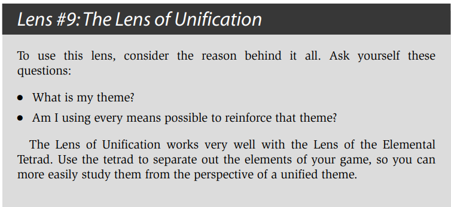

# The Art of Game Design

## 1. In the Beginning, There Is the Designer

### Magic Words

##### What is Game Design?

Game design is the act of deciding what a game should be.
That’s it. On the surface, it sounds too simple.

The designer is usually involved in the development of a game from the
very beginning to the very end, making decisions about how the game should be all
along the way.

### What Skills Does a Game Designer Need?

动画（Animation） - 让游戏中的角色更加鲜活，给予它们生命， 开启更广阔的创意设计视野。

人类学（Anthropology） - 准确地找出用户群体，并且分析需求，满足其欲望。

建筑学（Architecture） - 理解人与空间的关系，在游戏世界的构建过程中有一个好的立足点和新的方向。

头脑风暴（Brainstorming） - 不断的想出新的创意。

商业（Business） - 商业游戏的使命，越会用游戏赚钱，越有机会做出成就梦想的游戏。（also 数据分析）

电影学（Cinematography） - 学会穿搭一种在情感上极具吸引力的体验，将游戏过程想象成一部沉浸式电影。

交流（Communication） - 需要和各个领域的人交流沟通，解决问题，满足客户需求和让受众了解游戏的核心想法。

创造性写作（Creative Writing） - 游戏世界像小说中的世界一样，需要这样的能力来构建游戏世界。

经济学（Economics） - 游戏资源构建就是复杂的经济系统，理解经济学中的各种概念原则，对于游戏中经济体系的构建有着很大的帮助。

工程学（Engineering） - 看明白代码。

历史（History） - 如果是负责策划建构在历史背景上的游戏，需要丰富的历史知识，即便是在幻想背景上，许多灵感也是来自于真实历史。

管理（Management） - 让团队可以朝着同一个目标努力。

团队协作

数学（Mathematics） - 数值的计算和分析。

音乐（Music） - 音乐和美术是两个给用户第一印象的点，也是让用户沉浸其中的一个灵魂语言。

心理学（Psychology） - 了解用户，满足用户。

公众演讲（Public Speaking） - 需要把想法表达给别人，必须充满自信和说服力，让他人理解我们现在所做的工作。

声音设计（Sound Design） - 无须多言，耳听为实

技术性写作（Technical Writing） - 编写各种文档来清晰表述复杂的设计。

视觉艺术（Visual Arts） - 任何产品的视觉要素，是影响用户去留的非常重要的因素之一，理解并且有自己的想法，对整个设计有很大的提升。

### The Most Important Skill 

倾听，分为五个领域：团队，受众，游戏，客户以及自己。

这个倾听，是要倾听事物的本质，了解事物的真相

用一颗平静的心和一个静待开放的灵魂去倾听。去除情感，去除欲望，去除判断，去除指责。

### The Five Kinds of Listening
我们需要倾听我们的团队，因为我们需要一起制作游戏和做出各种关键的设计决策，并且一个人很难完全掌握上面所述的所有技能，但是一个团队的智慧加起来就有可能。所以我们需要深层的倾听我们的团队，并且和他们交流，让每个人都变成整体的一部分，分享自己所掌握的技能。

我们需要倾听我们的受众，因为他们是真正来玩我们的游戏的人，如果它们不满意我们的游戏，那么我们所做的一切都是失败的，去了解如何让他们满意，就是深层的倾听他们，想办法比他们更了解他们自身的需求。

我们需要倾听我们的游戏，这表示我们需要了解我们游戏的里里外外方方面面，任何一个问题都知道出在哪里，该如何解决。

我们需要倾听我们的客户，客户是金主爸爸，如果我们给不到他们想要的，他们就会去找下一家，只有学会倾听他们，满足他们，才能保持长期良好的合作关系。

最后还要倾听自己，这将成为无穷创造力背后的秘密。

要真正热爱这份工作，才能成为有天赋的游戏设计师，想要知道是否具备这种天赋，就要开始在这条路上走下去，看看它是否能让我们内心欢快。

所以回到开头，首先要告诉自己

**我是一名游戏设计师**

### The Secret of the Gifted 
There are two kinds.
First, there is the innate gift of a given skill. This is the minor gift. If you have this
gift, a skill such as game design, mathematics, or playing the piano comes natu-
rally to you.

The major gift is love of the work.

## 2. The Designer Creates an Experience

Create artifacts (rule sets, game boards, computer programs) that are likely to create certain kinds of experiences when a player interacts with them.

### 2.1 Experience? Unique to the games?

一本书或者一个电影剧本的作者只是在设计一种线性体验而已。在他们创作的内容以及读者和观众体验到的感觉上有着直接的映射关系。而游戏设计师就没这么轻松了。在体验过程中，我们给予了玩家对各种事件的节奏和顺序极大量的控制。

我们甚至在游戏里加入了随机事件！这使得交互的实体和体验之间的区分比线性娱乐要明显得多。与此同时，这也使得更难确定在玩家内心里到底产生了哪种体验。

### 2.2 追寻彩虹的三种途径

心理学

- 结果就是，现代心理学越向前发展，就离我们所关注的——人类体验的本质越来越远。

- 作为设计师：我们并不关注客观现实世界中的绝对正确，而只关注在主观体验世界中的相对正确。

人类学

- 他们努力客观地观察文化并进行实践，同时不断反思，将自己放在实验对象的位置。

- 我们可以从人类学家的研究中学到很多关于人类本质的重要知识——但更重要的是把文化人类学家的方法引入到我们的玩家中，与他们交谈，学习它们的一切，把我们自己放到它们的位置，我们就能获得客观观点中没有的洞察力。

设计学

- 我们必须开放思维并且勇于实践——优秀的创意能够来源于任何地方，但只有帮助提升游戏体验的创意才是好创意。

### 2.3 Introspection: Powers, Perils, and Practice

Peril #1: Introspection Can Lead to False Conclusions
About Reality

Peril #2: What Is True of My Experiences May Not be True
for Others

### 2.4 Dissect Your Feelings

### 2.5 战胜海森堡原理

“粒子的运动是无法在不干扰粒子的运动的情况下观察到的。类似地，一种体验也无法在不干扰到体验的本质的前提下观察到。”

- Analyze Memories: Not analyzing it while you play, but with the intention of analyzing the memory of it immediately after

- Two Passes: 分析记忆的一种方法是进行两轮体验。第一次别去停下来分析任何东西，只是去感受体验。然后回来再做一次，在这一次去分析每一样东西，可能甚至停下来记笔记。

- Sneak Glances
- Observe Silently

### 2.6 Essential Experience

在尝试设计一种体验时，你的目标是寻找能够定义你所想要的体验的基本元素，并想办法让它们成为游戏中的一部分。

游戏设计师的终极目标是穿搭体验。当你对理想中的体验和它所需的元素有一个清晰的认识时，你的设计就有了方向。

"如果我想做一个打雪球的游戏，那分析一下自己过去真实的打雪球的记忆不是对我要做的这个游戏很有帮助吗？但假如不是在一个真实的世界里和一群真实的朋友玩一场真正的打雪球，那是没办法完美地复制出这种体验的——那创造体验的关键点又在哪里呢？

关键点在于你并不需要完美地复制各种真实的体验才能做出一个好的游戏。你需要的只是为你的游戏去捕获这些体验中的本质就可以了。那“一次体验的本质”又是什么意思呢？——每一次可回想起的记忆都是有着一些关键的特征来界定它的，正是这些关键的特征使记忆显得特别。例如当你回忆一次打雪球的体验时，你可能会想起很多东西。你可能甚至会想到这次体验中一些很本质的内容：“学校的课取消了，那天又下了很大雪，”“我们当时是在街上玩的，”“那些雪很容易裹成一团，”“那天很冷，但是阳光普照——天空是很蓝的，”“当时四处都有很多小孩，”“我们建了个巨大的城堡，”“Fred把一个雪球扔得很高，当我抬头去看时，他又把另一个丢到我头上了！”“我们一直在大笑。”在体验里还有一些部分你会觉得不是本质的：“当时我穿着灯芯绒的裤子，”“在我口袋里有一些薄荷糖，”“一个正在遛狗的男人看着我们。”

作为游戏设计师，当你想要设计出某种体验时，你的目标是找出真正界定了你想创造的这种体验的本质元素，然后寻找各种方法来把这些元素变成游戏设计中的一部分。这样能让你游戏中的玩家能体验到这些本质元素。这本书中大部分的内容都会谈及各种这类的方法，利用这些方法，你打造出来的游戏能让玩家体验到你希望他们体验的。这里关键的一点在于你通常能用与真实体验极为不同的方法来传达出本质体验。回到我们前面说到的打雪球的例子，你能用什么方法在一个打雪球的游戏里传达出“天很冷”的体验呢？假如这是一个视频游戏，那理所当然能用美术图形的方式表达：角色会呼出一团团的白色热气，身体会做不断发抖的动画。你还能用音效去表达，通过刺耳的风声来传达寒冷的感觉。可能你想象到的不一定是寒冷大风的日子，但声效能捕捉到其中的本质，把寒冷的体验传达给玩家。假如寒冷这个概念对你很重要的话，你还能利用游戏的各种规则来表达。比方说玩家在不戴手套的情况下能做出更棒的雪球，但当他们的手变得太冷时，他们就必须带上手套了。这种情况可能并没有真的发生，但游戏规则能传达出这种寒冷的体验是游戏中主要组成部分。

有些人觉得这种方法很奇怪，他们会说：“我们可以光去设计一个游戏，然后看看从中能冒出什么样的体验的！”我想这一定程度上也是对的——假如你不清楚自己想要什么，那你是不用在意自己会得到什么的。但假如你清楚自己想要什么——假如你能想象到游戏在玩家面前呈现出什么样的感受——那你就需要考虑如何去传达这种本质体验了。"

The design of the very successive baseball game in Wii Sports is an excellent
example of the Lens of Essential Experience in use. Originally, the designers had intended to make it as much like real baseball as possible with the added bonus that you could swing your controller like a bat. As they proceeded, though, they realized they wouldn’t have time to simulate every aspect of baseball as well as they wanted. So, they made a big decision — since swinging the controller was the most unique part of this game, they would focus all their attention on getting that part of the baseball experience right — what they felt was the essential part. They decided that other details (nine innings, stealing bases, etc.) were not part of the essential experience they were trying to create.

## 3. The Experience Rises Out of a Game

### 3.1 漫谈定义

A game is something you play. A toy is an object you play with. A good toy is an object that is fun to play with. Fun is pleasure with surprises. 

- Games are entered willfully. 
- Games have goals. 
- Games have conflict. 
- Games have rules. 
- Games can be won and lost. 
- Games are interactive. 
- Games have challenge. 
- Games can create their own internal value. 
- Games engage players. 
- Games are closed, formal systems.

Jesse 认为 除了上面10点，游戏其实包含了解决问题。A game is a problem-solving activity, approached with a playful attitude.

但是诸如Gary's mod, MineCraft的问题是什么呢？如何让自己的创造物更好？Playful attitude，对于严肃游戏有成立吗？

所以给出我的定义：游戏是以自愿和自由为前提，以获得快乐自足为目的，且具有一定交互规则（玩家给出操作，规则给出反馈）的行为活动。

## 4. The Game Consists of Elements

### 4.1 The Four Basic Elements

1. 机制（Mechanics）：机制相当于你游戏的过程和规则。它描述了你游戏中的目标，定义了玩家在尝试达成目标的过程中能做和不能做的事，以及当玩家尝试去做这些事时会发生什么事。假如你把游戏和更具线性的娱乐体验（例如书籍、电影等等）相比较，你会留意到虽然在线性体验中也包含了技术、故事和美感（四元组中的其他三种元素），但它们完全不涉及到机制，因为正是各种机制让游戏成为一个游戏。当你挑选出一组关键的游戏玩法机制时，你需要挑选支持这些机制的技术，挑选用于强化它们使得玩家能清楚了解的美感，以及确定出一个能让各种游戏对玩家显得有意义的故事。

2. 故事（Story）：这是在你游戏中逐步展开的一系列事件。它可能是线性的、脚本预定义的、分支的，或者是突发的。

3. 美感（Aesthetics）：美感是你的游戏在视觉上、听觉上、嗅觉上、味觉上和感觉上的表现。

4. 技术（Technology）：Any materials and interactions that make your game possible such as paper and pencil, plastic chits, or high-powered lasers.The technology is essentially the medium in which the aesthetics take place, in which the mechanics will occur, and through which the story will be told.

### 4.2 Skin and Skeleton

皮肤（玩家的体验）& 看到游戏的骨骼（组成整个游戏的各种元素）

这是设计师面对的一个很大的挑战：在理解各种元素及其相互关系对体验的影响以及为什么产生这种影响的同时，还需要不断去感觉整个游戏的体验。你必须同时看到游戏的皮肤和骨骼。

## 5. The Elements Support a Theme

### 5.1 Unifying Themes 

Strengthen the power of your game’s experience. 

*Step 1: Figure out what your them49e is.*

*Step 2: Use every means possible to reinforce that theme.*

主题化的一个简单的例子：他有一本关于大象的书。这本书的创意是很简单的：向小孩子传达一种体验，让他们理解大象到底是什么。在某种意义上，你可以把这本书的主题叫做“什么是大象？”如此，步骤1就完成了。接下来我们去到步骤2：利用每一种可能的方法去强化这个主题。作者把这点是做得很明显的——这本书包含了各种关于大象的文字和图片。并且作者还把这步深化了，他把整本书以及书的封面和内页都裁剪成大象的形状。在每一次翻页里，你都需要找机会去以聪明和难以预料的方式去强化你的主题。

### 5.2 Resonance 共鸣

“experience-based theme” “truth-based theme”

共鸣性的主题能对你的作品增添极大的力量，不过即使你的游戏看起来没有这么一个主题，只要用一个统一的主题去聚焦游戏的体验，那整个游戏也会因此得以强化。

主题并不只是一种象征意义，不会像谜题一般故意留下隐藏的信息。主题会把你的作品聚焦在对玩家有意义的事物上。

### *5.3 注记

- 什么是主题？

主题在音乐创作中叫主旋律，在文章写作中叫中心思想，是观念形态由感性上升到理性后的总结，通过明确主题，让我们更清晰的认识到自己在做的是什么。

- 两种主题

大多数情况下，每项内容都可以抽象出外部主题和内部主题，外部主题需要直接的展示出来，让受众快速理解这是什么，而内部主题普遍会隐藏在外部主题之下，但却是作者真正想要传达的。e.g., 一道菜：
外部主题：一道价值299元的菜品，在食客品尝这道菜之前，厨师需要通过菜品的颜色组合、散发的香气、精致的摆盘，让用餐者食指大动，传达出这道菜值299的感觉；内部主题：不仅要好看，最重要还是要好吃，让食客回味无穷，流连忘返的那种好吃。一部电影：外部主题：电影《热辣滚烫》的外部主题是“破而后立的自我救赎”，在观众去电影院之前，就已经知道这是个励志故事了；内部主题：电影《热辣滚烫》的内部主题是“爱自己”，贾玲在电影中减肥，学习拳击，学会拒绝他人，都只是“爱自己”这主题的外化表象

- 总结：尽早确认主题，可以让我们的设计更聚焦，然后用尽所有方法强化主题，提升主题的传达度

## 6. 

