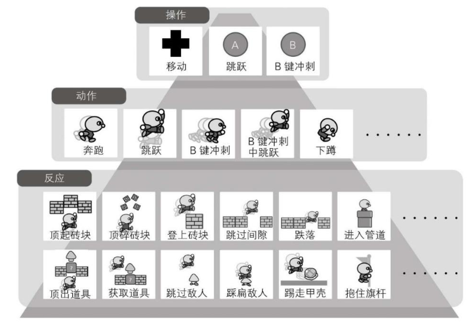

# 游戏设计的236个技巧

## 第一章 让3D游戏更有趣的玩家角色技术

### 1.1 能够吸引2D游戏玩家的3D游戏设计技巧

#### 01 如何给玩家带来游戏体验

该系列游戏在每个关卡中都设置了五花八门的障碍，让玩家有挑战障碍的**紧张感**和成功瞬间的**成就感**

玩家用手柄实际操纵马里奥时，会发现马里奥飞奔的感觉让人舒服，是因为特殊的动作设计。

玩家想停住的时候，马里奥不会立刻停止，有一段减速过程，加入了物理惯性。

B键冲刺的过程按反方向键时，马里奥出现“脚撑地面急刹车转换方向”的动作，并向前滑行一段距离。

对比了《塞尔达传说》中，主人公林克是立即停下。原因是两款游戏想设计的游戏体验不同。

《塞尔达》的游戏体验是探索（寻找）与战斗。

《超级马里奥兄弟》的游戏体验就是“单人挑战障碍赛跑”。如果玩家的每一个操作结果都可以被精准计算预知会让玩家享受自身成长的趣味性骤减。

*每一款优秀的游戏都会将这种让游戏更有趣的设计技巧装入玩家角色的动作之中，以求更好地实现该游戏想带给玩家的游戏体验。*

*然后这些机制相互组合，形成了一个游戏的机制核心，让玩家心底里觉得这个游戏有趣*

#### 02 B键冲刺带来的感官刺激以及风险与回报的趣味性

- **感官刺激**：通过运动或动作获得感官上的舒畅体验的过程称为“感官刺激”。哪怕不需要，玩家会不由自主地使用B键冲刺。
- **风险与回报**：风险越大紧张感越强（距离长，着陆点短，空心填充），获得的成就感也就越大。马里奥的B键冲刺用得越久，跳跃成功的时机越难掌握，增加失败的风险，同时加大了回报的筹码。

同一个障碍物，玩家可以*为自己创建新的挑战*。货真价实的趣味性能激发玩家的*自然感情*，进而在玩家心中成为一种真实体验。

#### 03 让跳跃更好用的技巧

- 跳跃体验丰富：《超级马里奥兄弟》采用了“按住A键的时间长度与B键冲刺的速度共同决定跳跃高度”的机制

- 有意思的设定：在跳跃的过程中按方向键可以控制马里奥在空中左右移动。

- 马里奥在跳跃过程中碰到墙壁等障碍物时并不会下落，反而会沿着障碍物向上升。

*马里奥系列游戏中，设计者大胆地抛开了现实中的物理法则，创建了一个“马里奥的物理世界”，将这种让人玩着舒心的“好用的跳跃动作”成功地呈现给了玩家。*

#### 04 勾起玩家跳跃冲动的互动式玩法

- 互动的乐趣：一个人对自己的某种想法付诸实践之后，能够获得相应的反馈。

- 公式：操作复杂度（输入指令的组合）＜动作数（可实践的事件数）＜反应数（反馈种类数）

- 自由度高、互动性强的游戏，大多符合这一规律。如果能用较少的动作（可实践的事件）获得较多反应（反馈），玩家就会在游戏中主动去尝试各种行为。

- 无论设计反馈有多少种，得让玩家有尝试的冲动。在游戏中存在让玩家不由自主想要去实践的机制，称为**游戏的钓饵**。马里奥的动画会在玩家心中放下一个钓饵，让玩家觉得砖块中好像藏着什么东西。

*动作和反应在互动式玩法中有举足轻重的地位*

#### 05 从《2D》到《3D》

#### 06 2D马里奥与3D马里奥的区别

取消了移动动作的惯性。马里奥会在玩家放开滑垫的瞬间原地立定

#### 07 用2D马里奥的感觉玩3D马里奥的机制

- 3D视角的距离感相比于2D要难以掌握，加入惯性可能会导致操作难度上升。

- 在3D游戏中玩家很难掌握距离感。在某些镜头角度下，玩家甚至无法直观地在画面上选取起跳点和急停点。

- 相较于2D游戏，3D游戏在难度提升上更难以把握，稍有不慎便会变得太难，往往不能照搬2D游戏中的一些机制

- 一般3D游戏的镜头角度都会交由玩家控制。设计者大胆地将镜头角度局限在了“侧面”“上方”“倾斜”三种固定模式中。
- 一般3D游戏中，玩家可以使用摇杆控制角色360度自由变换方向。马里奥的移动却被限制在16个方向之内。

- 游戏通过这种方式让镜头角度和移动角度保持一致
- 利用这一机制，游戏有效地避免了玩家因斜向移动而导致误判跳跃距离的情况发生

*为方便玩家掌握马里奥的跳跃高度，游戏在所有场景中都明确做出了马里奥的影子*

- 首次加入了在跳跃过程中改变方向的机制，让玩家能更轻松地完成某些动作，更准确地踩扁敌方角色

- 设计了“翻滚”“远跳”“翻滚跳”等高难度动作，吸引高端玩家重复挑战关卡。

#### 08 总结

- 将玩家吸引到游戏中来的“感官刺激”、决定游戏有趣程度的“挑战中的风险与回报”、让玩家不由自主付诸实践的“动作与反应”，以及为其服务的“连环钓饵”，这些既是给玩家带来愉快体验的关键，也是所有娱乐活动所共通的基本要素。
- 开发者在游戏作品中倾注的与玩家一同分享快乐的这份心。例如小时候和你的小伙伴玩闹
- 游戏体验的真实性并不仅取决于贴图和声效等外观因素，通过游戏内部机制表现出的“互动的乐趣”也对其有着巨大影响。
- 对于游戏的趣味性，不只在游戏内部做文章，还让其向游戏外的世界扩展。换句话说，就是为创造“从游戏中诞生的交流及团体”，在让游戏更有趣的设计上下功夫。

### 1.2 让游戏更具临场感的玩家角色动作设计技巧（《战神Ⅲ》）

#### 01 不需控制镜头的移动操作机制

《战神Ⅲ》中不涉及镜头的操作。称为“自动镜头”，会随着玩家的移动自动选取最佳角度。简化玩家角色的操作，让玩家能将更多注意力投入到游戏中去。

为了实现自动镜头，所作的细节设计：

a.自动追踪的镜头与玩家角色的移动速度需要一致，否则为了直线行走，玩家要调整摇杆方向。如果镜头移动方向不大，影响不大，玩家会下意识跟随。但一旦移动方向大，会给玩家带来更大的压力。

b.活用镜头特征:同时体验到2D游戏简单又直观的操作感，以及3D游戏身临其境般的操作感。e.g., 角度变化不大/不频繁；镜头与玩家角色距离角度一致。

#### 02 实现快节奏战斗的玩家移动动作机制

- 战神Ⅲ战斗节奏快的特点要求角色必须能够灵活转身及迅速静止。
- 对比《怪物猎人》角色的移动速度分为“行走”、“奔跑”、“冲刺”3个阶段，转身半径要大于《战神Ⅲ》。目的是创造出“狩猎”的感觉。
- 每个游戏都有一套能让玩家觉得舒服的“速度”“节奏”以及“触感”（手感）。要根据游戏设定。

#### 03 不带来烦躁感的地图切换机制

- 采用自动镜头的3D游戏在切换地图时多会大幅改变镜头角度，并且用电影般的动态构图来实现过场。
- 在进入新地图时，一些老游戏会出现镜头的倒退。《战神Ⅲ》有对该问题的修正，让玩家依旧按照想要的方向行进。

*能否让玩家角色的动作准确地反映出玩家意图很重要。*

#### 04 让人不由得手指发力的玩家角色动作机制

- 为了塑造主角的野性，开宝箱需要玩家长按R1键位，动画对应奎托斯用全力掀开宝箱的厚重盖子
- 专为塑造玩家角色形象服务的动作能够烘托角色的特点，作者称这种技巧为游戏演出（互动性演出）

#### 05 小结

设计游戏真实的体验感需要巧妙的自动镜头系统，在地图切换、动作节奏等细节上准确反映玩家操作意图。

### 1.3 让割草游戏更有趣的攻击动作设计技巧

#### 01 让攻击准确命中目标敌人的机制

- 锁定机制：《战神Ⅲ》采用的是自动锁定和解锁。
- 实现上分为以下几步：
    1. 锁定对象：倾斜左摇杆，移动方向上最近的敌人。
    2. 锁定中：角色面部会一直朝向敌人。自动追踪至敌方角色所在角度并发动攻击。
    3. 锁定解除：第一，玩家角色与敌方角色之间超出一定角度或距离。第二，消灭已锁定的敌方角色后。但是，如果玩家面朝的方向（侧面和背后除外）还有其他敌人，玩家角色则会自动锁定此敌人。实现痛击眼前的大批敌人的效果。

#### 02 让连击畅快淋漓的机制

- 两种攻击方式的对比：普通攻击的连击招式以灵活为主，一般在第三击时会转换成大范围（横向）攻击。重击攻击力更强，但出招速度慢且破绽多.，以纵向为主，无法像普通攻击一样进行大范围攻击。
- 为每一个攻击动作都分配了固定的用途。这让玩家在面对各关卡中充满个性的敌方角色时，主动去思考怎样使用连击才能消灭敌人，享受制定战术的乐趣。
- 3D游戏中每一个招式都是由“攻击动画”、“攻击力”（伤害）、“攻击方向”、“追踪性能”等要素组合而成的。“连击”则又要以充满个性的方式将这些“招式”组合到一起。
- “追踪性能”是一个重要的元素。指的是能否命中敌人。在游戏中需要对追踪性能的数值进行调控。如果性能过强，则连击命中过高，挑战系数低，玩家失去成长空间。如果性能过弱，需要玩家比较强的操作能力，才能连击命中。

#### 03 菜鸟也能轻松上手的畅快的浮空连击机制

- 浮空连击：允许玩家使用特定的“挑空攻击”将敌人打至空中，在空中施展连续攻击。
- 在游戏性和视觉方面都是一种享受，在割草游戏中广泛使用。
- 下落速度会设置得比较慢，方便玩家对被挑至空中的敌人进行连续攻击。
- 一般游戏中需要玩家较强的操作技能，卡准攻击时机。但《战神Ⅲ》只需长按△键即可发动挑空攻击。

#### 04 用简单操作发动复杂连击的机制

- 动作游戏存在一个动作指令清单
- 一般的动作只要识别玩家按了什么再核对清单即可。但“长按键”则需要先测量从按下按键到松开按键的时长，然后再进行核对。
- 为了中间进行时长判断。第一种解决方法是在“长按”判定结束之前，所有受影响的连击都应用同一个攻击动画。第二种解决方法是让玩家角色在完成“长按键”的判定之前不发动攻击（什么都不做）。但是这一机制会导致判定时间延长，影响攻击动作的节奏。
- 这一问题会随着长按键连击的增加而越发复杂，要保证所有连击动画之间不产生矛盾。
- 《战神Ⅲ》中的连击只有第一招需要判定按键长短，连击过程中完全不需要长按键。
- 《战神Ⅲ》可以在连击过程中配合方向键更换武器，施展出更加复杂的多武器连击。

*《战神Ⅲ》前期通过简单的控制使玩家上手游戏、融入角色，化身为奎托斯的感觉能够激发出玩家内心中潜藏的暴力性与残虐性。一款有趣的游戏，拥有激发出玩家内心深处的“某物”的魅力。*

### 1.4 让玩家角色动作更细腻的设计技巧（《塞尔达传说：天空之剑》）

#### 01 支撑海量解谜内容的玩家角色移动动作

- 玩家倾斜摇杆时，镜头会随着玩家角色一同移动及旋转。按下Z键，镜头会自动调整至主人公林克面朝的方向。

- 3D场景中存在高低差，玩家角色容易因为操作失误而跌落悬崖，游戏中加入了“在悬崖边行走不会跌落”的机制。只要移动方向与悬崖边的夹角小于某个角度，林克就能够沿悬崖边行走而不跌落。如果移动方向与悬崖边的夹角接近90°，林克则会跳下悬崖。
- 塞尔达系列很重视让玩家能够集中精力探索和解谜的操作性。

#### 02 让玩家下意识选择合适动作的Z注视机制

- 玩家按住Z键使用Z注视时，a.有敌人时：镜头注视（锁定）敌人，玩家能以敌人为中心进行移动。b.没有敌人:并不会锁定某个目标，保持方向不变与镜头一起前后左右移动。

- 3D塞尔达拥有“普通移动”“Z注视移动”“Z注视锁定敌人移动”三种移动模式。但玩家很少有意识地去考虑模式切换问题。

- 让玩家下意识地选择最合适的移动动作，自然而然地进行操作的机制是让游戏更有趣的重要技术之一。

#### 03 能单独当游戏玩的移动动作——奋力冲刺

- 玩家按住A键进行移动，林克进一步加快速度达到冲刺状态。冲刺时需要消耗“耐力值”。归零后林克会进入疲劳状态。

- 和耐力值相关的设置：a.耐力果实 b.冲刺机制本身的风险与回报，玩家更愿意试一试能冲多远。c.设置了只有奋力冲刺才能通过的斜坡场景。d.设置了相关的动作，如冲刺过程中向前挥动双截棍可以发动“前滚翻冲撞”，向着高墙冲刺时可以沿墙面向上跑等。

#### 04 没有跳跃键却可以体验真实跳跃的机制

- 《塞尔达传说：天空之剑》中没有跳跃键，所有跳跃动作都是由“自动跳跃”这一机制来实现的。
- 控制方式：a.玩家只需大幅度倾斜双截棍控制器的摇杆让林克奔跑到悬崖边缘，系统便会自动触发跳跃。b.只要玩家先按住A键再推摇杆进入冲刺模式，那么即便没有助跑也可以直接触发跳跃
- 自动跳跃让玩家不必考虑“起跳时机”的问题。
- 特殊的动作设计：从空之楼阁乘坐阁楼鸟跳下栈桥时，林克则是张开四肢跃入空中的。

*宫本茂：一个好的想法可以解决多个问题*

*“动作中伴随风险与回报，让简单操作也不失紧张感”*

*游戏需要在维持适度紧张感的同时为玩家提供易于上手的动作。*

### 1.5 头脑与身体一同享受的剑战动作设计技巧（《塞尔达传说：天空之剑》）

#### 01 能帅气挥剑的机制

- 游戏特色：使用加强版Wii遥控器进行战斗时，要将遥控器当成真剑来操作。

- “挥剑”的设计比普通按键复杂很多，按键只要识别对应指令表。挥剑需要分成“向上挥剑”和“向下劈砍”等多个步骤。例如，挥剑过程中不小心转动了手腕，很可能出现用剑背敲击敌人的尴尬动作。

- 人体运动的精度要比我们想象中低得多。

- 一款游戏要采用“将身体运动投影至游戏中的输入设备”，那么就需要在“玩家的哪些动作要如实反映”“玩家的哪些动作要省略、符号化”上多花心思。

- 体感游戏中，玩家的游戏体验会伴随着身体运动一同被记忆，形成肌肉记忆，记忆时间更久。

#### 02  攻击与体力的机制

- 采用了连击机制的游戏，从第一招到连击最后一招算是一个攻击流程。重视攻击流程的“起点”和“终点”。
- 起点：按下按钮或者挥动加强版Wii遥控器。
- 终点：
    - 连击结束。连击结束时的最后一招往往动作较大、破绽较多。
    - 反映玩家角色的体力参数。消耗到零结束。
    - 反映玩家自身的体力。玩家没有体力结束。
- 动作类游戏或格斗游戏会选择1与2的组合。体感游戏是2与3的组合。

需要巧妙地区分使用“玩家真实身体的体力”与“玩家角色参数化的体力”。

- 普通攻击：威力不大，可以连续无数次使用，但多次挥动Wii遥控器会让玩家自身感到疲劳。这时玩家自身的体力变成了玩家角色的体力。
- 特殊攻击：如回旋斩，通过过将双截棍控制器和加强版Wii遥控器快速交叉来发动攻击。玩家运动量并不大，如果在游戏中没有特殊限制，玩家将能像普通攻击一样多次连续使用，使攻击没有终点，因此要加入角色体力值限制。

#### 03 让玩家痛快反击的盾击机制

- 盾击是通过“玩家盾击动作”与“敌人攻击动作”中设置的“盾击成功判定帧”进行判定的。
- 盾牌加入了耐久度：如果不对盾牌防御和盾击做任何限制，那么只要一直举着盾就能无限防御敌人的攻击，导致玩家角色过于强大，淡化战斗紧迫感。
- 将游戏中角色动画的图片数称为“帧数”，例如1s为30帧，还可以自动选择最合适帧数的“可变帧”。碰撞检测指定的帧称为“碰撞检测帧”或“攻击判定帧”。

#### 04 实现剑战动作的机制

- 剑战的规则：当面对复数敌人时，只集中精力与一名敌人战斗。基本上是一对一战斗。和看古装剧类似，都是一个一个上去和主角打。

- 实现剑战：Z注视机制。游戏AI机制中规定了受到Z注视的敌人会先积极攻击，如果在Z注视的状态下消灭敌人，那么Z注视会立刻切换到附近的敌人身上。

#### 05 剑战动作与割草游戏的区别

- 3D塞尔达采用了自动跳跃机制，战斗中不会出现跳跃躲避敌人攻击的情况，符合剑战的氛围。是进行“平面战斗”的“2D战斗动作类游戏”。
- 以《战神Ⅲ》为代表的割草游戏可以通过跳跃躲避敌人。让玩家享受动感十足的战斗。是3D战斗动作类游戏。
- 割草游戏会为玩家准备大量可一次性攻击多个敌人的攻击动作。
- 3D塞尔达之中，能攻击多个敌人的动作只有“回旋斩”。
- 战斗的趣味性的区别在很大程度上受游戏机制组合的影响。

#### 06 小结

- 要制作一款有趣的游戏，在游戏机制上不能只用“加法”，还要适当使用“减法”。

- 3D塞尔达比2D塞尔达更追求游戏体验的真实度。例如，从《塞尔达传说：时之笛》开始附近有敌人会自动触发拔剑备战的动作。将玩家发现敌人时的紧张感通过玩家角色的反应生动地再现出来，以提高游戏体验的真实度。

- 采用了加强版Wii遥控器的战斗让玩家体验到一种“身体的延伸”，这时玩家对自己身体的注意力会大幅下降，例如玩着玩着撞到现实里的墙壁。

*要想强化玩家与玩家角色一体化的程度，不但要将游戏做得有趣，还要重视“游戏体验的真实度”以及“运动中身体延伸带来的一体化”。*