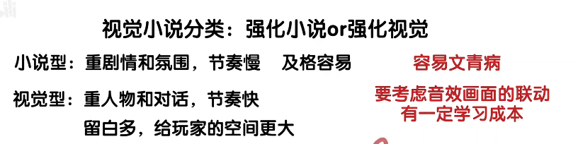

https://www.bilibili.com/video/BV1BpfCBYEKB?spm_id_from=333.788.videopod.sections&vd_source=784cac4665672e741fbe89004f7e0c75

视觉小说很重要的一点是处理好声音，文字和画面的信息占比。这是和传统小说截然不同的。与其说是写小说不如说是写剧本。
因此在写剧本时最好一开始处理好信息的分配。用关于演出的备注去替代一些信息。
比如大多数较低成本adv中，也可以靠背景，音乐，立绘演出，音效传达出大多数信息，文字仅负责角色的对话以及主角的心理。在高光或者复杂的场景时点缀上cg和额外一些文字补充。其实只要在图片切换的动画以及cg放出的分镜上下点功夫，作品的廉价感就会少很多

1. 利用对话提高信息密度 -> 减少理解成本
通过对话的台词设计，音效和画面的利用。（用音效画面代替客观事实）e.g., 摇了摇头表示否认，可以去掉因为后面的语言表示否认了；表示惊讶可以用画面震动，害羞可以通过表情实现

玩家可以接触到的信息有音效，画面，文本

文本内容分为三种：对话、心理和客观信息

其中音效、画面、对话、心理都是感官，是代入感来源。

对话转换为客观？小说感太重
对话转换为心理？每个读者心理活动不同，不必。

2. 区块化表达

把相同类型的内容放到一起可以减小阅读负担。大块的纯对话，纯心理。除非你有9/10分的把握读者100%会这么想

尽量不要纯客观。出现客观反而要把他们和心理放到一起。

3. 视觉小说分类

4. 零成本制作 实拍照片简单处理

5. 音乐音效背景立绘可视化组件

https://gakaisozai.seesaa.net/