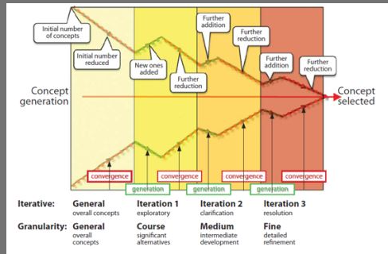
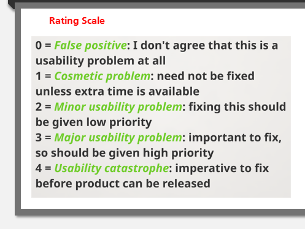

# W1 Intro to ID

## 1.1 ID

### 1.1.1 What is ID?

Preece, Rogers & Sharp (2019) "Designing interactive products to support the way people communicate and interact in their everyday and working lives."

Winograd (1997) "Designing spaces for human communication and interaction."

### 1.1.2 What is interaction?

stimulus -> response

### 1.1.3 Good Design v.s. Poor Design

Usable (Usability):

- Easy to Learn
- Effective to use
- Enjoyable user experience

### 1.1.4 ID & HCI

HCI is subset of ID

### 1.1.5 User experience (UX)

Preece, Rogers & Sharp (2019) "How people feel about a product and their pleasure and satisfaction when using it, looking at it, holding it, and opening or closing it"

4 threds:
- Sensual
- Emotional
- Compositional
- Spatio-temporal

### 1.1.6 ID Process

- Discover Requirements
- Designing Alternatives(sketches)
- Prototyping
- Evaluating

**3 Principles of User-Centered Design**

- Early focus on users
- Empirical measurement 以经验（或实验）为依据
- Iterative design

### 1.1.7 Usability Goals

- Effectiveness: how good at doing what it supposed to do
- Efficiency: how few steps needed
- Safety: how good at avoiding errors
- Utility: how appropriate are the functions user want to achieve
- Learnability: how quickly user can figure out what to do
- Memorability: how easy it sis to remember how to use

### 1.1.8 User Experience Goals

relate more to the relationship between user and product, rather than product it self. More subjective

- Desirable
  - Satisfying
  - Supporting
  - Provocative
  - ...

- Undesirable
  - Boring
  - Gimmicky
  - Annoying
  - ...

**Usable System**

- Meet users' goal
- Work in context of use
- Gather 3 kinds of data(who, what, how)
  
### 1.1.9 Design Principles
  
- Visibility
- Feedback
- Affordance
- \*Mapping
- Consistency
- Constraints
  
## 1.2 Process of ID
  
### 1.2.1 4 Approaches
  
- User-centered
  - Early focus on users and tasks
  - Empirical mrasurement
  - Iterative design
- Activity-centered
- Systems
- Genius

### 1.2.2 Practical Issues

#### 1.2.2.1 Users

many types
Stakeholders: People or organizations that will be affected by the system and have influence on the system requirements

#### 1.2.2.2 Needs

#### 1.2.2.3 Alternatives

#### 1.2.2.4 Choice

#### 1.2.2.5 Integration

### 1.2.3 Agile Manifesto

- Individuals and interactions over processes and tools
- Working software over comprehensive documentation
- Customer collaboration over contract negotiation
- Responding to change over following a plan

# W2 Discovering Requirements

- Who is target user?
- What are defining characteristics?
- How can we represent?

***Persona***: Fictitious character, Type of user, based on user data  
***Scenario***: Context of user, example of achieving a user goal, simple, natural, personal

## 2.1 Descovering.. / Establishing.. / Requirement Engineering

## 2.1.1 Aim

- Knowledge of users
- Set of requirements

## 2.1.2 Stages

- Data gathering
- Analysis
- Interpretation
- Presentation

**5 Methods of discovering**

- Interview
- Observation (laboratory, in the wild)
- Reviews
- Questionnaire
- Focus group(several people)

## 2.1.3 Gathering 

- Pre-existing
- Requirements gathering
- Requirements capture
- Need establishing

## 2.1.4 Definition of Requirements

A statement about an intended product that specifies what it is expected to do

## 2.1.5 Types

- Basic
  - Functional
  - Non-functional

- More
  - Functional
  - Data
  - Environmental
    - Physical
    - Social
    - Organizational
    - Technical

## 2.2 Personas
  
### 2.2.1 Cultural Probes

### 2.2.2 Contexual Enquiry

- Ethnograhic study
- User is expert, designer is apprentice
- Interview, but at user's workplace, 2-3 hours long
  - Structured
  - Unstructured
  - Semi-structured

### 2.2.3 Scenario 

Informal narrative description

### 2.2.4 Principles of Contexual Enquiry

- Context
- Partnership
- Interpretation
- Focus

## 2.3 Skinput

A product design involving using the skin as finger input surface

### 2.3.1 Skinput Usage Scenario

- Scrolling music tracks
- Controls television channel and volume
- Gets recipe 
- Telephones a friend
  
  
# W3 Designing Alternatives

## 3.1 Sketching 

Help with last 3 of the design process
- Get the design right
- Get the right design
  - Many alternatives

### 3.1.1 Reason

Critical part
- Idea generation (Ideation)
  - like climbing a hill: Generate one, then iterate and develop it
  - local hill climbing means that your design is always limited by the first idea
- Design exploration
- Engineering

### 3.1.2 Design Funnel

### 3.1.3 Tips
- Simple
- Icons
- 3D not needed
- Sketch fast, long strokes

## 3.2 Storyboarding

- Tell a story
- storyboard
- visual narration
- scene by scene
- comic

### 3.2.1 Techniques for narrative storyboards

- Sketching
  - Sequece of frames
  - emphasize actions and motions
- Photos
  - Sequence of snapshots
  - Edit, annotation

# W4 Prototyping
- Representation emphasizing some aspects and de-emphasizing others
- Simulation
- "One manifestation of a design that allows stakeholders to interact with it and explore its suitability."

## 4.1 What is a prototype

Certain features in common with the final product

One manifestation of a design that allows stakeholders to interact with it and to explore its suitability.

## 4.2 Sketching v.s. Prototyping
Sketches are about exploring ideas, prototyping is about testing ideas

suggest -> describe
explore -> refine
question -> answer
propose -> test
provoke -> resolve
tentative -> specific

low fidelity <-> high fidelity

## 4.3 Video Prototypes
- Technology in use
- Tell story
- Cheap
- Fast

## 4.4 The wizard of Oz
Human operator simulates the behaviour of the system

## 4.5 Sketch-a-move

## 4.6 Wireframe
Blueprints of the design of the computer interface
outline boxes where photographs and textboxes will be placed

## 4.7 Mockup
- low fidelity
- paper prototypes
- wireframes

## 4.8 Software

- ppt
- Balsamiq
- Interface builders
  - vs
  - eclipse
- Physical

## 4.9 Interactivity

- Non-interactive
  - Paper sketch
  - Physical mockup
  - Wireframe

- Interactive
  - Paper prototype
  - Physical prototype
  - Interactive wireframe

# W5 Evaluation

"10 usability heuristics" (Nielsen's heuristics for usability)  
https://www.nngroup.com/articles/ten-usability-heuristics/
1. Visibility of system status  
2. Match between system and real world  
3. User control and freedom
4. Consistency and standards
5. Error prevention
6. Recognition rather than recall
7. Flexibility and efficiency of use
8. Aesthetic and minimalist design
9. Help user recognize, diagnose and recover from errors
10. Help and documentation

## 5.1 Types

- Analytic Evaluation
  - Heuristic Evaluation (Heuristic: "rule of thumb", aid to discover)
  - Inspection method
  - Does not require users, but usability experts
  - Expert Evaluation

- Empirical Evaluation
  - Usability test (lab study/use test)

## 5.2 Applying Heuristic Evaluation

- Use 10 heuristics to spot problems
- Identify source
- Identify solution
- Prioritize solutions

## 5.3 How to conduct HE

- Train evaluators
- Identify problems
- Rate priority
- Collate

To be more precise:
1. Train some experts (3-5 evaluators)
2. Get individual experts to use heuristics to find problems
3. Permit experts to generate new heuristics
4. Get individual experts to use heuristics to prioritize problems on scale of 0 to 4
5. Collate reports into a  single evaluation

## 5.4 Rating Scale

## 5.5 Pros and Cons

- Advantages
  - Fewer ethical problems (no users)
  - Fewer practical problems (no users)
  - Fast
  - Cheap(discount usability)

- Disadvantages
  - Important problems may be missed
  - Trivial problems oftern identified
  - Expert biased
  - Difficult to find/train experts
  - Not good for collaborative apps
  - Not good for physical devices

# W6 Laboratory Studies

## 6.1 Lab Studies

### 6.1.1 Types of Evaluation
- Controlled settings
  - with users (Empirical Evaluation)
  - without users (Analytic Evaluation)

### 6.1.2 Analytic Approches

- Heuristic Evaluation
- Cognitive Walkthrough

### 6.1.3 Empirical Approches

- Usability Test
- Experiments
- Think aloud (Helps user test provide more infomation)

## 6.2 Cognitive Walkthrough

- Simulating user's prbolem solving process
- Focus on designs for the ease of learning

## 6.3 Usability Testing

### 6.3.1 Observation

- Data gathering
- Any stage in development
- Early
- Late
- Evaluation

### 6.3.2 Types of Observation
- Direct
  - Investigate the users
- Indirect
  - Records of activity
- Field studies
- Lab studies (controlled)

### 6.3.3 Controlled Environment

- Usability Labs
- Portable Labs

### 6.3.4 Think aloud

- User is asked to verbalize their thoughts
- Helps user test provide more infomation
- Helps the designer understand the user's thought process

### 6.3.5 Think aloud problem

- User are not experts
- Silence

Respond to Silence
- What are you looking for?
- What do you think you need to do?
- How do you think you'll do it?
- Can you see what you expect?
- What can you not find?

### 6.3.6 Think aloud tips

- Take notes on everything
  - What they did, what they did not do, what questions
- Let user make errors

### 6.3.7 Think aloud after
- Video interaction
- Play back
- Think aloud in review

### 6.3.8 Why, What, Where, When

### 6.3.9 Why evaluate?
- Usability
- User Experience
- Design sells
- Real Problems

### 6.3.10 Controlled settings
- Usability Tests
  - Product
  - Recruit potential users
  - Ask them to use
  - Ask them to think aloud
  - Record everything
  - Analyze
  - *Active testing
- Experiments

### 6.3.11 Ethical Considerations
- Protecting participants
- Informed consent

## 6.4 Experiments

### 6.4.1 Experiments

- Hypothesis Testing
- Stastical Analysis

### 6.4.2 Controlled Experiment

### 6.4.3 Variables
- Independent Variable
- Dependent Variable

### 6.4.4 Hypothesis

### 6.4.5 Null Hypothesis

### 6.4.6 Design

- Between-subjects
- Within-subjects

### 6.4.7 Statistics
Interface 1/2 -> Chance calculator -> p-value
p<0.05 -> design makes a difference

### 6.4.8 Reliability

- Reliability
  - Same result will be replicated if repeat the evaluation
- Validity
  - Method measures what it intends to measure

# W7 Field Studies

## 7.1 What is a field study?

- Lab studies(controlled)
- Field studies / In situ studies (in the original place) / In the wild studies
  - Natural settings
  - Messy
  - Activities overlap
  - Interrupted by events and people

## 7.2 Advantages of field studies

- Ubiquitous technologies
- Real world success

## 7.3 Disadvantages of field studies

- Little or no control
- Difficult to test hypotheses
- Interruption

## 7.4 Three types

- Current behavior
- Proof of concept
- Experience of Prototype

## 7.5 Current behavior

- WHat are people doing?
- Shared technology example (Brush & Inkpen (names of researchers))

## 7.6 Proof of concept

- Does it work in the real world?
- Context-aware power management

## 7.7 Experience of Prototype

- Prototype
- Wizard of Oz

## 7.8 Design of Field Studies

- Hidden variables
- Within subjects design
- Qualitative data

- *Uses mixed methods

## 7.9 Data Gathering
- Logging
- Surveys
- Experience sampling
- Diaries
- Interviews
- Unstructured observation

### 7.9.1 Logging
- Main quantitative method
- Prototype sends data

### 7.9,2 Surveys
- Presurvey
- Postcondition
- Postsurvey

- Open-ended
- Multiple-choice
- Likert scale

### 7.9.3 Good & bad surveys

7 tips

- Question is interpreted in a consistent manner
- Question people are willing to answer
- Question is answering truthfully
- Question with a known answer
- Avoid double-barreled questions
- Avoid biased terms wording
- Pretest your questions

### 7.9.4 Diaries
- Diary entries
- User initiated

### 7.9.5 Interviews

- Semi-structured
- Audio or video recording
- Photos

### 7.9.6 Unstructured observation
- Little interaction with participants

## 7.10 Data Analysis

- Quantitative
- Qualitative

## 7.11 Statistics

- Descriptive statistics
- Inferential statistics

## 7.12 Qualitative Analysis
- Coding
- Pre-existing themes
- Testing theory (deduction)

- No pre-existing themes
- Deriving themes (induction)
- Theory building

## 7.13 Successful study

- Study design
- Technology
- Running the study
- Data collection and analysis

### 7.13.1 Study design

4 tips

1. Clear research goal
2. Study design document
3. Scripts for visits
4. Pilot

### 7.13.2 Technology

5 tips

1. Robust enough
2. Other evaluation methods
3. Existing technology
4. Reassuring feedback
5. Negative results

### 7.13.3 Running the study

4 tips

1. Research team
2. Comfortable participants
3. Safety
4. Flexibility

### 7.13.4 Data collection and analysis

3 tips

1. Be objective
2. Dont argue. "The participant is always right"
3. Inappropriate claims

# W8 Affective Interaction

## 8.1 Affective Interaction

### 8.1.1 Emotions and Storytelling

### 8.1.2 Meaning of affect

Affect: "Any experience of feeling or emotion"

Affective Interaction: "HCI that involves emotion"
"The process of communicating emotional infomation to and from the user to improve the user experience"

The intersection of Affective computing and Interaction design

### 8.1.3 3 Aspects

- Respond to human emotions
- Communicate emotions
- AI

## 8.2 Recognition

### 8.2.1 Interaction

sense -> recognize -> respond

### 8.2.2 Detecting Emotions

- Self-report
- Speech recognition
- Gesture recognition
- Facial recognition
- Physiology
  - Temperature
  - Skin conductivity
  - Heart rate
  - Neural activity
  - blood pressure

### 8.2.3 Affective States

- Frustration
- Confusion
- Interest
- Fear
- Distress
- Anger
- Boredom
- Joy

### 8.2.4 Affective Design

- Detect user's emotions
- Associate with situation
- Feedback to Designer

## 8.3 Self reporting

## 8.4 Physiological Sensors

- Electromyamogram(EMG) (signal from muscle)
- Blood Volume Pulse(BVP)  
- Galvanic Skin Response(GSR)  (Intensity)
- Respiration  (around chest)

## 8.4 Facial

- Anger
- Fear
- Disgust
- Surprise
- Happiness
- Sadness

## 8.5 Speech

- What is said
- Who is speaking
- How it is said
  - Tone
  - Speed

Problems?

- Context
- Valence

## 8.6 Applications
- Education
- Retail
- Medical
- Autism
- Robotics
- Driving
