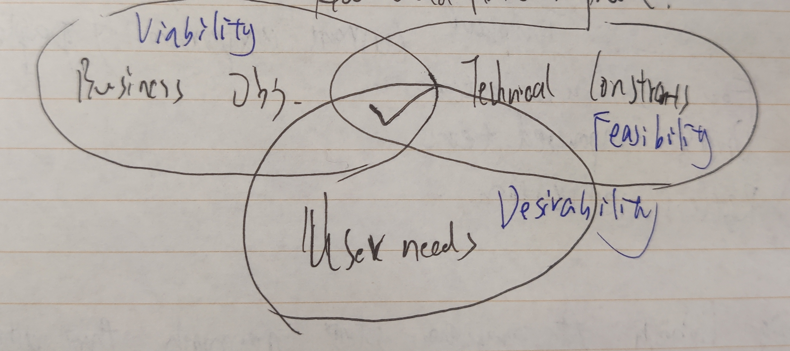

# Stanford D.School Design Thinking Process

- Empathize
- Define
- Ideate
- Protype
- Test

## Design Thinking

A problem-solving approach that aims to improve the current lived experience of people you serve

## Principles

- Focus on user outcomes
- Diverse empowered teams
- Restless reinvention

### Focus on user outcomes

1. Keep Asking

    - Who are our users?
    - What is their current experience?
    - How could it be improved?

    

2. Recognize assumptions

3. Observation builds empathy

### Restless reinvention

### Refocus work as a user-centered problem

## Loop

- Observe
- Reflect
- Make

## Keeps

- Hills: Statements of intent written as user enablements
- Playbacks
- Sponser Users
