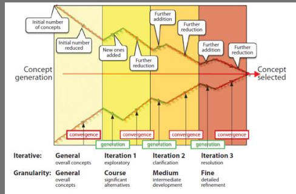
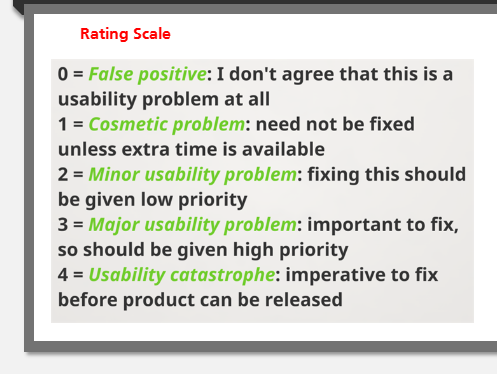

# W1 Intro to ID

## 1.1 ID
### 1.1.1 What is ID?

Preece, Rogers & Sharp (2019) "Designing interactive products to support the way people communicate and interact in their everyday and working lives."

Winograd (1997) "Designing spaces for human communication and interaction."

### 1.1.2 What is interaction?

stimulus -> response

### 1.1.3 Good Design v.s. Poor Design

Usable (Usability):
- Easy to Learn
- Effective to use
- Enjoyable user experience

### 1.1.4 ID & HCI

HCI is subset of ID

### 1.1.5 User experience (UX)
Preece, Rogers & Sharp (2019) "How people feel about a product and their pleasure and satisfaction when using it, looking at it, holding it, and opening or closing it"

4 threds:
- Sensual
- Emotional
- Compositional
- Spatio-temporal

### 1.1.6 ID Process

- Discover Requirements
- Designing Alternatives(sketches)
- Prototyping
- Evaluating

 **3 Principles of User-Centered Design**

- Early focus on users
- Empirical measurement 以经验（或实验）为依据
- Iterative design

### 1.1.7 Usability Goals

- Effectiveness: how good at doing what it supposed to do
- Efficiency: how few steps needed
- Safety: how good at avoiding errors
- Utility: how appropriate are the functions user want to achieve
- Learnability: how quickly user can figure out what to do
- Memorability: how easy it sis to remember how to use

### 1.1.8 User Experience Goals

relate more to the relationship between user and product, rather than product it self. More subjective

- Desirable
  - Satisfying
  - Supporting
  - Provocative
  - ...
- Undesirable
  - Boring
  - Gimmicky
  - Annoying
  - ...

**Usable System**

- Meet users' goal
- Work in context of use
- Gather 3 kinds of data(who, what, how)
  
### 1.1.9 Design Principles
  
- Visibility
- Feedback
- Affordance
- \*Mapping
- Consistency
- Constraints
  
## 1.2 Process of ID
  
### 1.2.1 4 Approaches
  
- User-centered
  - Early focus on users and tasks
  - Empirical mrasurement
  - Iterative design
- Activity-centered
- Systems
- Genius

### 1.2.2 Practical Issues

#### 1.2.2.1 Users

many types
Stakeholders: People or organizations that will be affected by the system and have influence on the system requirements

#### 1.2.2.2 Needs

#### 1.2.2.3 Alternatives

#### 1.2.2.4 Choice

#### 1.2.2.5 Integration

### 1.2.3 Agile Manifesto

- Individuals and interactions over processes and tools
- Working software over comprehensive documentation
- Customer collaboration over contract negotiation
- Responding to change over following a plan

# W2 Discovering Requirements

- Who is target user?
- What are defining characteristics?
- How can we represent?

***Persona***: Fictitious character, Type of user, based on user data  
***Scenario***: Context of user, example of achieving a user goal, simple, natural, personal 
## 2.1 Descovering.. / Establishing.. / Requirement Engieering
## 2.1.1 Aim

- Knowledge of users
- Set of requirements

## 2.1.2 Stages

- Data gathering
- Analysis
- Interpretation
- Presentation

**5 Methods of discovering**

- Interview
- Observation (laboratory, in the wild)
- Reviews
- Questionnaire
- Focus group(several people)
## 2.1.3 Gathering 

- Pre-existing
- Requirements gathering
- Requirements capture
- Need establishing

## 2.1.4 Definition of Requirements

A statement about an intended product that specifies what it is expected to do

## 2.1.5 Types

- Basic
  - Functional
  - Non-functional

- More
  - Functional
  - Data
  - Environmental
    - Physical
    - Social
    - Organizational
    - Technical

## 2.2 Personas
  
### 2.2.1 Cultural Probes

### 2.2.2 Contexual Enquiry

- Ethnograhic study
- User is expert, designer is apprentice
- Interview, but at user's workplace, 2-3 hours long
  - Structured
  - Unstructured
  - Semi-structured

### 2.2.3 Scenario 
Informal narrative description

### 2.2.4 Principles of Contexual Enquiry

- Context
- Partnership
- Interpretation
- Focus

## 2.3 Skinput

A product design involving using the skin as finger input surface

### 2.3.1 Skinput Usage Scenario

- Scrolling music tracks
- Controls television channel and volume
- Gets recipe 
- Telephones a friend
  
  
# W3 Designing Alternatives

## 3.1 Sketching 

Help with last 3 of the design process
- Get the desing right
- Get the right design
  - Many alternatives

### 3.1.1 Reason

Critical part
- Idea generation (Ideation)
  - like climbing a hill: Generate one, then iterate and develop it
  - local hill climbing means that your design is always limited by the first idea
- Design exploration
- Engineering

### 3.1.2 Design Funnel

### 3.1.3 Tips
- Simple
- Icons
- 3D not needed
- Sketch fast, long strokes

## 3.2 Storyboarding

- Tell a story
- storyboard
- visual narration
- scene by scene
- comic

### 3.2.1 Techniques for narrative storyboards

- Sketching
  - Sequece of frames
  - emphasize actions and motions
- Photos
  - Sequence of snapshots
  - Edit, annotation

# W4 Prototyping
- Representation emphasizing some aspects and de-emphasizing others
- Simulation
- "One manifestation of a design that allows stakeholders to interact with it and explore its suitability."

## 4.1 What is a prototype

Certain features in common with the final product

One manifestation of a design that allows stakeholders to interact with it and to explore its suitability.

## 4.2 Sketching v.s. Prototyping
Sketches are about exploring ideas, prototyping is about testing ideas

suggest -> describe
explore -> refine
question -> answer
propose -> test
provoke -> resolve
tentative -> specific

low fidelity <-> high fidelity

## 4.3 Video Prototypes
- Technology in use
- Tell story
- Cheap
- Fast

## 4.4 The wizard of Oz
Human operator simulates the behaviour of the system

## 4.5 Sketch-a-move

## 4.6 Wireframe
Blueprints of the design of the computer interface
outline boxes where photographs and textboxes will be placed

## 4.7 Mockup
- low fidelity
- paper prototypes
- wireframes

## 4.8 Software

- ppt
- Balsamiq
- Interface builders
  - vs
  - eclipse
- Physical

## 4.9 Interactivity

- Non-interactive
  - Paper sketch
  - Physical mockup
  - Wireframe

- Interactive
  - Paper prototype
  - Physical prototype
  - Interactive wireframe

# W5 Evaluation

"10 usability heuristics" (Nielsen's heuristics for usability)  
https://www.nngroup.com/articles/ten-usability-heuristics/
1. Visibility of system status  
2. Match between system and real world  
3. User control and freedom
4. Consistency and standards
5. Error prevention
6. Recognition rather than recall
7. Flexibility and efficiency of use
8. Aesthetic and minimalist design
9. Help user recognize, diagnose and recover from errors
10. Help and documentation

## 5.1 Types

- Analytic Evaluation
  - Heuristic Evaluation (Heuristic: "rule of thumb", aid to discover)
  - Inspection method
  - Does not require users, but usability experts
  - Expert Evaluation

- Empirical Evaluation
  - Usability test (lab study/use test)

## 5.2 Applying Heuristic Evaluation

- Use 10 heuristics to spot problems
- Identify source
- Identify solution
- Prioritize solutions

## 5.3 How to conduct HE

1. Train some experts (3-5 evaluators)
2. Get individual experts to use heuristics to find problems
3. Permit experts to generate new heuristics
4. Get individual experts to use heuristics to prioritize problems on scale of 0 to 4
5. Collate reports into a  single evaluation

## 5.4 Rating Scale

## 5.5 Pros and Cons

- Advantages
  - Fewer ethical problems (no users)
  - Fewer practical problems (no users)
  - Fast
  - Cheap(discount usability)

- Disadvantages
  - Important problems may be missed
  - Trivial problems oftern identified
  - Expert biased
  - Difficult to find/train experts
  - Not good for collaborative apps
  - Not good for physical devices